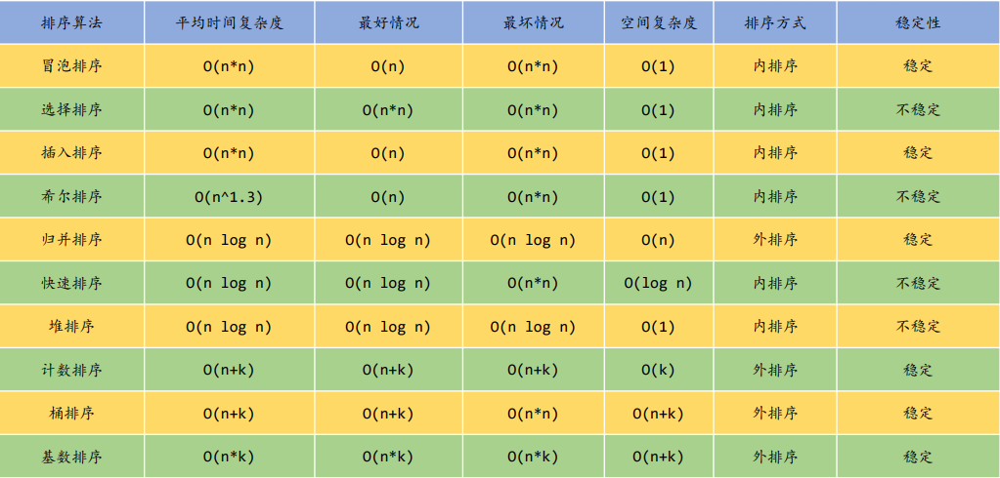
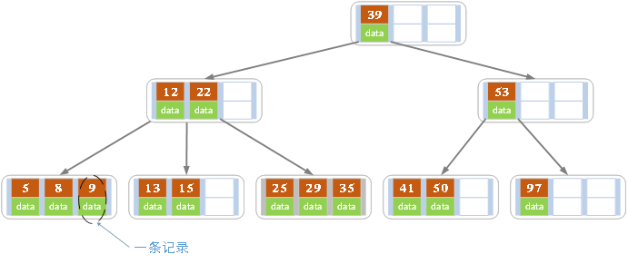
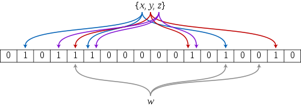
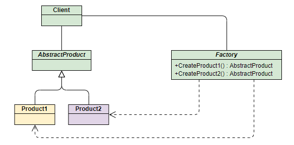

## 一、算法与设计模式专栏

### 1.查找与排序/KMP算法，栈/队列



#### 1.1 希尔排序

- 希尔排序，也称递减增量排序算法，是插入排序的一种更高效的改进版本。但希尔排序是非稳定排序算法。

  希尔排序是基于插入排序的以下两点性质而提出改进方法的：

  - 插入排序在对几乎已经排好序的数据操作时，效率高，即可以达到线性排序的效率；
  - 但插入排序一般来说是低效的，因为插入排序每次只能将数据移动一位；

  希尔排序的基本思想是：先将整个待排序的记录序列分割成为若干子序列分别进行直接插入排序，待整个序列中的记录"基本有序"时，再对全体记录进行依次直接插入排序。

- 算法步骤
  - 选择一个增量序列 t1，t2，……，tk，其中 ti > tj, tk = 1；
  - 按增量序列个数 k，对序列进行 k 趟排序；
  - 每趟排序，根据对应的增量 ti，将待排序列分割成若干长度为 m 的子序列，分别对各子表进行直接插入排序。仅增量因子为 1 时，整个序列作为一个表来处理，表长度即为整个序列的长度。

- [代码](./code/sort/sort.c)

  ```C
  int shell_sort(int *data, int length)
  {
      int gap = 0;
      int i = 0, j = 0;
      int temp = 0;
  
      // 外层分组
      for (gap = length / 2; gap >= 1; gap /= 2)
      {
          // 插入排序
          for (i = gap; i < length; ++i)
          {
              temp = data[i];
              for (j = i - gap; j >= 0 && temp < data[j]; j -= gap)
              {
                  // 将data[j]右移
                  data[j + gap] = data[j];
              }
              // 将temp(开始的data[i])放到循环跳出的地方
              data[j + gap] = temp;
          }
      }
      return 0;
  }
  ```
  
#### 1.2 归并排序

- 归并排序（Merge sort）是建立在归并操作上的一种有效的排序算法。该算法是采用分治法（Divide and Conquer）的一个非常典型的应用。
- 作为一种典型的分而治之思想的算法应用，归并排序的实现由两种方法：

  - 自上而下的递归（所有递归的方法都可以用迭代重写，所以就有了第 2 种方法）；

  - 自下而上的迭代；
- 和选择排序一样，归并排序的性能不受输入数据的影响，但表现比选择排序好的多，因为始终都是 O(nlogn) 的时间复杂度。代价是需要额外的内存空间。
- 算法步骤
  - 申请空间，使其大小为两个已经排序序列之和，该空间用来存放合并后的序列；
  - 设定两个指针，最初位置分别为两个已经排序序列的起始位置；
  - 比较两个指针所指向的元素，选择相对小的元素放入到合并空间，并移动指针到下一位置；
  - 重复步骤 3 直到某一指针达到序列尾；
  - 将另一序列剩下的所有元素直接复制到合并序列尾。

- [代码](./code/sort/sort.c)

  ```C
  void merge(int *data, int *temp, int start, int middle, int end)
  {
      int i = start, j = middle + 1, k = start;
      while (i <= middle && j <= end)
      {
          if (data[i] > data[j])
          {
              temp[k++] = data[j++];
          }
          else
          {
              temp[k++] = data[i++];
          }
      }
  
      while (i <= middle)
      {
          temp[k++] = data[i++];
      }
      while (j <= end)
      {
          temp[k++] = data[j++];
      }
  
      for (i = start; i <= end; i++)
      {
          data[i] = temp[i];
      }
  }
  
  int merge_sort(int *data, int *temp, int start, int end)
  {
      int middle;
      if (start < end)
      {
          middle = start + (end - start) / 2;
          merge_sort(data, temp, start, middle);
          merge_sort(data, temp, middle + 1, end);
          merge(data, temp, start, middle, end);
      }
  }
  ```

#### 1.3 快速排序

- 快速排序是由东尼·霍尔所发展的一种排序算法。在平均状况下，排序 n 个项目要 Ο(nlogn) 次比较。在最坏状况下则需要 Ο(n2) 次比较，但这种状况并不常见。事实上，快速排序通常明显比其他 Ο(nlogn) 算法更快，因为它的内部循环（inner loop）可以在大部分的架构上很有效率地被实现出来。
- 快速排序使用分治法（Divide and conquer）策略来把一个串行（list）分为两个子串行（sub-lists）。
- 快速排序又是一种分而治之思想在排序算法上的典型应用。本质上来看，快速排序应该算是在冒泡排序基础上的递归分治法。
- 快速排序的名字起的是简单粗暴，因为一听到这个名字你就知道它存在的意义，就是快，而且效率高！它是处理大数据最快的排序算法之一了。虽然 Worst Case 的时间复杂度达到了 O(n²)，但是人家就是优秀，在大多数情况下都比平均时间复杂度为 O(n logn) 的排序算法表现要更好。
- 算法步骤
  - 从数列中挑出一个元素，称为 "基准"（pivot）;
  - 重新排序数列，所有元素比基准值小的摆放在基准前面，所有元素比基准值大的摆在基准的后面（相同的数可以到任一边）。在这个分区退出之后，该基准就处于数列的中间位置。这个称为分区（partition）操作；
  - 递归地（recursive）把小于基准值元素的子数列和大于基准值元素的子数列排序；

- [代码](./code/sort/sort.c)

  ```C
  void quick(int *data, int left, int right)
  {
      if (left >= right)
          return;
  
      int i = left;
      int j = right;
      // 哨兵
      int key = data[left];
      while (i < j)
      {
          while (i < j && key <= data[j])
          {
              j--;
          }
          data[i] = data[j];
  
          while (i < j && key >= data[i])
          {
              i++;
          }
          data[j] = data[i];
      }
  
      data[i] = key;
      quick(data, left, i - 1);
      quick(data, i + 1, right);
  }
  
  int quick_sort(int *data, int length)
  {
      quick(data, 0, length - 1);
  }
  ```

#### 1.4 KMP算法

- **Knuth-Morris-Pratt字符串查找算法**（简称为**KMP算法**）可在一个**主文本字符串**`S`内查找一个**词**`W`的出现位置。此算法通过运用对这个词在不匹配时本身就包含足够的信息来确定下一个匹配将在哪里开始的发现，从而避免重新检查先前匹配的字符。

- **部分匹配表**，又称为**失配函数**，作用是让算法无需多次匹配`S`中的任何字符。能够实现线性时间搜索的关键是在主串的一些字段中检查模式串的*初始字段*，我们可以确切地知道在当前位置之前的一个潜在匹配的位置。换句话说，在不错过任何潜在匹配的情况下，我们"预搜索"这个模式串本身并将其译成一个包含所有可能失配的位置对应可以绕过最多无效字符的列表。

- 对于`W`中的任何位置，我们都希望能够查询那个位置前（不包括那个位置）有可能的`W`的最长初始字段的长度，而不是从`W[0]`开始失配的整个字段，这长度就是我们查找下一个匹配时回退的距离。因此`T[i]`是`W`的可能的*适当*初始字段同时也是结束于`W[i - 1]`的子串的最大长度。我们使空串长度是0。当一个失配出现在模式串的最开始，这是特殊情况（无法回退），我们设置`T[0] = -1`。

- [代码](./code/search/kmp.c)

  ```C
  void make_next(const char *pattern, int *next)
  {
      int q, k;// k前缀下标，q后缀下标
      int m = strlen(pattern);
  
      next[0] = 0;
      for (q = 1, k = 0; q < m; q++)
      {
          while (k > 0 && pattern[q] != pattern[k])
              k = next[k - 1];
  
          if (pattern[q] == pattern[k])
          {
              k++;
          }
  
          next[q] = k;
      }
  
      // abcabc
      // next[0] = 0;
      // q=1, k=0, pattern[q]:pattern[k] = b:a, next[1] = 0;
      // q=2, k=0, pattern[q]:pattern[k] = c:a, next[2] = 0;
      // q=3, k=0, pattern[q]:pattern[k] = a:a, k++, next[3] = 1;
      // q=4, k=1, pattern[q]:pattern[k] = b:b, k++, next[4] = 2;
      // q=5, k=2, pattern[q]:pattern[k] = c:c, k++, next[5] = 3;
      // q=6, k=3, pattern[q]:pattern[k] = d:a, k=next[k-1] -> k=0; next[6] = 0;
  }
  
  int kmp(const char *text, const char *pattern, int *next)
  {
      int n = strlen(text);
      int m = strlen(pattern);
      make_next(pattern, next);
  
      int i, q;
      for (i = 0, q = 0; i < n; i++)
      {
          while (q > 0 && pattern[q] != text[i])
          {
              q = next[q - 1];
          }
  
          if (pattern[q] == text[i])
          {
              q++;
          }
  
          if (q == m)
          {
              break;
          }
      }
  
      return i - q + 1;
  }
  ```


### 2.二叉树与红黑树

#### 2.1 二叉树

- **二叉树**是n(n>=0)个结点的有限集合，该集合或者为空集（称为空二叉树），或者由一个根结点和两棵互不相交的、分别称为根结点的左子树和右子树组成。
- 二叉树特点
  - 每个结点最多有两颗子树，所以二叉树中不存在度大于2的结点。
  - 左子树和右子树是有顺序的，次序不能任意颠倒。
  - 即使树中某结点只有一棵子树，也要区分它是左子树还是右子树。

- [代码](./code/tree/btree.c)

  ```C
  typedef int KEY_VALUE;
  
  #define BSTREE_ENTRY(name, type) \
      struct name                  \
      {                            \
          struct type *left;       \
          struct type *right;      \
      }
  
  struct bstree_node
  {
      KEY_VALUE data;
      BSTREE_ENTRY(, bstree_node)
      bst;
  };
  
  struct bstree
  {
      struct bstree_node *root;
  };
  
  struct bstree_node *bstree_create_node(KEY_VALUE key)
  {
      struct bstree_node *node = (struct bstree_node *)malloc(sizeof(struct bstree_node));
      if (node == NULL)
      {
          assert(0);
      }
      node->data = key;
      node->bst.left = node->bst.right = NULL;
  
      return node;
  }
  
  int bstree_insert(struct bstree *T, int key)
  {
      assert(T != NULL);
      if (T->root == NULL)
      {
          T->root = bstree_create_node(key);
          return 0;
      }
  
      struct bstree_node *node = T->root;
      struct bstree_node *tmp = T->root;//保存父节点
      while (node != NULL)
      {
          tmp = node;
          if (key < node->data)
          {
              node = node->bst.left;
          }
          else
          {
              node = node->bst.right;
          }
      }
  
      if (key < tmp->data)
      {
          tmp->bst.left = bstree_create_node(key);
      }
      else
      {
          tmp->bst.right = bstree_create_node(key);
      }
  
      return 0;
  }
  
  int bstree_traversal(struct bstree_node *node)
  {
      if (node == NULL)
          return 0;
  
      bstree_traversal(node->bst.left);
      printf("%4d ", node->data);
      bstree_traversal(node->bst.right);
  }
  ```


#### 2.2 红黑树


-  R-B Tree，全称是Red-Black Tree，又称为“红黑树”，它一种特殊的二叉查找树。红黑树的每个节点上都有存储位表示节点的颜色，可以是红(Red)或黑(Black)。
- 红黑树的特性
  - 每个节点或者是黑色，或者是红色。
  - 根节点是黑色。
  - 每个叶子节点（NIL）是黑色。这里叶子节点，是指为空(NIL或NULL)的叶子节点！
  - 如果一个节点是红色的，则它的子节点必须是黑色的。
  - 从一个节点到该节点的子孙节点的所有路径上包含相同数目的黑节点。

- [代码](./code/tree/rbtree.c)

  ```C
  #define RED 1
  #define BLACK 2
  
  typedef int KEY_TYPE;
  
  typedef struct _rbtree_node
  {
      unsigned char color;
      struct _rbtree_node *right;
      struct _rbtree_node *left;
      struct _rbtree_node *parent;
      KEY_TYPE key;
      void *value;
  } rbtree_node;
  
  typedef struct _rbtree
  {
      rbtree_node *root;
      rbtree_node *nil;
  } rbtree;
  
  rbtree_node *rbtree_mini(rbtree *T, rbtree_node *x)
  {
      while (x->left != T->nil)
      {
          x = x->left;
      }
      return x;
  }
  
  rbtree_node *rbtree_maxi(rbtree *T, rbtree_node *x)
  {
      while (x->right != T->nil)
      {
          x = x->right;
      }
      return x;
  }
  
  rbtree_node *rbtree_successor(rbtree *T, rbtree_node *x)
  {
      rbtree_node *y = x->parent;
  
      if (x->right != T->nil)
      {
          return rbtree_mini(T, x->right);
      }
  
      while ((y != T->nil) && (x == y->right))
      {
          x = y;
          y = y->parent;
      }
      return y;
  }
  
  void rbtree_left_rotate(rbtree *T, rbtree_node *x)
  {
      rbtree_node *y = x->right; // x  --> y  ,  y --> x,   right --> left,  left --> right
  
      x->right = y->left; //1 1
      if (y->left != T->nil)
      { //1 2
          y->left->parent = x;
      }
  
      y->parent = x->parent; //1 3
      if (x->parent == T->nil)
      { //1 4
          T->root = y;
      }
      else if (x == x->parent->left)
      {
          x->parent->left = y;
      }
      else
      {
          x->parent->right = y;
      }
  
      y->left = x;   //1 5
      x->parent = y; //1 6
  }
  
  void rbtree_right_rotate(rbtree *T, rbtree_node *y)
  {
      rbtree_node *x = y->left;
  
      y->left = x->right;
      if (x->right != T->nil)
      {
          x->right->parent = y;
      }
  
      x->parent = y->parent;
      if (y->parent == T->nil)
      {
          T->root = x;
      }
      else if (y == y->parent->right)
      {
          y->parent->right = x;
      }
      else
      {
          y->parent->left = x;
      }
  
      x->right = y;
      y->parent = x;
  }
  
  void rbtree_insert_fixup(rbtree *T, rbtree_node *z)
  {
      while (z->parent->color == RED)
      { //z ---> RED
          if (z->parent == z->parent->parent->left)
          {
              rbtree_node *y = z->parent->parent->right;
              if (y->color == RED)
              {
                  z->parent->color = BLACK;
                  y->color = BLACK;
                  z->parent->parent->color = RED;
  
                  z = z->parent->parent; //z --> RED
              }
              else
              {
                  if (z == z->parent->right)
                  {
                      z = z->parent;
                      rbtree_left_rotate(T, z);
                  }
  
                  z->parent->color = BLACK;
                  z->parent->parent->color = RED;
                  rbtree_right_rotate(T, z->parent->parent);
              }
          }
          else
          {
              rbtree_node *y = z->parent->parent->left;
              if (y->color == RED)
              {
                  z->parent->color = BLACK;
                  y->color = BLACK;
                  z->parent->parent->color = RED;
  
                  z = z->parent->parent; //z --> RED
              }
              else
              {
                  if (z == z->parent->left)
                  {
                      z = z->parent;
                      rbtree_right_rotate(T, z);
                  }
  
                  z->parent->color = BLACK;
                  z->parent->parent->color = RED;
                  rbtree_left_rotate(T, z->parent->parent);
              }
          }
      }
  
      T->root->color = BLACK;
  }
  
  void rbtree_insert(rbtree *T, rbtree_node *z)
  {
      rbtree_node *y = T->nil;
      rbtree_node *x = T->root;
  
      while (x != T->nil)
      {
          y = x;
          if (z->key < x->key)
          {
              x = x->left;
          }
          else if (z->key > x->key)
          {
              x = x->right;
          }
          else
          { //Exist
              return;
          }
      }
  
      z->parent = y;
      if (y == T->nil)
      {
          T->root = z;
      }
      else if (z->key < y->key)
      {
          y->left = z;
      }
      else
      {
          y->right = z;
      }
  
      z->left = T->nil;
      z->right = T->nil;
      z->color = RED;
  
      rbtree_insert_fixup(T, z);
  }
  
  void rbtree_delete_fixup(rbtree *T, rbtree_node *x)
  {
      while ((x != T->root) && (x->color == BLACK))
      {
          if (x == x->parent->left)
          {
              rbtree_node *w = x->parent->right;
              if (w->color == RED)
              {
                  w->color = BLACK;
                  x->parent->color = RED;
  
                  rbtree_left_rotate(T, x->parent);
                  w = x->parent->right;
              }
  
              if ((w->left->color == BLACK) && (w->right->color == BLACK))
              {
                  w->color = RED;
                  x = x->parent;
              }
              else
              {
                  if (w->right->color == BLACK)
                  {
                      w->left->color = BLACK;
                      w->color = RED;
                      rbtree_right_rotate(T, w);
                      w = x->parent->right;
                  }
  
                  w->color = x->parent->color;
                  x->parent->color = BLACK;
                  w->right->color = BLACK;
                  rbtree_left_rotate(T, x->parent);
  
                  x = T->root;
              }
          }
          else
          {
              rbtree_node *w = x->parent->left;
              if (w->color == RED)
              {
                  w->color = BLACK;
                  x->parent->color = RED;
                  rbtree_right_rotate(T, x->parent);
                  w = x->parent->left;
              }
  
              if ((w->left->color == BLACK) && (w->right->color == BLACK))
              {
                  w->color = RED;
                  x = x->parent;
              }
              else
              {
                  if (w->left->color == BLACK)
                  {
                      w->right->color = BLACK;
                      w->color = RED;
                      rbtree_left_rotate(T, w);
                      w = x->parent->left;
                  }
  
                  w->color = x->parent->color;
                  x->parent->color = BLACK;
                  w->left->color = BLACK;
                  rbtree_right_rotate(T, x->parent);
  
                  x = T->root;
              }
          }
      }
  
      x->color = BLACK;
  }
  
  rbtree_node *rbtree_delete(rbtree *T, rbtree_node *z)
  {
      rbtree_node *y = T->nil;
      rbtree_node *x = T->nil;
  
      if ((z->left == T->nil) || (z->right == T->nil))
      {
          y = z;
      }
      else
      {
          y = rbtree_successor(T, z);
      }
  
      if (y->left != T->nil)
      {
          x = y->left;
      }
      else if (y->right != T->nil)
      {
          x = y->right;
      }
  
      x->parent = y->parent;
      if (y->parent == T->nil)
      {
          T->root = x;
      }
      else if (y == y->parent->left)
      {
          y->parent->left = x;
      }
      else
      {
          y->parent->right = x;
      }
  
      if (y != z)
      {
          z->key = y->key;
          z->value = y->value;
      }
  
      if (y->color == BLACK)
      {
          rbtree_delete_fixup(T, x);
      }
  
      return y;
  }
  
  rbtree_node *rbtree_search(rbtree *T, KEY_TYPE key)
  {
      rbtree_node *node = T->root;
      while (node != T->nil)
      {
          if (key < node->key)
          {
              node = node->left;
          }
          else if (key > node->key)
          {
              node = node->right;
          }
          else
          {
              return node;
          }
      }
      return T->nil;
  }
  
  void rbtree_traversal(rbtree *T, rbtree_node *node)
  {
      if (node != T->nil)
      {
          rbtree_traversal(T, node->left);
          printf("key:%d, color:%d\n", node->key, node->color);
          rbtree_traversal(T, node->right);
      }
  }
  ```

### 3.B-树



- B树也称B-树，它是一颗多路平衡查找树。我们描述一颗B树时需要指定它的阶数，阶数表示了一个结点最多有多少个孩子结点，一般用字母m表示阶数。当m取2时，就是我们常见的二叉搜索树。
- 一颗m阶的B树定义
  - 每个结点最多有m-1个关键字。
  - 根结点最少可以只有1个关键字。
  - 非根结点至少有Math.ceil(m/2)-1个关键字。
  - 每个结点中的关键字都按照从小到大的顺序排列，每个关键字的左子树中的所有关键字都小于它，而右子树中的所有关键字都大于它。
  - 所有叶子结点都位于同一层，或者说根结点到每个叶子结点的长度都相同。

- [代码](./code/tree/b-tree.c)

  ```C
  #define DEGREE 3
  typedef int KEY_VALUE;
  
  typedef struct _btree_node
  {
      KEY_VALUE *keys;
      struct _btree_node **childrens;
      int num;
      int leaf;
  } btree_node;
  
  typedef struct _btree
  {
      btree_node *root;
      int t;
  } btree;
  
  btree_node *btree_create_node(int t, int leaf)
  {
      btree_node *node = (btree_node *)calloc(1, sizeof(btree_node));
      if (node == NULL)
          assert(0);
  
      node->leaf = leaf;
      node->keys = (KEY_VALUE *)calloc(1, (2 * t - 1) * sizeof(KEY_VALUE));
      node->childrens = (btree_node **)calloc(1, (2 * t) * sizeof(btree_node));
      node->num = 0;
  
      return node;
  }
  
  void btree_destroy_node(btree_node *node)
  {
      assert(node);
  
      free(node->childrens);
      free(node->keys);
      free(node);
  }
  
  void btree_create(btree *T, int t)
  {
      T->t = t;
  
      btree_node *x = btree_create_node(t, 1);
      T->root = x;
  }
  
  void btree_split_child(btree *T, btree_node *x, int i)
  {
      int t = T->t;
  
      btree_node *y = x->childrens[i];
      btree_node *z = btree_create_node(t, y->leaf);
  
      z->num = t - 1;
  
      int j = 0;
      for (j = 0; j < t - 1; j++)
      {
          z->keys[j] = y->keys[j + t];
      }
      if (y->leaf == 0)
      {
          for (j = 0; j < t; j++)
          {
              z->childrens[j] = y->childrens[j + t];
          }
      }
  
      y->num = t - 1;
      for (j = x->num; j >= i + 1; j--)
      {
          x->childrens[j + 1] = x->childrens[j];
      }
  
      x->childrens[i + 1] = z;
  
      for (j = x->num - 1; j >= i; j--)
      {
          x->keys[j + 1] = x->keys[j];
      }
      x->keys[i] = y->keys[t - 1];
      x->num += 1;
  }
  
  void btree_insert_nonfull(btree *T, btree_node *x, KEY_VALUE k)
  {
      int i = x->num - 1;
  
      if (x->leaf == 1)
      {
          while (i >= 0 && x->keys[i] > k)
          {
              x->keys[i + 1] = x->keys[i];
              i--;
          }
          x->keys[i + 1] = k;
          x->num += 1;
      }
      else
      {
          while (i >= 0 && x->keys[i] > k)
              i--;
  
          if (x->childrens[i + 1]->num == (2 * (T->t)) - 1)
          {
              btree_split_child(T, x, i + 1);
              if (k > x->keys[i + 1])
                  i++;
          }
  
          btree_insert_nonfull(T, x->childrens[i + 1], k);
      }
  }
  
  void btree_insert(btree *T, KEY_VALUE key)
  {
      //int t = T->t;
      btree_node *r = T->root;
      if (r->num == 2 * T->t - 1)
      {
          btree_node *node = btree_create_node(T->t, 0);
          T->root = node;
  
          node->childrens[0] = r;
  
          btree_split_child(T, node, 0);
  
          int i = 0;
          if (node->keys[0] < key)
              i++;
          btree_insert_nonfull(T, node->childrens[i], key);
      }
      else
      {
          btree_insert_nonfull(T, r, key);
      }
  }
  
  void btree_traverse(btree_node *x)
  {
      int i = 0;
      for (i = 0; i < x->num; i++)
      {
          if (x->leaf == 0)
              btree_traverse(x->childrens[i]);
          printf("%C ", x->keys[i]);
      }
  
      if (x->leaf == 0)
          btree_traverse(x->childrens[i]);
  }
  
  void btree_print(btree *T, btree_node *node, int layer)
  {
      btree_node *p = node;
      int i;
      if (p)
      {
          printf("\nlayer = %d keynum = %d is_leaf = %d\n", layer, p->num, p->leaf);
          for (i = 0; i < node->num; i++)
              printf("%c ", p->keys[i]);
          printf("\n");
  
          layer++;
          for (i = 0; i <= p->num; i++)
              if (p->childrens[i])
                  btree_print(T, p->childrens[i], layer);
      }
      else
          printf("the tree is empty\n");
  }
  
  int btree_bin_search(btree_node *node, int low, int high, KEY_VALUE key)
  {
      int mid;
      if (low > high || low < 0 || high < 0)
      {
          return -1;
      }
  
      while (low <= high)
      {
          mid = (low + high) / 2;
          if (key > node->keys[mid])
          {
              low = mid + 1;
          }
          else
          {
              high = mid - 1;
          }
      }
  
      return low;
  }
  
  //{child[idx], key[idx], child[idx+1]}
  void btree_merge(btree *T, btree_node *node, int idx)
  {
      btree_node *left = node->childrens[idx];
      btree_node *right = node->childrens[idx + 1];
  
      int i = 0;
  
      /////data merge
      left->keys[T->t - 1] = node->keys[idx];
      for (i = 0; i < T->t - 1; i++)
      {
          left->keys[T->t + i] = right->keys[i];
      }
      if (!left->leaf)
      {
          for (i = 0; i < T->t; i++)
          {
              left->childrens[T->t + i] = right->childrens[i];
          }
      }
      left->num += T->t;
  
      //destroy right
      btree_destroy_node(right);
  
      //node
      for (i = idx + 1; i < node->num; i++)
      {
          node->keys[i - 1] = node->keys[i];
          node->childrens[i] = node->childrens[i + 1];
      }
      node->childrens[i + 1] = NULL;
      node->num -= 1;
  
      if (node->num == 0)
      {
          T->root = left;
          btree_destroy_node(node);
      }
  }
  
  void btree_delete_key(btree *T, btree_node *node, KEY_VALUE key)
  {
      if (node == NULL)
          return;
  
      int idx = 0, i;
  
      while (idx < node->num && key > node->keys[idx])
      {
          idx++;
      }
  
      if (idx < node->num && key == node->keys[idx])
      {
          if (node->leaf)
          {
              for (i = idx; i < node->num - 1; i++)
              {
                  node->keys[i] = node->keys[i + 1];
              }
  
              node->keys[node->num - 1] = 0;
              node->num--;
  
              if (node->num == 0)
              { //root
                  free(node);
                  T->root = NULL;
              }
  
              return;
          }
          else if (node->childrens[idx]->num >= T->t)
          {
              btree_node *left = node->childrens[idx];
              node->keys[idx] = left->keys[left->num - 1];
  
              btree_delete_key(T, left, left->keys[left->num - 1]);
          }
          else if (node->childrens[idx + 1]->num >= T->t)
          {
              btree_node *right = node->childrens[idx + 1];
              node->keys[idx] = right->keys[0];
  
              btree_delete_key(T, right, right->keys[0]);
          }
          else
          {
              btree_merge(T, node, idx);
              btree_delete_key(T, node->childrens[idx], key);
          }
      }
      else
      {
          btree_node *child = node->childrens[idx];
          if (child == NULL)
          {
              printf("Cannot del key = %d\n", key);
              return;
          }
  
          if (child->num == T->t - 1)
          {
              btree_node *left = NULL;
              btree_node *right = NULL;
              if (idx - 1 >= 0)
                  left = node->childrens[idx - 1];
              if (idx + 1 <= node->num)
                  right = node->childrens[idx + 1];
  
              if ((left && left->num >= T->t) ||
                  (right && right->num >= T->t))
              {
                  int richR = 0;
                  if (right)
                      richR = 1;
                  if (left && right)
                      richR = (right->num > left->num) ? 1 : 0;
  
                  if (right && right->num >= T->t && richR)
                  { //borrow from next
                      child->keys[child->num] = node->keys[idx];
                      child->childrens[child->num + 1] = right->childrens[0];
                      child->num++;
  
                      node->keys[idx] = right->keys[0];
                      for (i = 0; i < right->num - 1; i++)
                      {
                          right->keys[i] = right->keys[i + 1];
                          right->childrens[i] = right->childrens[i + 1];
                      }
  
                      right->keys[right->num - 1] = 0;
                      right->childrens[right->num - 1] = right->childrens[right->num];
                      right->childrens[right->num] = NULL;
                      right->num--;
                  }
                  else
                  { //borrow from prev
  
                      for (i = child->num; i > 0; i--)
                      {
                          child->keys[i] = child->keys[i - 1];
                          child->childrens[i + 1] = child->childrens[i];
                      }
  
                      child->childrens[1] = child->childrens[0];
                      child->childrens[0] = left->childrens[left->num];
                      child->keys[0] = node->keys[idx - 1];
  
                      child->num++;
  
                      node->keys[idx - 1] = left->keys[left->num - 1];
                      left->keys[left->num - 1] = 0;
                      left->childrens[left->num] = NULL;
                      left->num--;
                  }
              }
              else if ((!left || (left->num == T->t - 1)) && (!right || (right->num == T->t - 1)))
              {
                  if (left && left->num == T->t - 1)
                  {
                      btree_merge(T, node, idx - 1);
                      child = left;
                  }
                  else if (right && right->num == T->t - 1)
                  {
                      btree_merge(T, node, idx);
                  }
              }
          }
  
          btree_delete_key(T, child, key);
      }
  }
  
  int btree_delete(btree *T, KEY_VALUE key)
  {
      if (!T->root)
          return -1;
  
      btree_delete_key(T, T->root, key);
      return 0;
  }
  ```

### 4.布隆过滤器



- bloom算法类似一个hash set，用来判断某个元素（key）是否在某个集合中。和一般的hash set不同的是，这个算法无需存储key的值，对于每个key，只需要k个比特位，每个存储一个标志，用来判断key是否在集合中。
- 算法：

  - 首先需要k个hash函数，每个函数可以把key散列成为1个整数

  - 初始化时，需要一个长度为n比特的数组，每个比特位初始化为0

  - 某个key加入集合时，用k个hash函数计算出k个散列值，并把数组中对应的比特位置为1

  - 判断某个key是否在集合时，用k个hash函数计算出k个散列值，并查询数组中对应的比特位，如果所有的比特位都是1，认为在集合中。
- 优点：不需要存储key，节省空间
- 缺点：
  - 算法判断key在集合中时，有一定的概率key其实不在集合中
  - 无法删除
- 典型的应用场景：
  某些存储系统的设计中，会存在空查询缺陷：当查询一个不存在的key时，需要访问慢设备，导致效率低下。比如一个前端页面的缓存系统，可能这样设计：先查询某个页面在本地是否存在，如果存在就直接返回，如果不存在，就从后端获取。但是当频繁从缓存系统查询一个页面时，缓存系统将会频繁请求后端，把压力导入后端。这时只要增加一个bloom算法的服务，后端插入一个key时，在这个服务中设置一次
  需要查询后端时，先判断key在后端是否存在，这样就能避免后端的压力。

- [代码](./code/bloomfilter/bloomfilter.h)

  ```C
  /**
   *  BloomFilter使用例子：
   *  static BaseBloomFilter stBloomFilter = {0};
   *
   *  初始化BloomFilter(最大100000元素，不超过0.00001的错误率)：
   *      InitBloomFilter(&stBloomFilter, 0, 100000, 0.00001);
   *  重置BloomFilter：
   *      ResetBloomFilter(&stBloomFilter);
   *  释放BloomFilter:
   *      FreeBloomFilter(&stBloomFilter);
   *
   *  向BloomFilter中新增一个数值（0-正常，1-加入数值过多）：
   *      uint32_t dwValue;
   *      iRet = BloomFilter_Add(&stBloomFilter, &dwValue, sizeof(uint32_t));
   *  检查数值是否在BloomFilter内（0-存在，1-不存在）：
   *      iRet = BloomFilter_Check(&stBloomFilter, &dwValue, sizeof(uint32_t));
   *
   *  (1.1新增) 将生成好的BloomFilter写入文件:
   *      iRet = SaveBloomFilterToFile(&stBloomFilter, "dump.bin")
   *  (1.1新增) 从文件读取生成好的BloomFilter:
   *      iRet = LoadBloomFilterFromFile(&stBloomFilter, "dump.bin")
  **/
  
  // 注意，要让Add/Check函数内联，必须使用 -O2 或以上的优化等级
  #define FORCE_INLINE __attribute__((always_inline))
  
  #define BYTE_BITS (8)
  #define MIX_UINT64(v) ((uint32_t)((v >> 32) ^ (v)))
  
  #define SETBIT(filter, n) (filter->pstFilter[n / BYTE_BITS] |= (1 << (n % BYTE_BITS)))
  #define GETBIT(filter, n) (filter->pstFilter[n / BYTE_BITS] & (1 << (n % BYTE_BITS)))
  
  #pragma pack(1)
  
  // BloomFilter结构定义
  typedef struct
  {
      uint8_t cInitFlag; // 初始化标志，为0时的第一次Add()会对stFilter[]做初始化
      uint8_t cResv[3];
  
      uint32_t dwMaxItems;   // n - BloomFilter中最大元素个数 (输入量)
      double dProbFalse;     // p - 假阳概率(误判率) (输入量，比如万分之一：0.00001)
      uint32_t dwFilterBits; // m =  ; - BloomFilter的比特数
      uint32_t dwHashFuncs;  // k = round(log(2.0) * m / n); - 哈希函数个数
  
      uint32_t dwSeed;  // MurmurHash的种子偏移量
      uint32_t dwCount; // Add()的计数，超过MAX_BLOOMFILTER_N则返回失败
  
      uint32_t dwFilterSize;    // dwFilterBits / BYTE_BITS
      unsigned char *pstFilter; // BloomFilter存储指针，使用malloc分配
      uint32_t *pdwHashPos;     // 存储上次hash得到的K个bit位置数组(由bloom_hash填充)
  } BaseBloomFilter;
  
  // BloomFilter文件头部定义
  typedef struct
  {
      uint32_t dwMagicCode; // 文件头部标识，填充 __MGAIC_CODE__
      uint32_t dwSeed;
      uint32_t dwCount;
  
      uint32_t dwMaxItems;   // n - BloomFilter中最大元素个数 (输入量)
      double dProbFalse;     // p - 假阳概率 (输入量，比如万分之一：0.00001)
      uint32_t dwFilterBits; // m = ceil((n * log(p)) / log(1.0 / (pow(2.0, log(2.0))))); - BloomFilter的比特数
      uint32_t dwHashFuncs;  // k = round(log(2.0) * m / n); - 哈希函数个数
  
      uint32_t dwResv[6];
      uint32_t dwFileCrc;    // (未使用)整个文件的校验和
      uint32_t dwFilterSize; // 后面Filter的Buffer长度
  } BloomFileHead;
  
  #pragma pack()
  
  // 计算BloomFilter的参数m,k
  static inline void _CalcBloomFilterParam(uint32_t n, double p, uint32_t *pm, uint32_t *pk)
  {
      /**
       *  n - Number of items in the filter
       *  p - Probability of false positives, float between 0 and 1 or a number indicating 1-in-p
       *  m - Number of bits in the filter
       *  k - Number of hash functions
       *
       *  f = ln(2) × ln(1/2) × m / n = (0.6185) ^ (m/n)
       *  m = -1 * ln(p) × n / 0.6185 , 这里有错误
       *  k = ln(2) × m / n = 0.6931 * m / n
       * darren修正：
       * m = -1*n*ln(p)/((ln(2))^2) = -1*n*ln(p)/(ln(2)*ln(2)) = -1*n*ln(p)/(0.69314718055995*0.69314718055995))
       *   = -1*n*ln(p)/0.4804530139182079271955440025
       * k = ln(2)*m/n
      **/
  
      uint32_t m, k, m2;
  
      //    printf("ln(2):%lf, ln(p):%lf\n", log(2), log(p)); // 用来验证函数正确性
  
      // 计算指定假阳(误差)概率下需要的比特数
      m = (uint32_t)ceil(-1.0 * n * log(p) / 0.480453); //darren 修正
  
      m = (m - m % 64) + 64; // 8字节对齐
                             //    m2 =(uint32_t) ceil(-1 * n * log(p) / 0.480453); //错误写法
      // 计算哈希函数个数
      double double_k = (0.69314 * m / n); // ln(2)*m/n // 这里只是为了debug出来看看具体的浮点数值
      k = round(double_k);                 // 返回x的四舍五入整数值。
      printf("orig_k:%lf, k:%u\n", double_k, k);
  
      *pm = m;
      *pk = k;
      return;
  }
  
  // 根据目标精度和数据个数，初始化BloomFilter结构
  /**
   * @brief 初始化布隆过滤器
   * @param pstBloomfilter 布隆过滤器实例
   * @param dwSeed    hash种子
   * @param dwMaxItems 存储容量
   * @param dProbFalse 允许的误判率
   * @return 返回值
   *      -1 传入的布隆过滤器为空
   *      -2 hash种子错误或误差>=1
   */
  inline int InitBloomFilter(BaseBloomFilter *pstBloomfilter,
                             uint32_t dwSeed,
                             uint32_t dwMaxItems, double dProbFalse)
  {
      if (pstBloomfilter == NULL)
          return -1;
      if ((dProbFalse <= 0) || (dProbFalse >= 1))
          return -2;
  
      // 先检查是否重复Init，释放内存
      if (pstBloomfilter->pstFilter != NULL)
          free(pstBloomfilter->pstFilter);
      if (pstBloomfilter->pdwHashPos != NULL)
          free(pstBloomfilter->pdwHashPos);
  
      memset(pstBloomfilter, 0, sizeof(BaseBloomFilter));
  
      // 初始化内存结构，并计算BloomFilter需要的空间
      pstBloomfilter->dwMaxItems = dwMaxItems; // 最大存储
      pstBloomfilter->dProbFalse = dProbFalse; // 误差
      pstBloomfilter->dwSeed = dwSeed;         // hash种子
  
      // 计算 m, k
      _CalcBloomFilterParam(pstBloomfilter->dwMaxItems, pstBloomfilter->dProbFalse,
                            &pstBloomfilter->dwFilterBits, &pstBloomfilter->dwHashFuncs);
  
      // 分配BloomFilter的存储空间
      pstBloomfilter->dwFilterSize = pstBloomfilter->dwFilterBits / BYTE_BITS;
      pstBloomfilter->pstFilter = (unsigned char *)malloc(pstBloomfilter->dwFilterSize);
      if (NULL == pstBloomfilter->pstFilter)
          return -100;
  
      // 哈希结果数组，每个哈希函数一个
      pstBloomfilter->pdwHashPos = (uint32_t *)malloc(pstBloomfilter->dwHashFuncs * sizeof(uint32_t));
      if (NULL == pstBloomfilter->pdwHashPos)
          return -200;
  
      printf(">>> Init BloomFilter(n=%u, p=%e, m=%u, k=%d), malloc() size=%.6fMB, items:bits=1:%0.1lf\n",
             pstBloomfilter->dwMaxItems, pstBloomfilter->dProbFalse, pstBloomfilter->dwFilterBits,
             pstBloomfilter->dwHashFuncs, (double)pstBloomfilter->dwFilterSize / 1024 / 1024,
             pstBloomfilter->dwFilterBits * 1.0 / pstBloomfilter->dwMaxItems);
  
      // 初始化BloomFilter的内存
      memset(pstBloomfilter->pstFilter, 0, pstBloomfilter->dwFilterSize);
      pstBloomfilter->cInitFlag = 1;
      return 0;
  }
  
  // 释放BloomFilter
  inline int FreeBloomFilter(BaseBloomFilter *pstBloomfilter)
  {
      if (pstBloomfilter == NULL)
          return -1;
  
      pstBloomfilter->cInitFlag = 0;
      pstBloomfilter->dwCount = 0;
  
      free(pstBloomfilter->pstFilter);
      pstBloomfilter->pstFilter = NULL;
      free(pstBloomfilter->pdwHashPos);
      pstBloomfilter->pdwHashPos = NULL;
      return 0;
  }
  
  // 重置BloomFilter
  // 注意: Reset()函数不会立即初始化stFilter，而是当一次Add()时去memset
  inline int ResetBloomFilter(BaseBloomFilter *pstBloomfilter)
  {
      if (pstBloomfilter == NULL)
          return -1;
  
      pstBloomfilter->cInitFlag = 0;
      pstBloomfilter->dwCount = 0;
      return 0;
  }
  
  // 和ResetBloomFilter不同，调用后立即memset内存
  inline int RealResetBloomFilter(BaseBloomFilter *pstBloomfilter)
  {
      if (pstBloomfilter == NULL)
          return -1;
  
      memset(pstBloomfilter->pstFilter, 0, pstBloomfilter->dwFilterSize);
      pstBloomfilter->cInitFlag = 1;
      pstBloomfilter->dwCount = 0;
      return 0;
  }
  
  ///
  ///  函数FORCE_INLINE，加速执行
  ///
  // MurmurHash2, 64-bit versions, by Austin Appleby
  // https://sites.google.com/site/murmurhash/
  FORCE_INLINE uint64_t MurmurHash2_x64(const void *key, int len, uint32_t seed)
  {
      const uint64_t m = 0xc6a4a7935bd1e995;
      const int r = 47;
  
      uint64_t h = seed ^ (len * m);
  
      const uint64_t *data = (const uint64_t *)key;
      const uint64_t *end = data + (len / 8);
  
      while (data != end)
      {
          uint64_t k = *data++;
  
          k *= m;
          k ^= k >> r;
          k *= m;
  
          h ^= k;
          h *= m;
      }
  
      const uint8_t *data2 = (const uint8_t *)data;
  
      switch (len & 7)
      {
      case 7:
          h ^= ((uint64_t)data2[6]) << 48;
      case 6:
          h ^= ((uint64_t)data2[5]) << 40;
      case 5:
          h ^= ((uint64_t)data2[4]) << 32;
      case 4:
          h ^= ((uint64_t)data2[3]) << 24;
      case 3:
          h ^= ((uint64_t)data2[2]) << 16;
      case 2:
          h ^= ((uint64_t)data2[1]) << 8;
      case 1:
          h ^= ((uint64_t)data2[0]);
          h *= m;
      };
  
      h ^= h >> r;
      h *= m;
      h ^= h >> r;
  
      return h;
  }
  
  // 双重散列封装，k个函数函数, 比如要20个
  FORCE_INLINE void bloom_hash(BaseBloomFilter *pstBloomfilter, const void *key, int len)
  {
      //if (pstBloomfilter == NULL) return;
      int i;
      uint32_t dwFilterBits = pstBloomfilter->dwFilterBits;
      uint64_t hash1 = MurmurHash2_x64(key, len, pstBloomfilter->dwSeed);
      uint64_t hash2 = MurmurHash2_x64(key, len, MIX_UINT64(hash1));
  
      for (i = 0; i < (int)pstBloomfilter->dwHashFuncs; i++)
      {
          // k0 = (hash1 + 0*hash2) % dwFilterBits; // dwFilterBits bit向量的长度
          // k1 = (hash1 + 1*hash2) % dwFilterBits;
          pstBloomfilter->pdwHashPos[i] = (hash1 + i * hash2) % dwFilterBits;
      }
  
      return;
  }
  
  // 向BloomFilter中新增一个元素
  // 成功返回0，当添加数据超过限制值时返回1提示用户
  FORCE_INLINE int BloomFilter_Add(BaseBloomFilter *pstBloomfilter, const void *key, int len)
  {
      if ((pstBloomfilter == NULL) || (key == NULL) || (len <= 0))
          return -1;
  
      int i;
  
      if (pstBloomfilter->cInitFlag != 1)
      {
          // Reset后没有初始化，使用前需要memset
          memset(pstBloomfilter->pstFilter, 0, pstBloomfilter->dwFilterSize);
          pstBloomfilter->cInitFlag = 1;
      }
  
      // hash key到bloomfilter中, 为了计算不同hash命中的位置，保存pdwHashPos数组
      bloom_hash(pstBloomfilter, key, len);
      for (i = 0; i < (int)pstBloomfilter->dwHashFuncs; i++)
      {
          // dwHashFuncs[0] = hash0(key)
          // dwHashFuncs[1] = hash1(key)
          // dwHashFuncs[k-1] = hashk-1(key)
          SETBIT(pstBloomfilter, pstBloomfilter->pdwHashPos[i]);
      }
  
      // 增加count数
      pstBloomfilter->dwCount++;
      if (pstBloomfilter->dwCount <= pstBloomfilter->dwMaxItems)
          return 0;
      else
          return 1; // 超过N最大值，可能出现准确率下降等情况
  }
  
  // 检查一个元素是否在bloomfilter中
  // 返回：0-存在，1-不存在，负数表示失败
  FORCE_INLINE int BloomFilter_Check(BaseBloomFilter *pstBloomfilter, const void *key, int len)
  {
      if ((pstBloomfilter == NULL) || (key == NULL) || (len <= 0))
          return -1;
  
      int i;
  
      bloom_hash(pstBloomfilter, key, len);
      for (i = 0; i < (int)pstBloomfilter->dwHashFuncs; i++)
      {
          // 如果有任意bit不为1，说明key不在bloomfilter中
          // 注意: GETBIT()返回不是0|1，高位可能出现128之类的情况
          if (GETBIT(pstBloomfilter, pstBloomfilter->pdwHashPos[i]) == 0)
              return 1;
      }
  
      return 0;
  }
  
  /* 文件相关封装 */
  // 将生成好的BloomFilter写入文件
  inline int SaveBloomFilterToFile(BaseBloomFilter *pstBloomfilter, char *szFileName)
  {
      if ((pstBloomfilter == NULL) || (szFileName == NULL))
          return -1;
  
      int iRet;
      FILE *pFile;
      static BloomFileHead stFileHeader = {0};
  
      pFile = fopen(szFileName, "wb");
      if (pFile == NULL)
      {
          perror("fopen");
          return -11;
      }
  
      // 先写入文件头
      stFileHeader.dwMagicCode = __MGAIC_CODE__;
      stFileHeader.dwSeed = pstBloomfilter->dwSeed;
      stFileHeader.dwCount = pstBloomfilter->dwCount;
      stFileHeader.dwMaxItems = pstBloomfilter->dwMaxItems;
      stFileHeader.dProbFalse = pstBloomfilter->dProbFalse;
      stFileHeader.dwFilterBits = pstBloomfilter->dwFilterBits;
      stFileHeader.dwHashFuncs = pstBloomfilter->dwHashFuncs;
      stFileHeader.dwFilterSize = pstBloomfilter->dwFilterSize;
  
      iRet = fwrite((const void *)&stFileHeader, sizeof(stFileHeader), 1, pFile);
      if (iRet != 1)
      {
          perror("fwrite(head)");
          return -21;
      }
  
      // 接着写入BloomFilter的内容
      iRet = fwrite(pstBloomfilter->pstFilter, 1, pstBloomfilter->dwFilterSize, pFile);
      if ((uint32_t)iRet != pstBloomfilter->dwFilterSize)
      {
          perror("fwrite(data)");
          return -31;
      }
  
      fclose(pFile);
      return 0;
  }
  
  // 从文件读取生成好的BloomFilter
  inline int LoadBloomFilterFromFile(BaseBloomFilter *pstBloomfilter, char *szFileName)
  {
      if ((pstBloomfilter == NULL) || (szFileName == NULL))
          return -1;
  
      int iRet;
      FILE *pFile;
      static BloomFileHead stFileHeader = {0};
  
      if (pstBloomfilter->pstFilter != NULL)
          free(pstBloomfilter->pstFilter);
      if (pstBloomfilter->pdwHashPos != NULL)
          free(pstBloomfilter->pdwHashPos);
  
      //
      pFile = fopen(szFileName, "rb");
      if (pFile == NULL)
      {
          perror("fopen");
          return -11;
      }
  
      // 读取并检查文件头
      iRet = fread((void *)&stFileHeader, sizeof(stFileHeader), 1, pFile);
      if (iRet != 1)
      {
          perror("fread(head)");
          return -21;
      }
  
      if ((stFileHeader.dwMagicCode != __MGAIC_CODE__) || (stFileHeader.dwFilterBits != stFileHeader.dwFilterSize * BYTE_BITS))
          return -50;
  
      // 初始化传入的 BaseBloomFilter 结构
      pstBloomfilter->dwMaxItems = stFileHeader.dwMaxItems;
      pstBloomfilter->dProbFalse = stFileHeader.dProbFalse;
      pstBloomfilter->dwFilterBits = stFileHeader.dwFilterBits;
      pstBloomfilter->dwHashFuncs = stFileHeader.dwHashFuncs;
      pstBloomfilter->dwSeed = stFileHeader.dwSeed;
      pstBloomfilter->dwCount = stFileHeader.dwCount;
      pstBloomfilter->dwFilterSize = stFileHeader.dwFilterSize;
  
      pstBloomfilter->pstFilter = (unsigned char *)malloc(pstBloomfilter->dwFilterSize);
      if (NULL == pstBloomfilter->pstFilter)
          return -100;
      pstBloomfilter->pdwHashPos = (uint32_t *)malloc(pstBloomfilter->dwHashFuncs * sizeof(uint32_t));
      if (NULL == pstBloomfilter->pdwHashPos)
          return -200;
  
      // 将后面的Data部分读入 pstFilter
      iRet = fread((void *)(pstBloomfilter->pstFilter), 1, pstBloomfilter->dwFilterSize, pFile);
      if ((uint32_t)iRet != pstBloomfilter->dwFilterSize)
      {
          perror("fread(data)");
          return -31;
      }
      pstBloomfilter->cInitFlag = 1;
  
      printf(">>> Load BloomFilter(n=%u, p=%f, m=%u, k=%d), malloc() size=%.2fMB\n",
             pstBloomfilter->dwMaxItems, pstBloomfilter->dProbFalse, pstBloomfilter->dwFilterBits,
             pstBloomfilter->dwHashFuncs, (double)pstBloomfilter->dwFilterSize / 1024 / 1024);
  
      fclose(pFile);
      return 0;
  }
  ```

### 5.设计模式

#### 5.1 观察者模式


- 定义对象间一种一对多的依赖关系，使得每当一个对象改变状态，则所有依赖于它的对象都会得到通知并被自动更新。

- [代码](./code/designpattern/observer.cpp)

  ```C++
  // 简单变形示例——区别对待观察者
  /*
  1：范例需求
  这是一个实际系统的简化需求：在一个水质监测系统中有这样一个功能，当水中的杂质为正常的时候，只是通知监测人员做记录；
  当为轻度污染的时候，除了通知监测人员做记录外，还要通知预警人员，判断是否需要预警；当为中度或者高度污染的时候，
  除了通知监测人员做记录外，还要通知预警人员，判断是否需要预警，同时还要通知监测部门领导做相应的处理。
  */
  #include <iostream>
  #include <list>
  using namespace std;
  
  class WaterQualitySubject;
  
  // 观察者的接口
  /**
   * 水质观察者接口定义
   */
  class WatcherObserver
  {
  public:
      WatcherObserver() {}
      virtual ~WatcherObserver() {}
      /**
       * 被通知的方法
       * @param subject 传入被观察的目标对象
       */
      virtual void update(WaterQualitySubject *subject) = 0;
  
      // 和普通观察者模式， 增加了角色
      /**
       * 设置观察人员的职务
       * @param job 观察人员的职务
       */
      virtual void setJob(string job) = 0;
  
      /**
       * 获取观察人员的职务
       * @return 观察人员的职务
       */
      virtual string getJob() = 0;
  };
  
  /**
  * 定义水质监测的目标对象
  */
  class WaterQualitySubject
  {
  public:
      WaterQualitySubject() {}
      virtual ~WaterQualitySubject() {}
      /**
      * 注册观察者对象
       * @param observer 观察者对象
       */
      void attach(WatcherObserver *observer)
      {
          observers.push_back(observer);
      }
  
      /**
       * 删除观察者对象
       * @param observer 观察者对象
       */
      void detach(WatcherObserver *observer)
      {
          observers.remove(observer);
      }
  
      /**
       * 通知相应的观察者对象
       */
      virtual void notifyWatchers() = 0;
  
      /**
       * 获取水质污染的级别
       * @return 水质污染的级别
       */
      virtual int getPolluteLevel() = 0;
  
  protected:
      /**
       * 用来保存注册的观察者对象
       */
      list<WatcherObserver *> observers;
  };
  
  /**
   * 具体的观察者实现
   */
  class Watcher : public WatcherObserver
  {
  public:
      Watcher() {}
      virtual ~Watcher() {}
      string getJob()
      {
          return m_job;
      }
  
      void setJob(string job)
      {
          m_job = job;
      }
  
      virtual void update(WaterQualitySubject *subject)
      {
          //这里采用的是拉的方式
          cout << m_job << " 获取到通知，当前污染级别为：" << subject->getPolluteLevel() << endl;
      }
  
  private:
      /**
       * 职务
       */
      string m_job;
  };
  
  /**
   * 具体的水质监测对象
   */
  class WaterQuality : public WaterQualitySubject
  {
  public:
      WaterQuality() {}
      virtual ~WaterQuality() {}
      /**
       * 获取水质污染的级别
       * @return 水质污染的级别
       */
      int getPolluteLevel()
      {
          return m_polluteLevel;
      }
  
      /**
       * 当监测水质情况后，设置水质污染的级别
       * @param polluteLevel 水质污染的级别
       */
      virtual void setPolluteLevel(int polluteLevel)
      {
          m_polluteLevel = polluteLevel;
          //通知相应的观察者
          notifyWatchers();
      }
  
      /**
       * 通知相应的观察者对象
       */
  
      virtual void notifyWatchers()
      {
          //循环所有注册的观察者
          for (WatcherObserver *watcher : observers)
          {
              //开始根据污染级别判断是否需要通知，由这里总控
              if (m_polluteLevel >= 0)
              {
                  //通知监测员做记录
                  if (watcher->getJob().compare("监测人员") == 0)
                  {
                      watcher->update(this);
                  }
              }
  
              if (m_polluteLevel >= 1)
              {
                  //通知预警人员
                  if (watcher->getJob().compare("预警人员") == 0)
                  {
                      watcher->update(this);
                  }
              }
  
              if (m_polluteLevel >= 2)
              {
                  //通知监测部门领导
                  if (watcher->getJob().compare("监测部门领导") == 0)
                  {
                      watcher->update(this);
                  }
              }
          }
      }
  
  private:
      /**
       * 污染的级别，0表示正常，1表示轻度污染，2表示中度污染，3表示高度污染
       */
      int m_polluteLevel = 0;
  };
  
  int main()
  {
      //创建水质主题对象
      WaterQuality *subject = new WaterQuality();
      //创建几个观察者, 观察者分了不同角色
      WatcherObserver *watcher1 = new Watcher();
      watcher1->setJob("监测人员");
      WatcherObserver *watcher2 = new Watcher();
      watcher2->setJob("预警人员");
      WatcherObserver *watcher3 = new Watcher();
      watcher3->setJob("监测部门领导");
  
      //注册观察者
      subject->attach(watcher1);
      subject->attach(watcher2);
      subject->attach(watcher3);
  
      //填写水质报告
      cout << "当水质为正常的时候------------------〉" << endl;
      subject->setPolluteLevel(0);
  
      cout << "\n当水质为轻度污染的时候---------------〉" << endl;
      subject->setPolluteLevel(1);
  
      cout << "\n当水质为中度污染的时候---------------〉" << endl;
      subject->setPolluteLevel(2);
  
      // 释放观察者
      subject->detach(watcher1);
      subject->detach(watcher2);
      subject->detach(watcher3);
  
      delete watcher1;
      delete watcher2;
      delete watcher3;
  
      delete subject;
  
      return 0;
  }
  ```

#### 5.2 工厂模式



- 定义一个用于创建对象的接口，让子类决定实例化哪一个类。工厂方法是一个类的实例化延迟到其子类。

- [代码](./code/designpattern/factory.cpp)

  ```C++
  #include <iostream>
  
  using namespace std;
  
  class ExportFileProduct
  {
  public:
      ExportFileProduct() {}
      virtual ~ExportFileProduct() {}
  
      virtual bool Export(string data) = 0;
  };
  
  // 保存成文件
  class ExportTextProduct : public ExportFileProduct
  {
  public:
      ExportTextProduct() {}
      virtual ~ExportTextProduct() {}
      virtual bool Export(string data)
      {
          cout << "导出数据:[" << data << "]保存成文本的方式" << endl;
          return true;
      }
  };
  
  class ExportDBProduct : public ExportFileProduct
  {
  public:
      ExportDBProduct() {}
      virtual ~ExportDBProduct() {}
      virtual bool Export(string data)
      {
          cout << "导出数据:[" << data << "]保存数据库的方式" << endl;
          return true;
      }
  };
  
  class ExportFactory
  {
  public:
      ExportFactory() {}
      virtual ~ExportFactory() {}
      /**
       * @brief Export
       * @param type 导出的类型
       * @param data 具体的数据
       * @return
       */
      virtual bool Export(int type, string data)
      {
          ExportFileProduct *product = nullptr;
          product = factoryMethod(type);
  
          bool ret = false;
          if (product)
          {
              ret = product->Export(data);
              delete product;
          }
          else
          {
              cout << "没有对应的导出方式";
          }
          return ret;
      }
  
  protected:
      virtual ExportFileProduct *factoryMethod(int type)
      {
          ExportFileProduct *product = nullptr;
          if (1 == type)
          {
              product = new ExportTextProduct();
          }
          else if (2 == type)
          {
              product = new ExportDBProduct();
          }
          return product;
      }
  };
  
  // 加一种新的导出方式:
  // (1)修改原来的工厂方法
  // (2)继承工厂方法去拓展
  class ExportXMLProduct : public ExportFileProduct
  {
  public:
      ExportXMLProduct() {}
      virtual ~ExportXMLProduct() {}
      virtual bool Export(string data)
      {
          cout << "导出数据:[" << data << "]保存XML的方式" << endl;
          return true;
      }
  };
  
  class ExportPortobufferProduct : public ExportFileProduct
  {
  public:
      ExportPortobufferProduct() {}
      virtual ~ExportPortobufferProduct() {}
      virtual bool Export(string data)
      {
          cout << "导出数据:[" << data << "]保存Portobuffer的方式" << endl;
          return true;
      }
  };
  
  class ExportFactory2 : public ExportFactory
  {
  public:
      ExportFactory2() {}
      virtual ~ExportFactory2() {}
  
  protected:
      virtual ExportFileProduct *factoryMethod(int type)
      {
          ExportFileProduct *product = nullptr;
          if (3 == type)
          {
              product = new ExportXMLProduct();
          }
          else if (4 == type)
          {
              product = new ExportPortobufferProduct();
          }
          else
          {
              product = ExportFactory::factoryMethod(type);
          }
          return product;
      }
  };
  
  int main()
  {
      cout << "ExportFactory" << endl;
      ExportFactory *factory = new ExportFactory();
  
      factory->Export(1, "上课人数");
      factory->Export(2, "上课人数");
      factory->Export(3, "上课人数");
  
      cout << "\nExportFactory2" << endl;
      ExportFactory *factory2 = new ExportFactory2();
  
      factory2->Export(1, "上课人数");
      factory2->Export(2, "上课人数");
      factory2->Export(3, "上课人数");
      factory2->Export(4, "上课人数");
  
      delete factory;
      delete factory2;
      return 0;
  }
  ```

#### 5.3 单例模式

- 确保某一个类只有一个实例，而且自行实例化并向整个系统提供这个实例。

- [代码](./code/designpattern/singleton.cpp)

  ```C++
  #define SINGLETON_INDEX 6 // 开关，不同模式的开关
  
  /*
   * 补充：
   * =default: 用于显式要求编译器提供合成版本的四大函数(构造、拷贝、析构、赋值)
   * =delete: 用于定义删除函数，在旧标准下，我们如果希望阻止拷贝可以通过显式声明拷贝构造函数和拷贝赋值函数为private，但新标准下允许我们定义删除函数
   */
  
  // 反汇编举例 objdump -S -d 4-singleton-c++11 > 4-singleton-c++11.txt
  // 直接汇编：g++ -S -o main2-2.s main2.cpp -std=c++11
  
  //1、原始懒汉式单例模式 懒汉式单例就是需要使用这个单例对象的时候才去创建这个单例对象。
  #if SINGLETON_INDEX == 1
  class Singleton
  {
  private:
      static Singleton *m_singleton;
      Singleton() = default;                             // 自动生成默认构造函数
      Singleton(const Singleton &s) = delete;            // 禁用拷贝构造函数
      Singleton &operator=(const Singleton &s) = delete; // 禁用拷贝赋值操作符
  
      class GarbageCollector
      {
      public:
          ~GarbageCollector()
          {
              cout << "~GarbageCollector\n";
              if (Singleton::m_singleton)
              {
                  cout << "free m_singleton\n";
                  delete Singleton::m_singleton;
                  Singleton::m_singleton = nullptr;
              }
          }
      };
      static GarbageCollector m_gc;
  
  public:
      static Singleton *getInstance()
      {
          if (Singleton::m_singleton == nullptr)
          {
              std::this_thread::sleep_for(std::chrono::milliseconds(10)); //休眠，模拟创建实例的时间
              m_singleton = new Singleton();
          }
          return m_singleton;
      }
  };
  // 必须在类外初始化
  Singleton *Singleton::m_singleton = nullptr;
  Singleton::GarbageCollector Singleton::m_gc;
  #elif SINGLETON_INDEX == 2
  // 2 线程安全的懒汉式单例模式
  //线程安全的懒汉式单例
  
  class Singleton
  {
  private:
      static Singleton *m_singleton;
      static mutex m_mutex;
      Singleton() = default;
      Singleton(const Singleton &s) = delete;            // 禁用拷贝构造函数
      Singleton &operator=(const Singleton &s) = delete; // 禁用拷贝赋值操作符
      class GarbageCollector
      {
      public:
          ~GarbageCollector()
          {
              cout << "~GarbageCollector\n";
              if (Singleton::m_singleton)
              {
                  cout << "free m_singleton\n";
                  delete Singleton::m_singleton;
                  Singleton::m_singleton = nullptr;
              }
          }
      };
      static GarbageCollector m_gc;
  
  public:
      static Singleton *getInstance()
      {                   // 加锁的粒度大，效率较低， 对高并发的访问
          m_mutex.lock(); // 加锁，保证只有一个线程在访问下面的语句
          if (Singleton::m_singleton == nullptr)
          {
              //std::this_thread::sleep_for(std::chrono::milliseconds(1000)); //休眠，模拟创建实例的时间
              m_singleton = new Singleton();
          }
          m_mutex.unlock(); //解锁
          return m_singleton;
      }
  };
  Singleton *Singleton::m_singleton = nullptr;
  mutex Singleton::m_mutex;
  Singleton::GarbageCollector Singleton::m_gc;
  #elif SINGLETON_INDEX == 3
  // 3、锁住初始化实例语句之后再次检查实例是否被创建
  /* 双检查锁，但由于内存读写reorder不安全 因为C++创建对象时，会执行1、分配内存，2 调用构造，3 赋值操作三步操作，
  然而现代CPU和编译器高并发下可能会进行乱序重排操作，因而创建对象new CSingleton的第2步可能会晚于第3步进行指令调用，
  因而导致出现未定义的的行为。*/
  class Singleton
  {
  private:
      static Singleton *m_singleton;
      static mutex m_mutex;
      Singleton() = default;
      Singleton(const Singleton &s) = default;
      Singleton &operator=(const Singleton &s) = default;
      class GarbageCollector
      {
      public:
          ~GarbageCollector()
          {
              cout << "~GarbageCollector\n";
              if (Singleton::m_singleton)
              {
                  cout << "free m_singleton\n";
                  delete Singleton::m_singleton;
                  Singleton::m_singleton = nullptr;
              }
          }
      };
      static GarbageCollector m_gc;
  
  public:
      void *getSingletonAddress()
      {
          return m_singleton;
      }
      static Singleton *getInstance()
      {
          if (Singleton::m_singleton == nullptr)
          {
              m_mutex.lock(); // 加锁，保证只有一个线程在访问线程内的代码
              if (Singleton::m_singleton == nullptr)
              {                                  //再次检查
                  m_singleton = new Singleton(); // 对象的new不是原子操作 1、分配内存，2 调用构造，3 赋值操作，到第3步的时候才是m_singleton非空
                                                 //  1、分配内存，2 赋值操作 3 调用构造，到第2步的时候才是m_singleton非空
              }
              m_mutex.unlock(); //解锁
          }
          return m_singleton;
      }
  };
  Singleton *Singleton::m_singleton = nullptr;
  mutex Singleton::m_mutex;
  Singleton::GarbageCollector Singleton::m_gc;
  #elif SINGLETON_INDEX == 4
  // 4、C++ 11版本之后的跨平台实现
  class Singleton
  {
  private:
      static std::atomic<Singleton *> m_instance;
      static std::mutex m_mutex;
      Singleton() = default;
      Singleton(const Singleton &s) = default;
      Singleton &operator=(const Singleton &s) = default;
      class GarbageCollector
      {
      public:
          ~GarbageCollector()
          {
              cout << "~GarbageCollector\n";
              Singleton *tmp = m_instance.load(std::memory_order_relaxed);
              if (tmp)
              {
                  cout << "free m_singleton: " << tmp << endl;
                  delete tmp;
              }
          }
      };
      static GarbageCollector m_gc;
  
  public:
      void *getSingletonAddress()
      {
          return m_instance;
      }
      static Singleton *getInstance()
      {
          Singleton *tmp = m_instance.load(std::memory_order_relaxed);
          std::atomic_thread_fence(std::memory_order_acquire); //获取内存fence
          if (tmp == nullptr)
          {
              std::lock_guard<std::mutex> lock(m_mutex);
              tmp = m_instance.load(std::memory_order_relaxed);
              if (tmp == nullptr)
              {
                  tmp = new Singleton();                               // 1、分配内存，2 调用构造，3 赋值操作
                  std::atomic_thread_fence(std::memory_order_release); //释放内存fence
                  m_instance.store(tmp, std::memory_order_relaxed);
              }
          }
          return tmp;
      }
  };
  std::atomic<Singleton *> Singleton::m_instance;
  std::mutex Singleton::m_mutex;
  Singleton::GarbageCollector Singleton::m_gc;
  #elif SINGLETON_INDEX == 5
  // 懒汉式
  class Singleton
  {
  private:
      //Singleton() = default;  // 自动生成默认构造函数
      Singleton()
      { // 构造函数会影响局部静态变量，不能用隐式的构造函数
          cout << "Singleton construct\n";
      }
      Singleton(const Singleton &s) = delete;            // 禁用拷贝构造函数
      Singleton &operator=(const Singleton &s) = delete; // 禁用拷贝赋值操作符
  public:
      static Singleton *getInstance()
      {
          static Singleton s_singleton; // C++11线程安全，C++11之前不是线程安全  __cxa_guard_acquire 和 __cxa_guard_release
          return &s_singleton;
      }
  };
  #elif SINGLETON_INDEX == 6
  // 饿汉式，在main函数运行前初始化，绝对安全
  class Singleton
  {
  private:
      //Singleton() = default;   //自动生成默认构造函数
      Singleton()
      {
          cout << "Singleton construct\n";
      }
      Singleton(const Singleton &s) = delete;            // 禁用拷贝构造函数
      Singleton &operator=(const Singleton &s) = delete; // 禁用拷贝赋值操作符
      static Singleton m_singleton;
  
  public:
      static Singleton *getInstance()
      {
          return &m_singleton;
      }
  };
  Singleton Singleton::m_singleton;
  #endif
  ```

  