## 一、算法与设计模式专栏

### 1.查找与排序/KMP算法，栈/队列


#### 1.1 希尔排序

- 希尔排序，也称递减增量排序算法，是插入排序的一种更高效的改进版本。但希尔排序是非稳定排序算法。

  希尔排序是基于插入排序的以下两点性质而提出改进方法的：

  - 插入排序在对几乎已经排好序的数据操作时，效率高，即可以达到线性排序的效率；
  - 但插入排序一般来说是低效的，因为插入排序每次只能将数据移动一位；

  希尔排序的基本思想是：先将整个待排序的记录序列分割成为若干子序列分别进行直接插入排序，待整个序列中的记录"基本有序"时，再对全体记录进行依次直接插入排序。

- 算法步骤
  - 选择一个增量序列 t1，t2，……，tk，其中 ti > tj, tk = 1；
  - 按增量序列个数 k，对序列进行 k 趟排序；
  - 每趟排序，根据对应的增量 ti，将待排序列分割成若干长度为 m 的子序列，分别对各子表进行直接插入排序。仅增量因子为 1 时，整个序列作为一个表来处理，表长度即为整个序列的长度。

- [代码](./code/sort/sort.c)

  <details>
  <summary>希尔排序</summary>

  ```C
  int shell_sort(int *data, int length)
  {
      int gap = 0;
      int i = 0, j = 0;
      int temp = 0;
  
      // 外层分组
      for (gap = length / 2; gap >= 1; gap /= 2)
      {
          // 插入排序
          for (i = gap; i < length; ++i)
          {
              temp = data[i];
              for (j = i - gap; j >= 0 && temp < data[j]; j -= gap)
              {
                  // 将data[j]右移
                  data[j + gap] = data[j];
              }
              // 将temp(开始的data[i])放到循环跳出的地方
              data[j + gap] = temp;
          }
      }
      return 0;
  }
  ```
  </details>
  
#### 1.2 归并排序

- 归并排序（Merge sort）是建立在归并操作上的一种有效的排序算法。该算法是采用分治法（Divide and Conquer）的一个非常典型的应用。

- 作为一种典型的分而治之思想的算法应用，归并排序的实现由两种方法：

  - 自上而下的递归（所有递归的方法都可以用迭代重写，所以就有了第 2 种方法）；

  - 自下而上的迭代；
  
- 和选择排序一样，归并排序的性能不受输入数据的影响，但表现比选择排序好的多，因为始终都是 O(nlogn) 的时间复杂度。代价是需要额外的内存空间。

- 算法步骤
  - 申请空间，使其大小为两个已经排序序列之和，该空间用来存放合并后的序列；
  - 设定两个指针，最初位置分别为两个已经排序序列的起始位置；
  - 比较两个指针所指向的元素，选择相对小的元素放入到合并空间，并移动指针到下一位置；
  - 重复步骤 3 直到某一指针达到序列尾；
  - 将另一序列剩下的所有元素直接复制到合并序列尾。

- [代码](./code/sort/sort.c)

  <details>
  <summary>归并排序</summary>

  ```C
  void merge(int *data, int *temp, int start, int middle, int end)
  {
      int i = start, j = middle + 1, k = start;
      while (i <= middle && j <= end)
      {
          if (data[i] > data[j])
          {
              temp[k++] = data[j++];
          }
          else
          {
              temp[k++] = data[i++];
          }
      }
  
      while (i <= middle)
      {
          temp[k++] = data[i++];
      }
      while (j <= end)
      {
          temp[k++] = data[j++];
      }
      
      for (i = start; i <= end; i++)
      {
          data[i] = temp[i];
      }
  }
  
  int merge_sort(int *data, int *temp, int start, int end)
  {
      int middle;
      if (start < end)
      {
          middle = start + (end - start) / 2;
          merge_sort(data, temp, start, middle);
          merge_sort(data, temp, middle + 1, end);
          merge(data, temp, start, middle, end);
      }
  }
  ```
  </details>

#### 1.3 快速排序

- 快速排序是由东尼·霍尔所发展的一种排序算法。在平均状况下，排序 n 个项目要 Ο(nlogn) 次比较。在最坏状况下则需要 Ο(n2) 次比较，但这种状况并不常见。事实上，快速排序通常明显比其他 Ο(nlogn) 算法更快，因为它的内部循环（inner loop）可以在大部分的架构上很有效率地被实现出来。
- 快速排序使用分治法（Divide and conquer）策略来把一个串行（list）分为两个子串行（sub-lists）。
- 快速排序又是一种分而治之思想在排序算法上的典型应用。本质上来看，快速排序应该算是在冒泡排序基础上的递归分治法。
- 快速排序的名字起的是简单粗暴，因为一听到这个名字你就知道它存在的意义，就是快，而且效率高！它是处理大数据最快的排序算法之一了。虽然 Worst Case 的时间复杂度达到了 O(n²)，但是人家就是优秀，在大多数情况下都比平均时间复杂度为 O(n logn) 的排序算法表现要更好。
- 算法步骤
  - 从数列中挑出一个元素，称为 "基准"（pivot）;
  - 重新排序数列，所有元素比基准值小的摆放在基准前面，所有元素比基准值大的摆在基准的后面（相同的数可以到任一边）。在这个分区退出之后，该基准就处于数列的中间位置。这个称为分区（partition）操作；
  - 递归地（recursive）把小于基准值元素的子数列和大于基准值元素的子数列排序；

- [代码](./code/sort/sort.c)

  <details>
  <summary>快速排序</summary>
  
  ```C
  void quick(int *data, int left, int right)
  {
      if (left >= right)
          return;
  
      int i = left;
      int j = right;
      // 哨兵
      int key = data[left];
      while (i < j)
      {
          while (i < j && key <= data[j])
          {
              j--;
          }
          data[i] = data[j];
  
          while (i < j && key >= data[i])
          {
              i++;
          }
          data[j] = data[i];
      }
  
      data[i] = key;
      quick(data, left, i - 1);
      quick(data, i + 1, right);
  }
  
  int quick_sort(int *data, int length)
  {
      quick(data, 0, length - 1);
  }
  ```
  </details>

#### 1.4 KMP算法

- **Knuth-Morris-Pratt字符串查找算法**（简称为**KMP算法**）可在一个**主文本字符串**`S`内查找一个**词**`W`的出现位置。此算法通过运用对这个词在不匹配时本身就包含足够的信息来确定下一个匹配将在哪里开始的发现，从而避免重新检查先前匹配的字符。

- **部分匹配表**，又称为**失配函数**，作用是让算法无需多次匹配`S`中的任何字符。能够实现线性时间搜索的关键是在主串的一些字段中检查模式串的*初始字段*，我们可以确切地知道在当前位置之前的一个潜在匹配的位置。换句话说，在不错过任何潜在匹配的情况下，我们"预搜索"这个模式串本身并将其译成一个包含所有可能失配的位置对应可以绕过最多无效字符的列表。

- 对于`W`中的任何位置，我们都希望能够查询那个位置前（不包括那个位置）有可能的`W`的最长初始字段的长度，而不是从`W[0]`开始失配的整个字段，这长度就是我们查找下一个匹配时回退的距离。因此`T[i]`是`W`的可能的*适当*初始字段同时也是结束于`W[i - 1]`的子串的最大长度。我们使空串长度是0。当一个失配出现在模式串的最开始，这是特殊情况（无法回退），我们设置`T[0] = -1`。

- [代码](./code/search/kmp.c)

  <details>
  <summary>KMP算法</summary>
  
  ```C
  void make_next(const char *pattern, int *next)
  {
      int q, k;// k前缀下标，q后缀下标
      int m = strlen(pattern);
  
      next[0] = 0;
      for (q = 1, k = 0; q < m; q++)
      {
          while (k > 0 && pattern[q] != pattern[k])
              k = next[k - 1];
  
          if (pattern[q] == pattern[k])
          {
              k++;
          }
  
          next[q] = k;
      }
  
      // abcabc
      // next[0] = 0;
      // q=1, k=0, pattern[q]:pattern[k] = b:a, next[1] = 0;
      // q=2, k=0, pattern[q]:pattern[k] = c:a, next[2] = 0;
      // q=3, k=0, pattern[q]:pattern[k] = a:a, k++, next[3] = 1;
      // q=4, k=1, pattern[q]:pattern[k] = b:b, k++, next[4] = 2;
      // q=5, k=2, pattern[q]:pattern[k] = c:c, k++, next[5] = 3;
      // q=6, k=3, pattern[q]:pattern[k] = d:a, k=next[k-1] -> k=0; next[6] = 0;
  }
  
  int kmp(const char *text, const char *pattern, int *next)
  {
      int n = strlen(text);
      int m = strlen(pattern);
      make_next(pattern, next);
  
      int i, q;
      for (i = 0, q = 0; i < n; i++)
      {
          while (q > 0 && pattern[q] != text[i])
          {
              q = next[q - 1];
          }
  
          if (pattern[q] == text[i])
          {
              q++;
          }
  
          if (q == m)
          {
              break;
          }
      }
  
      return i - q + 1;
  }
  ```
  </details>

### 2.二叉树与红黑树

#### 2.1 二叉树

- **二叉树**是n(n>=0)个结点的有限集合，该集合或者为空集（称为空二叉树），或者由一个根结点和两棵互不相交的、分别称为根结点的左子树和右子树组成。
- 二叉树特点
  - 每个结点最多有两颗子树，所以二叉树中不存在度大于2的结点。
  - 左子树和右子树是有顺序的，次序不能任意颠倒。
  - 即使树中某结点只有一棵子树，也要区分它是左子树还是右子树。

- [代码](./code/tree/btree.c)

  <details>
  <summary>二叉树</summary>

  ```C
  typedef int KEY_VALUE;
  
  #define BSTREE_ENTRY(name, type) \
      struct name                  \
      {                            \
          struct type *left;       \
          struct type *right;      \
      }
  
  struct bstree_node
  {
      KEY_VALUE data;
      BSTREE_ENTRY(, bstree_node)
      bst;
  };
  
  struct bstree
  {
      struct bstree_node *root;
  };
  
  struct bstree_node *bstree_create_node(KEY_VALUE key)
  {
      struct bstree_node *node = (struct bstree_node *)malloc(sizeof(struct bstree_node));
      if (node == NULL)
      {
          assert(0);
      }
      node->data = key;
      node->bst.left = node->bst.right = NULL;
  
      return node;
  }
  
  int bstree_insert(struct bstree *T, int key)
  {
      assert(T != NULL);
      if (T->root == NULL)
      {
          T->root = bstree_create_node(key);
          return 0;
      }
  
      struct bstree_node *node = T->root;
      struct bstree_node *tmp = T->root;//保存父节点
      while (node != NULL)
      {
          tmp = node;
          if (key < node->data)
          {
              node = node->bst.left;
          }
          else
          {
              node = node->bst.right;
          }
      }
  
      if (key < tmp->data)
      {
          tmp->bst.left = bstree_create_node(key);
      }
      else
      {
          tmp->bst.right = bstree_create_node(key);
      }
  
      return 0;
  }
  
  int bstree_traversal(struct bstree_node *node)
  {
      if (node == NULL)
          return 0;
  
      bstree_traversal(node->bst.left);
      printf("%4d ", node->data);
      bstree_traversal(node->bst.right);
  }
  ```
  </details>

#### 2.2 红黑树


-  R-B Tree，全称是Red-Black Tree，又称为“红黑树”，它一种特殊的二叉查找树。红黑树的每个节点上都有存储位表示节点的颜色，可以是红(Red)或黑(Black)。
- 红黑树的特性
  - 每个节点或者是黑色，或者是红色。
  - 根节点是黑色。
  - 每个叶子节点（NIL）是黑色。这里叶子节点，是指为空(NIL或NULL)的叶子节点！
  - 如果一个节点是红色的，则它的子节点必须是黑色的。
  - 从一个节点到该节点的子孙节点的所有路径上包含相同数目的黑节点。

- [代码](./code/tree/rbtree.c)

  <details>
  <summary>红黑树</summary>

  ```C
  #define RED 1
  #define BLACK 2
  
  typedef int KEY_TYPE;
  
  typedef struct _rbtree_node
  {
      unsigned char color;
      struct _rbtree_node *right;
      struct _rbtree_node *left;
      struct _rbtree_node *parent;
      KEY_TYPE key;
      void *value;
  } rbtree_node;
  
  typedef struct _rbtree
  {
      rbtree_node *root;
      rbtree_node *nil;
  } rbtree;
  
  rbtree_node *rbtree_mini(rbtree *T, rbtree_node *x)
  {
      while (x->left != T->nil)
      {
          x = x->left;
      }
      return x;
  }
  
  rbtree_node *rbtree_maxi(rbtree *T, rbtree_node *x)
  {
      while (x->right != T->nil)
      {
          x = x->right;
      }
      return x;
  }
  
  rbtree_node *rbtree_successor(rbtree *T, rbtree_node *x)
  {
      rbtree_node *y = x->parent;
  
      if (x->right != T->nil)
      {
          return rbtree_mini(T, x->right);
      }
  
      while ((y != T->nil) && (x == y->right))
      {
          x = y;
          y = y->parent;
      }
      return y;
  }
  
  void rbtree_left_rotate(rbtree *T, rbtree_node *x)
  {
      rbtree_node *y = x->right; // x  --> y  ,  y --> x,   right --> left,  left --> right
  
      x->right = y->left; //1 1
      if (y->left != T->nil)
      { //1 2
          y->left->parent = x;
      }
  
      y->parent = x->parent; //1 3
      if (x->parent == T->nil)
      { //1 4
          T->root = y;
      }
      else if (x == x->parent->left)
      {
          x->parent->left = y;
      }
      else
      {
          x->parent->right = y;
      }
  
      y->left = x;   //1 5
      x->parent = y; //1 6
  }
  
  void rbtree_right_rotate(rbtree *T, rbtree_node *y)
  {
      rbtree_node *x = y->left;
  
      y->left = x->right;
      if (x->right != T->nil)
      {
          x->right->parent = y;
      }
  
      x->parent = y->parent;
      if (y->parent == T->nil)
      {
          T->root = x;
      }
      else if (y == y->parent->right)
      {
          y->parent->right = x;
      }
      else
      {
          y->parent->left = x;
      }
  
      x->right = y;
      y->parent = x;
  }
  
  void rbtree_insert_fixup(rbtree *T, rbtree_node *z)
  {
      while (z->parent->color == RED)
      { //z ---> RED
          if (z->parent == z->parent->parent->left)
          {
              rbtree_node *y = z->parent->parent->right;
              if (y->color == RED)
              {
                  z->parent->color = BLACK;
                  y->color = BLACK;
                  z->parent->parent->color = RED;
  
                  z = z->parent->parent; //z --> RED
              }
              else
              {
                  if (z == z->parent->right)
                  {
                      z = z->parent;
                      rbtree_left_rotate(T, z);
                  }
  
                  z->parent->color = BLACK;
                  z->parent->parent->color = RED;
                  rbtree_right_rotate(T, z->parent->parent);
              }
          }
          else
          {
              rbtree_node *y = z->parent->parent->left;
              if (y->color == RED)
              {
                  z->parent->color = BLACK;
                  y->color = BLACK;
                  z->parent->parent->color = RED;
  
                  z = z->parent->parent; //z --> RED
              }
              else
              {
                  if (z == z->parent->left)
                  {
                      z = z->parent;
                      rbtree_right_rotate(T, z);
                  }
  
                  z->parent->color = BLACK;
                  z->parent->parent->color = RED;
                  rbtree_left_rotate(T, z->parent->parent);
              }
          }
      }
  
      T->root->color = BLACK;
  }
  
  void rbtree_insert(rbtree *T, rbtree_node *z)
  {
      rbtree_node *y = T->nil;
      rbtree_node *x = T->root;
  
      while (x != T->nil)
      {
          y = x;
          if (z->key < x->key)
          {
              x = x->left;
          }
          else if (z->key > x->key)
          {
              x = x->right;
          }
          else
          { //Exist
              return;
          }
      }
  
      z->parent = y;
      if (y == T->nil)
      {
          T->root = z;
      }
      else if (z->key < y->key)
      {
          y->left = z;
      }
      else
      {
          y->right = z;
      }
  
      z->left = T->nil;
      z->right = T->nil;
      z->color = RED;
  
      rbtree_insert_fixup(T, z);
  }
  
  void rbtree_delete_fixup(rbtree *T, rbtree_node *x)
  {
      while ((x != T->root) && (x->color == BLACK))
      {
          if (x == x->parent->left)
          {
              rbtree_node *w = x->parent->right;
              if (w->color == RED)
              {
                  w->color = BLACK;
                  x->parent->color = RED;
  
                  rbtree_left_rotate(T, x->parent);
                  w = x->parent->right;
              }
  
              if ((w->left->color == BLACK) && (w->right->color == BLACK))
              {
                  w->color = RED;
                  x = x->parent;
              }
              else
              {
                  if (w->right->color == BLACK)
                  {
                      w->left->color = BLACK;
                      w->color = RED;
                      rbtree_right_rotate(T, w);
                      w = x->parent->right;
                  }
  
                  w->color = x->parent->color;
                  x->parent->color = BLACK;
                  w->right->color = BLACK;
                  rbtree_left_rotate(T, x->parent);
  
                  x = T->root;
              }
          }
          else
          {
              rbtree_node *w = x->parent->left;
              if (w->color == RED)
              {
                  w->color = BLACK;
                  x->parent->color = RED;
                  rbtree_right_rotate(T, x->parent);
                  w = x->parent->left;
              }
  
              if ((w->left->color == BLACK) && (w->right->color == BLACK))
              {
                  w->color = RED;
                  x = x->parent;
              }
              else
              {
                  if (w->left->color == BLACK)
                  {
                      w->right->color = BLACK;
                      w->color = RED;
                      rbtree_left_rotate(T, w);
                      w = x->parent->left;
                  }
  
                  w->color = x->parent->color;
                  x->parent->color = BLACK;
                  w->left->color = BLACK;
                  rbtree_right_rotate(T, x->parent);
  
                  x = T->root;
              }
          }
      }
  
      x->color = BLACK;
  }
  
  rbtree_node *rbtree_delete(rbtree *T, rbtree_node *z)
  {
      rbtree_node *y = T->nil;
      rbtree_node *x = T->nil;
  
      if ((z->left == T->nil) || (z->right == T->nil))
      {
          y = z;
      }
      else
      {
          y = rbtree_successor(T, z);
      }
  
      if (y->left != T->nil)
      {
          x = y->left;
      }
      else if (y->right != T->nil)
      {
          x = y->right;
      }
  
      x->parent = y->parent;
      if (y->parent == T->nil)
      {
          T->root = x;
      }
      else if (y == y->parent->left)
      {
          y->parent->left = x;
      }
      else
      {
          y->parent->right = x;
      }
  
      if (y != z)
      {
          z->key = y->key;
          z->value = y->value;
      }
  
      if (y->color == BLACK)
      {
          rbtree_delete_fixup(T, x);
      }
  
      return y;
  }
  
  rbtree_node *rbtree_search(rbtree *T, KEY_TYPE key)
  {
      rbtree_node *node = T->root;
      while (node != T->nil)
      {
          if (key < node->key)
          {
              node = node->left;
          }
          else if (key > node->key)
          {
              node = node->right;
          }
          else
          {
              return node;
          }
      }
      return T->nil;
  }
  
  void rbtree_traversal(rbtree *T, rbtree_node *node)
  {
      if (node != T->nil)
      {
          rbtree_traversal(T, node->left);
          printf("key:%d, color:%d\n", node->key, node->color);
          rbtree_traversal(T, node->right);
      }
  }
  ```
  </details>

### 3.B-树


- B树也称B-树，它是一颗多路平衡查找树。我们描述一颗B树时需要指定它的阶数，阶数表示了一个结点最多有多少个孩子结点，一般用字母m表示阶数。当m取2时，就是我们常见的二叉搜索树。
- 一颗m阶的B树定义
  - 每个结点最多有m-1个关键字。
  - 根结点最少可以只有1个关键字。
  - 非根结点至少有Math.ceil(m/2)-1个关键字。
  - 每个结点中的关键字都按照从小到大的顺序排列，每个关键字的左子树中的所有关键字都小于它，而右子树中的所有关键字都大于它。
  - 所有叶子结点都位于同一层，或者说根结点到每个叶子结点的长度都相同。

- [代码](./code/tree/b-tree.c)

  <details>
  <summary>B-树</summary>
  
  ```C
  #define DEGREE 3
  typedef int KEY_VALUE;
  
  typedef struct _btree_node
  {
      KEY_VALUE *keys;
      struct _btree_node **childrens;
      int num;
      int leaf;
  } btree_node;
  
  typedef struct _btree
  {
      btree_node *root;
      int t;
  } btree;
  
  btree_node *btree_create_node(int t, int leaf)
  {
      btree_node *node = (btree_node *)calloc(1, sizeof(btree_node));
      if (node == NULL)
          assert(0);
  
      node->leaf = leaf;
      node->keys = (KEY_VALUE *)calloc(1, (2 * t - 1) * sizeof(KEY_VALUE));
      node->childrens = (btree_node **)calloc(1, (2 * t) * sizeof(btree_node));
      node->num = 0;
  
      return node;
  }
  
  void btree_destroy_node(btree_node *node)
  {
      assert(node);
  
      free(node->childrens);
      free(node->keys);
      free(node);
  }
  
  void btree_create(btree *T, int t)
  {
      T->t = t;
  
      btree_node *x = btree_create_node(t, 1);
      T->root = x;
  }
  
  void btree_split_child(btree *T, btree_node *x, int i)
  {
      int t = T->t;
  
      btree_node *y = x->childrens[i];
      btree_node *z = btree_create_node(t, y->leaf);
  
      z->num = t - 1;
  
      int j = 0;
      for (j = 0; j < t - 1; j++)
      {
          z->keys[j] = y->keys[j + t];
      }
      if (y->leaf == 0)
      {
          for (j = 0; j < t; j++)
          {
              z->childrens[j] = y->childrens[j + t];
          }
      }
  
      y->num = t - 1;
      for (j = x->num; j >= i + 1; j--)
      {
          x->childrens[j + 1] = x->childrens[j];
      }
  
      x->childrens[i + 1] = z;
  
      for (j = x->num - 1; j >= i; j--)
      {
          x->keys[j + 1] = x->keys[j];
      }
      x->keys[i] = y->keys[t - 1];
      x->num += 1;
  }
  
  void btree_insert_nonfull(btree *T, btree_node *x, KEY_VALUE k)
  {
      int i = x->num - 1;
  
      if (x->leaf == 1)
      {
          while (i >= 0 && x->keys[i] > k)
          {
              x->keys[i + 1] = x->keys[i];
              i--;
          }
          x->keys[i + 1] = k;
          x->num += 1;
      }
      else
      {
          while (i >= 0 && x->keys[i] > k)
              i--;
  
          if (x->childrens[i + 1]->num == (2 * (T->t)) - 1)
          {
              btree_split_child(T, x, i + 1);
              if (k > x->keys[i + 1])
                  i++;
          }
  
          btree_insert_nonfull(T, x->childrens[i + 1], k);
      }
  }
  
  void btree_insert(btree *T, KEY_VALUE key)
  {
      //int t = T->t;
      btree_node *r = T->root;
      if (r->num == 2 * T->t - 1)
      {
          btree_node *node = btree_create_node(T->t, 0);
          T->root = node;
  
          node->childrens[0] = r;
  
          btree_split_child(T, node, 0);
  
          int i = 0;
          if (node->keys[0] < key)
              i++;
          btree_insert_nonfull(T, node->childrens[i], key);
      }
      else
      {
          btree_insert_nonfull(T, r, key);
      }
  }
  
  void btree_traverse(btree_node *x)
  {
      int i = 0;
      for (i = 0; i < x->num; i++)
      {
          if (x->leaf == 0)
              btree_traverse(x->childrens[i]);
          printf("%C ", x->keys[i]);
      }
  
      if (x->leaf == 0)
          btree_traverse(x->childrens[i]);
  }
  
  void btree_print(btree *T, btree_node *node, int layer)
  {
      btree_node *p = node;
      int i;
      if (p)
      {
          printf("\nlayer = %d keynum = %d is_leaf = %d\n", layer, p->num, p->leaf);
          for (i = 0; i < node->num; i++)
              printf("%c ", p->keys[i]);
          printf("\n");
  
          layer++;
          for (i = 0; i <= p->num; i++)
              if (p->childrens[i])
                  btree_print(T, p->childrens[i], layer);
      }
      else
          printf("the tree is empty\n");
  }
  
  int btree_bin_search(btree_node *node, int low, int high, KEY_VALUE key)
  {
      int mid;
      if (low > high || low < 0 || high < 0)
      {
          return -1;
      }
  
      while (low <= high)
      {
          mid = (low + high) / 2;
          if (key > node->keys[mid])
          {
              low = mid + 1;
          }
          else
          {
              high = mid - 1;
          }
      }
  
      return low;
  }
  
  //{child[idx], key[idx], child[idx+1]}
  void btree_merge(btree *T, btree_node *node, int idx)
  {
      btree_node *left = node->childrens[idx];
      btree_node *right = node->childrens[idx + 1];
  
      int i = 0;
  
      /////data merge
      left->keys[T->t - 1] = node->keys[idx];
      for (i = 0; i < T->t - 1; i++)
      {
          left->keys[T->t + i] = right->keys[i];
      }
      if (!left->leaf)
      {
          for (i = 0; i < T->t; i++)
          {
              left->childrens[T->t + i] = right->childrens[i];
          }
      }
      left->num += T->t;
  
      //destroy right
      btree_destroy_node(right);
  
      //node
      for (i = idx + 1; i < node->num; i++)
      {
          node->keys[i - 1] = node->keys[i];
          node->childrens[i] = node->childrens[i + 1];
      }
      node->childrens[i + 1] = NULL;
      node->num -= 1;
  
      if (node->num == 0)
      {
          T->root = left;
          btree_destroy_node(node);
      }
  }
  
  void btree_delete_key(btree *T, btree_node *node, KEY_VALUE key)
  {
      if (node == NULL)
          return;
  
      int idx = 0, i;
  
      while (idx < node->num && key > node->keys[idx])
      {
          idx++;
      }
  
      if (idx < node->num && key == node->keys[idx])
      {
          if (node->leaf)
          {
              for (i = idx; i < node->num - 1; i++)
              {
                  node->keys[i] = node->keys[i + 1];
              }
  
              node->keys[node->num - 1] = 0;
              node->num--;
  
              if (node->num == 0)
              { //root
                  free(node);
                  T->root = NULL;
              }
  
              return;
          }
          else if (node->childrens[idx]->num >= T->t)
          {
              btree_node *left = node->childrens[idx];
              node->keys[idx] = left->keys[left->num - 1];
  
              btree_delete_key(T, left, left->keys[left->num - 1]);
          }
          else if (node->childrens[idx + 1]->num >= T->t)
          {
              btree_node *right = node->childrens[idx + 1];
              node->keys[idx] = right->keys[0];
  
              btree_delete_key(T, right, right->keys[0]);
          }
          else
          {
              btree_merge(T, node, idx);
              btree_delete_key(T, node->childrens[idx], key);
          }
      }
      else
      {
          btree_node *child = node->childrens[idx];
          if (child == NULL)
          {
              printf("Cannot del key = %d\n", key);
              return;
          }
  
          if (child->num == T->t - 1)
          {
              btree_node *left = NULL;
              btree_node *right = NULL;
              if (idx - 1 >= 0)
                  left = node->childrens[idx - 1];
              if (idx + 1 <= node->num)
                  right = node->childrens[idx + 1];
  
              if ((left && left->num >= T->t) ||
                  (right && right->num >= T->t))
              {
                  int richR = 0;
                  if (right)
                      richR = 1;
                  if (left && right)
                      richR = (right->num > left->num) ? 1 : 0;
  
                  if (right && right->num >= T->t && richR)
                  { //borrow from next
                      child->keys[child->num] = node->keys[idx];
                      child->childrens[child->num + 1] = right->childrens[0];
                      child->num++;
  
                      node->keys[idx] = right->keys[0];
                      for (i = 0; i < right->num - 1; i++)
                      {
                          right->keys[i] = right->keys[i + 1];
                          right->childrens[i] = right->childrens[i + 1];
                      }
  
                      right->keys[right->num - 1] = 0;
                      right->childrens[right->num - 1] = right->childrens[right->num];
                      right->childrens[right->num] = NULL;
                      right->num--;
                  }
                  else
                  { //borrow from prev
  
                      for (i = child->num; i > 0; i--)
                      {
                          child->keys[i] = child->keys[i - 1];
                          child->childrens[i + 1] = child->childrens[i];
                      }
  
                      child->childrens[1] = child->childrens[0];
                      child->childrens[0] = left->childrens[left->num];
                      child->keys[0] = node->keys[idx - 1];
  
                      child->num++;
  
                      node->keys[idx - 1] = left->keys[left->num - 1];
                      left->keys[left->num - 1] = 0;
                      left->childrens[left->num] = NULL;
                      left->num--;
                  }
              }
              else if ((!left || (left->num == T->t - 1)) && (!right || (right->num == T->t - 1)))
              {
                  if (left && left->num == T->t - 1)
                  {
                      btree_merge(T, node, idx - 1);
                      child = left;
                  }
                  else if (right && right->num == T->t - 1)
                  {
                      btree_merge(T, node, idx);
                  }
              }
          }
  
          btree_delete_key(T, child, key);
      }
  }
  
  int btree_delete(btree *T, KEY_VALUE key)
  {
      if (!T->root)
          return -1;
  
      btree_delete_key(T, T->root, key);
      return 0;
  }
  ```
  </details>

### 4.布隆过滤器


- bloom算法类似一个hash set，用来判断某个元素（key）是否在某个集合中。和一般的hash set不同的是，这个算法无需存储key的值，对于每个key，只需要k个比特位，每个存储一个标志，用来判断key是否在集合中。
- 算法：

  - 首先需要k个hash函数，每个函数可以把key散列成为1个整数

  - 初始化时，需要一个长度为n比特的数组，每个比特位初始化为0

  - 某个key加入集合时，用k个hash函数计算出k个散列值，并把数组中对应的比特位置为1

  - 判断某个key是否在集合时，用k个hash函数计算出k个散列值，并查询数组中对应的比特位，如果所有的比特位都是1，认为在集合中。
- 优点：不需要存储key，节省空间
- 缺点：
  - 算法判断key在集合中时，有一定的概率key其实不在集合中
  - 无法删除
- 典型的应用场景：
  某些存储系统的设计中，会存在空查询缺陷：当查询一个不存在的key时，需要访问慢设备，导致效率低下。比如一个前端页面的缓存系统，可能这样设计：先查询某个页面在本地是否存在，如果存在就直接返回，如果不存在，就从后端获取。但是当频繁从缓存系统查询一个页面时，缓存系统将会频繁请求后端，把压力导入后端。这时只要增加一个bloom算法的服务，后端插入一个key时，在这个服务中设置一次
  需要查询后端时，先判断key在后端是否存在，这样就能避免后端的压力。

- [代码](./code/bloomfilter/bloomfilter.h)

  <details>
  <summary>布隆过滤器</summary>
  
  ```C
  /**
   *  BloomFilter使用例子：
   *  static BaseBloomFilter stBloomFilter = {0};
   *
   *  初始化BloomFilter(最大100000元素，不超过0.00001的错误率)：
   *      InitBloomFilter(&stBloomFilter, 0, 100000, 0.00001);
   *  重置BloomFilter：
   *      ResetBloomFilter(&stBloomFilter);
   *  释放BloomFilter:
   *      FreeBloomFilter(&stBloomFilter);
   *
   *  向BloomFilter中新增一个数值（0-正常，1-加入数值过多）：
   *      uint32_t dwValue;
   *      iRet = BloomFilter_Add(&stBloomFilter, &dwValue, sizeof(uint32_t));
   *  检查数值是否在BloomFilter内（0-存在，1-不存在）：
   *      iRet = BloomFilter_Check(&stBloomFilter, &dwValue, sizeof(uint32_t));
   *
   *  (1.1新增) 将生成好的BloomFilter写入文件:
   *      iRet = SaveBloomFilterToFile(&stBloomFilter, "dump.bin")
   *  (1.1新增) 从文件读取生成好的BloomFilter:
   *      iRet = LoadBloomFilterFromFile(&stBloomFilter, "dump.bin")
  **/
  
  // 注意，要让Add/Check函数内联，必须使用 -O2 或以上的优化等级
  #define FORCE_INLINE __attribute__((always_inline))
  
  #define BYTE_BITS (8)
  #define MIX_UINT64(v) ((uint32_t)((v >> 32) ^ (v)))
  
  #define SETBIT(filter, n) (filter->pstFilter[n / BYTE_BITS] |= (1 << (n % BYTE_BITS)))
  #define GETBIT(filter, n) (filter->pstFilter[n / BYTE_BITS] & (1 << (n % BYTE_BITS)))
  
  #pragma pack(1)
  
  // BloomFilter结构定义
  typedef struct
  {
      uint8_t cInitFlag; // 初始化标志，为0时的第一次Add()会对stFilter[]做初始化
      uint8_t cResv[3];
  
      uint32_t dwMaxItems;   // n - BloomFilter中最大元素个数 (输入量)
      double dProbFalse;     // p - 假阳概率(误判率) (输入量，比如万分之一：0.00001)
      uint32_t dwFilterBits; // m =  ; - BloomFilter的比特数
      uint32_t dwHashFuncs;  // k = round(log(2.0) * m / n); - 哈希函数个数
  
      uint32_t dwSeed;  // MurmurHash的种子偏移量
      uint32_t dwCount; // Add()的计数，超过MAX_BLOOMFILTER_N则返回失败
  
      uint32_t dwFilterSize;    // dwFilterBits / BYTE_BITS
      unsigned char *pstFilter; // BloomFilter存储指针，使用malloc分配
      uint32_t *pdwHashPos;     // 存储上次hash得到的K个bit位置数组(由bloom_hash填充)
  } BaseBloomFilter;
  
  // BloomFilter文件头部定义
  typedef struct
  {
      uint32_t dwMagicCode; // 文件头部标识，填充 __MGAIC_CODE__
      uint32_t dwSeed;
      uint32_t dwCount;
  
      uint32_t dwMaxItems;   // n - BloomFilter中最大元素个数 (输入量)
      double dProbFalse;     // p - 假阳概率 (输入量，比如万分之一：0.00001)
      uint32_t dwFilterBits; // m = ceil((n * log(p)) / log(1.0 / (pow(2.0, log(2.0))))); - BloomFilter的比特数
      uint32_t dwHashFuncs;  // k = round(log(2.0) * m / n); - 哈希函数个数
  
      uint32_t dwResv[6];
      uint32_t dwFileCrc;    // (未使用)整个文件的校验和
      uint32_t dwFilterSize; // 后面Filter的Buffer长度
  } BloomFileHead;
  
  #pragma pack()
  
  // 计算BloomFilter的参数m,k
  static inline void _CalcBloomFilterParam(uint32_t n, double p, uint32_t *pm, uint32_t *pk)
  {
      /**
       *  n - Number of items in the filter
       *  p - Probability of false positives, float between 0 and 1 or a number indicating 1-in-p
       *  m - Number of bits in the filter
       *  k - Number of hash functions
       *
       *  f = ln(2) × ln(1/2) × m / n = (0.6185) ^ (m/n)
       *  m = -1 * ln(p) × n / 0.6185 , 这里有错误
       *  k = ln(2) × m / n = 0.6931 * m / n
       * darren修正：
       * m = -1*n*ln(p)/((ln(2))^2) = -1*n*ln(p)/(ln(2)*ln(2)) = -1*n*ln(p)/(0.69314718055995*0.69314718055995))
       *   = -1*n*ln(p)/0.4804530139182079271955440025
       * k = ln(2)*m/n
      **/
  
      uint32_t m, k, m2;
  
      //    printf("ln(2):%lf, ln(p):%lf\n", log(2), log(p)); // 用来验证函数正确性
  
      // 计算指定假阳(误差)概率下需要的比特数
      m = (uint32_t)ceil(-1.0 * n * log(p) / 0.480453); //darren 修正
  
      m = (m - m % 64) + 64; // 8字节对齐
                             //    m2 =(uint32_t) ceil(-1 * n * log(p) / 0.480453); //错误写法
      // 计算哈希函数个数
      double double_k = (0.69314 * m / n); // ln(2)*m/n // 这里只是为了debug出来看看具体的浮点数值
      k = round(double_k);                 // 返回x的四舍五入整数值。
      printf("orig_k:%lf, k:%u\n", double_k, k);
  
      *pm = m;
      *pk = k;
      return;
  }
  
  // 根据目标精度和数据个数，初始化BloomFilter结构
  /**
   * @brief 初始化布隆过滤器
   * @param pstBloomfilter 布隆过滤器实例
   * @param dwSeed    hash种子
   * @param dwMaxItems 存储容量
   * @param dProbFalse 允许的误判率
   * @return 返回值
   *      -1 传入的布隆过滤器为空
   *      -2 hash种子错误或误差>=1
   */
  inline int InitBloomFilter(BaseBloomFilter *pstBloomfilter,
                             uint32_t dwSeed,
                             uint32_t dwMaxItems, double dProbFalse)
  {
      if (pstBloomfilter == NULL)
          return -1;
      if ((dProbFalse <= 0) || (dProbFalse >= 1))
          return -2;
  
      // 先检查是否重复Init，释放内存
      if (pstBloomfilter->pstFilter != NULL)
          free(pstBloomfilter->pstFilter);
      if (pstBloomfilter->pdwHashPos != NULL)
          free(pstBloomfilter->pdwHashPos);
  
      memset(pstBloomfilter, 0, sizeof(BaseBloomFilter));
  
      // 初始化内存结构，并计算BloomFilter需要的空间
      pstBloomfilter->dwMaxItems = dwMaxItems; // 最大存储
      pstBloomfilter->dProbFalse = dProbFalse; // 误差
      pstBloomfilter->dwSeed = dwSeed;         // hash种子
  
      // 计算 m, k
      _CalcBloomFilterParam(pstBloomfilter->dwMaxItems, pstBloomfilter->dProbFalse,
                            &pstBloomfilter->dwFilterBits, &pstBloomfilter->dwHashFuncs);
  
      // 分配BloomFilter的存储空间
      pstBloomfilter->dwFilterSize = pstBloomfilter->dwFilterBits / BYTE_BITS;
      pstBloomfilter->pstFilter = (unsigned char *)malloc(pstBloomfilter->dwFilterSize);
      if (NULL == pstBloomfilter->pstFilter)
          return -100;
  
      // 哈希结果数组，每个哈希函数一个
      pstBloomfilter->pdwHashPos = (uint32_t *)malloc(pstBloomfilter->dwHashFuncs * sizeof(uint32_t));
      if (NULL == pstBloomfilter->pdwHashPos)
          return -200;
  
      printf(">>> Init BloomFilter(n=%u, p=%e, m=%u, k=%d), malloc() size=%.6fMB, items:bits=1:%0.1lf\n",
             pstBloomfilter->dwMaxItems, pstBloomfilter->dProbFalse, pstBloomfilter->dwFilterBits,
             pstBloomfilter->dwHashFuncs, (double)pstBloomfilter->dwFilterSize / 1024 / 1024,
             pstBloomfilter->dwFilterBits * 1.0 / pstBloomfilter->dwMaxItems);
  
      // 初始化BloomFilter的内存
      memset(pstBloomfilter->pstFilter, 0, pstBloomfilter->dwFilterSize);
      pstBloomfilter->cInitFlag = 1;
      return 0;
  }
  
  // 释放BloomFilter
  inline int FreeBloomFilter(BaseBloomFilter *pstBloomfilter)
  {
      if (pstBloomfilter == NULL)
          return -1;
  
      pstBloomfilter->cInitFlag = 0;
      pstBloomfilter->dwCount = 0;
  
      free(pstBloomfilter->pstFilter);
      pstBloomfilter->pstFilter = NULL;
      free(pstBloomfilter->pdwHashPos);
      pstBloomfilter->pdwHashPos = NULL;
      return 0;
  }
  
  // 重置BloomFilter
  // 注意: Reset()函数不会立即初始化stFilter，而是当一次Add()时去memset
  inline int ResetBloomFilter(BaseBloomFilter *pstBloomfilter)
  {
      if (pstBloomfilter == NULL)
          return -1;
  
      pstBloomfilter->cInitFlag = 0;
      pstBloomfilter->dwCount = 0;
      return 0;
  }
  
  // 和ResetBloomFilter不同，调用后立即memset内存
  inline int RealResetBloomFilter(BaseBloomFilter *pstBloomfilter)
  {
      if (pstBloomfilter == NULL)
          return -1;
  
      memset(pstBloomfilter->pstFilter, 0, pstBloomfilter->dwFilterSize);
      pstBloomfilter->cInitFlag = 1;
      pstBloomfilter->dwCount = 0;
      return 0;
  }
  
  ///
  ///  函数FORCE_INLINE，加速执行
  ///
  // MurmurHash2, 64-bit versions, by Austin Appleby
  // https://sites.google.com/site/murmurhash/
  FORCE_INLINE uint64_t MurmurHash2_x64(const void *key, int len, uint32_t seed)
  {
      const uint64_t m = 0xc6a4a7935bd1e995;
      const int r = 47;
  
      uint64_t h = seed ^ (len * m);
  
      const uint64_t *data = (const uint64_t *)key;
      const uint64_t *end = data + (len / 8);
  
      while (data != end)
      {
          uint64_t k = *data++;
  
          k *= m;
          k ^= k >> r;
          k *= m;
  
          h ^= k;
          h *= m;
      }
  
      const uint8_t *data2 = (const uint8_t *)data;
  
      switch (len & 7)
      {
      case 7:
          h ^= ((uint64_t)data2[6]) << 48;
      case 6:
          h ^= ((uint64_t)data2[5]) << 40;
      case 5:
          h ^= ((uint64_t)data2[4]) << 32;
      case 4:
          h ^= ((uint64_t)data2[3]) << 24;
      case 3:
          h ^= ((uint64_t)data2[2]) << 16;
      case 2:
          h ^= ((uint64_t)data2[1]) << 8;
      case 1:
          h ^= ((uint64_t)data2[0]);
          h *= m;
      };
  
      h ^= h >> r;
      h *= m;
      h ^= h >> r;
  
      return h;
  }
  
  // 双重散列封装，k个函数函数, 比如要20个
  FORCE_INLINE void bloom_hash(BaseBloomFilter *pstBloomfilter, const void *key, int len)
  {
      //if (pstBloomfilter == NULL) return;
      int i;
      uint32_t dwFilterBits = pstBloomfilter->dwFilterBits;
      uint64_t hash1 = MurmurHash2_x64(key, len, pstBloomfilter->dwSeed);
      uint64_t hash2 = MurmurHash2_x64(key, len, MIX_UINT64(hash1));
  
      for (i = 0; i < (int)pstBloomfilter->dwHashFuncs; i++)
      {
          // k0 = (hash1 + 0*hash2) % dwFilterBits; // dwFilterBits bit向量的长度
          // k1 = (hash1 + 1*hash2) % dwFilterBits;
          pstBloomfilter->pdwHashPos[i] = (hash1 + i * hash2) % dwFilterBits;
      }
  
      return;
  }
  
  // 向BloomFilter中新增一个元素
  // 成功返回0，当添加数据超过限制值时返回1提示用户
  FORCE_INLINE int BloomFilter_Add(BaseBloomFilter *pstBloomfilter, const void *key, int len)
  {
      if ((pstBloomfilter == NULL) || (key == NULL) || (len <= 0))
          return -1;
  
      int i;
  
      if (pstBloomfilter->cInitFlag != 1)
      {
          // Reset后没有初始化，使用前需要memset
          memset(pstBloomfilter->pstFilter, 0, pstBloomfilter->dwFilterSize);
          pstBloomfilter->cInitFlag = 1;
      }
  
      // hash key到bloomfilter中, 为了计算不同hash命中的位置，保存pdwHashPos数组
      bloom_hash(pstBloomfilter, key, len);
      for (i = 0; i < (int)pstBloomfilter->dwHashFuncs; i++)
      {
          // dwHashFuncs[0] = hash0(key)
          // dwHashFuncs[1] = hash1(key)
          // dwHashFuncs[k-1] = hashk-1(key)
          SETBIT(pstBloomfilter, pstBloomfilter->pdwHashPos[i]);
      }
  
      // 增加count数
      pstBloomfilter->dwCount++;
      if (pstBloomfilter->dwCount <= pstBloomfilter->dwMaxItems)
          return 0;
      else
          return 1; // 超过N最大值，可能出现准确率下降等情况
  }
  
  // 检查一个元素是否在bloomfilter中
  // 返回：0-存在，1-不存在，负数表示失败
  FORCE_INLINE int BloomFilter_Check(BaseBloomFilter *pstBloomfilter, const void *key, int len)
  {
      if ((pstBloomfilter == NULL) || (key == NULL) || (len <= 0))
          return -1;
  
      int i;
  
      bloom_hash(pstBloomfilter, key, len);
      for (i = 0; i < (int)pstBloomfilter->dwHashFuncs; i++)
      {
          // 如果有任意bit不为1，说明key不在bloomfilter中
          // 注意: GETBIT()返回不是0|1，高位可能出现128之类的情况
          if (GETBIT(pstBloomfilter, pstBloomfilter->pdwHashPos[i]) == 0)
              return 1;
      }
  
      return 0;
  }
  
  /* 文件相关封装 */
  // 将生成好的BloomFilter写入文件
  inline int SaveBloomFilterToFile(BaseBloomFilter *pstBloomfilter, char *szFileName)
  {
      if ((pstBloomfilter == NULL) || (szFileName == NULL))
          return -1;
  
      int iRet;
      FILE *pFile;
      static BloomFileHead stFileHeader = {0};
  
      pFile = fopen(szFileName, "wb");
      if (pFile == NULL)
      {
          perror("fopen");
          return -11;
      }
  
      // 先写入文件头
      stFileHeader.dwMagicCode = __MGAIC_CODE__;
      stFileHeader.dwSeed = pstBloomfilter->dwSeed;
      stFileHeader.dwCount = pstBloomfilter->dwCount;
      stFileHeader.dwMaxItems = pstBloomfilter->dwMaxItems;
      stFileHeader.dProbFalse = pstBloomfilter->dProbFalse;
      stFileHeader.dwFilterBits = pstBloomfilter->dwFilterBits;
      stFileHeader.dwHashFuncs = pstBloomfilter->dwHashFuncs;
      stFileHeader.dwFilterSize = pstBloomfilter->dwFilterSize;
  
      iRet = fwrite((const void *)&stFileHeader, sizeof(stFileHeader), 1, pFile);
      if (iRet != 1)
      {
          perror("fwrite(head)");
          return -21;
      }
  
      // 接着写入BloomFilter的内容
      iRet = fwrite(pstBloomfilter->pstFilter, 1, pstBloomfilter->dwFilterSize, pFile);
      if ((uint32_t)iRet != pstBloomfilter->dwFilterSize)
      {
          perror("fwrite(data)");
          return -31;
      }
  
      fclose(pFile);
      return 0;
  }
  
  // 从文件读取生成好的BloomFilter
  inline int LoadBloomFilterFromFile(BaseBloomFilter *pstBloomfilter, char *szFileName)
  {
      if ((pstBloomfilter == NULL) || (szFileName == NULL))
          return -1;
  
      int iRet;
      FILE *pFile;
      static BloomFileHead stFileHeader = {0};
  
      if (pstBloomfilter->pstFilter != NULL)
          free(pstBloomfilter->pstFilter);
      if (pstBloomfilter->pdwHashPos != NULL)
          free(pstBloomfilter->pdwHashPos);
  
      //
      pFile = fopen(szFileName, "rb");
      if (pFile == NULL)
      {
          perror("fopen");
          return -11;
      }
  
      // 读取并检查文件头
      iRet = fread((void *)&stFileHeader, sizeof(stFileHeader), 1, pFile);
      if (iRet != 1)
      {
          perror("fread(head)");
          return -21;
      }
  
      if ((stFileHeader.dwMagicCode != __MGAIC_CODE__) || (stFileHeader.dwFilterBits != stFileHeader.dwFilterSize * BYTE_BITS))
          return -50;
  
      // 初始化传入的 BaseBloomFilter 结构
      pstBloomfilter->dwMaxItems = stFileHeader.dwMaxItems;
      pstBloomfilter->dProbFalse = stFileHeader.dProbFalse;
      pstBloomfilter->dwFilterBits = stFileHeader.dwFilterBits;
      pstBloomfilter->dwHashFuncs = stFileHeader.dwHashFuncs;
      pstBloomfilter->dwSeed = stFileHeader.dwSeed;
      pstBloomfilter->dwCount = stFileHeader.dwCount;
      pstBloomfilter->dwFilterSize = stFileHeader.dwFilterSize;
  
      pstBloomfilter->pstFilter = (unsigned char *)malloc(pstBloomfilter->dwFilterSize);
      if (NULL == pstBloomfilter->pstFilter)
          return -100;
      pstBloomfilter->pdwHashPos = (uint32_t *)malloc(pstBloomfilter->dwHashFuncs * sizeof(uint32_t));
      if (NULL == pstBloomfilter->pdwHashPos)
          return -200;
  
      // 将后面的Data部分读入 pstFilter
      iRet = fread((void *)(pstBloomfilter->pstFilter), 1, pstBloomfilter->dwFilterSize, pFile);
      if ((uint32_t)iRet != pstBloomfilter->dwFilterSize)
      {
          perror("fread(data)");
          return -31;
      }
      pstBloomfilter->cInitFlag = 1;
  
      printf(">>> Load BloomFilter(n=%u, p=%f, m=%u, k=%d), malloc() size=%.2fMB\n",
             pstBloomfilter->dwMaxItems, pstBloomfilter->dProbFalse, pstBloomfilter->dwFilterBits,
             pstBloomfilter->dwHashFuncs, (double)pstBloomfilter->dwFilterSize / 1024 / 1024);
  
      fclose(pFile);
      return 0;
  }
  ```
  </details>

### 5.设计模式

#### 5.1 观察者模式


- 定义对象间一种一对多的依赖关系，使得每当一个对象改变状态，则所有依赖于它的对象都会得到通知并被自动更新。

- [代码](./code/designpattern/observer.cpp)

  <details>
  <summary>观察者模式</summary>
  
  ```C++
  // 简单变形示例——区别对待观察者
  /*
  1：范例需求
  这是一个实际系统的简化需求：在一个水质监测系统中有这样一个功能，当水中的杂质为正常的时候，只是通知监测人员做记录；
  当为轻度污染的时候，除了通知监测人员做记录外，还要通知预警人员，判断是否需要预警；当为中度或者高度污染的时候，
  除了通知监测人员做记录外，还要通知预警人员，判断是否需要预警，同时还要通知监测部门领导做相应的处理。
  */
  #include <iostream>
  #include <list>
  using namespace std;
  
  class WaterQualitySubject;
  
  // 观察者的接口
  /**
   * 水质观察者接口定义
   */
  class WatcherObserver
  {
  public:
      WatcherObserver() {}
      virtual ~WatcherObserver() {}
      /**
       * 被通知的方法
       * @param subject 传入被观察的目标对象
       */
      virtual void update(WaterQualitySubject *subject) = 0;
  
      // 和普通观察者模式， 增加了角色
      /**
       * 设置观察人员的职务
       * @param job 观察人员的职务
       */
      virtual void setJob(string job) = 0;
  
      /**
       * 获取观察人员的职务
       * @return 观察人员的职务
       */
      virtual string getJob() = 0;
  };
  
  /**
  * 定义水质监测的目标对象
  */
  class WaterQualitySubject
  {
  public:
      WaterQualitySubject() {}
      virtual ~WaterQualitySubject() {}
      /**
      * 注册观察者对象
       * @param observer 观察者对象
       */
      void attach(WatcherObserver *observer)
      {
          observers.push_back(observer);
      }
  
      /**
       * 删除观察者对象
       * @param observer 观察者对象
       */
      void detach(WatcherObserver *observer)
      {
          observers.remove(observer);
      }
  
      /**
       * 通知相应的观察者对象
       */
      virtual void notifyWatchers() = 0;
  
      /**
       * 获取水质污染的级别
       * @return 水质污染的级别
       */
      virtual int getPolluteLevel() = 0;
  
  protected:
      /**
       * 用来保存注册的观察者对象
       */
      list<WatcherObserver *> observers;
  };
  
  /**
   * 具体的观察者实现
   */
  class Watcher : public WatcherObserver
  {
  public:
      Watcher() {}
      virtual ~Watcher() {}
      string getJob()
      {
          return m_job;
      }
  
      void setJob(string job)
      {
          m_job = job;
      }
  
      virtual void update(WaterQualitySubject *subject)
      {
          //这里采用的是拉的方式
          cout << m_job << " 获取到通知，当前污染级别为：" << subject->getPolluteLevel() << endl;
      }
  
  private:
      /**
       * 职务
       */
      string m_job;
  };
  
  /**
   * 具体的水质监测对象
   */
  class WaterQuality : public WaterQualitySubject
  {
  public:
      WaterQuality() {}
      virtual ~WaterQuality() {}
      /**
       * 获取水质污染的级别
       * @return 水质污染的级别
       */
      int getPolluteLevel()
      {
          return m_polluteLevel;
      }
  
      /**
       * 当监测水质情况后，设置水质污染的级别
       * @param polluteLevel 水质污染的级别
       */
      virtual void setPolluteLevel(int polluteLevel)
      {
          m_polluteLevel = polluteLevel;
          //通知相应的观察者
          notifyWatchers();
      }
  
      /**
       * 通知相应的观察者对象
       */
  
      virtual void notifyWatchers()
      {
          //循环所有注册的观察者
          for (WatcherObserver *watcher : observers)
          {
              //开始根据污染级别判断是否需要通知，由这里总控
              if (m_polluteLevel >= 0)
              {
                  //通知监测员做记录
                  if (watcher->getJob().compare("监测人员") == 0)
                  {
                      watcher->update(this);
                  }
              }
  
              if (m_polluteLevel >= 1)
              {
                  //通知预警人员
                  if (watcher->getJob().compare("预警人员") == 0)
                  {
                      watcher->update(this);
                  }
              }
  
              if (m_polluteLevel >= 2)
              {
                  //通知监测部门领导
                  if (watcher->getJob().compare("监测部门领导") == 0)
                  {
                      watcher->update(this);
                  }
              }
          }
      }
  
  private:
      /**
       * 污染的级别，0表示正常，1表示轻度污染，2表示中度污染，3表示高度污染
       */
      int m_polluteLevel = 0;
  };
  
  int main()
  {
      //创建水质主题对象
      WaterQuality *subject = new WaterQuality();
      //创建几个观察者, 观察者分了不同角色
      WatcherObserver *watcher1 = new Watcher();
      watcher1->setJob("监测人员");
      WatcherObserver *watcher2 = new Watcher();
      watcher2->setJob("预警人员");
      WatcherObserver *watcher3 = new Watcher();
      watcher3->setJob("监测部门领导");
  
      //注册观察者
      subject->attach(watcher1);
      subject->attach(watcher2);
      subject->attach(watcher3);
  
      //填写水质报告
      cout << "当水质为正常的时候------------------〉" << endl;
      subject->setPolluteLevel(0);
  
      cout << "\n当水质为轻度污染的时候---------------〉" << endl;
      subject->setPolluteLevel(1);
  
      cout << "\n当水质为中度污染的时候---------------〉" << endl;
      subject->setPolluteLevel(2);
  
      // 释放观察者
      subject->detach(watcher1);
      subject->detach(watcher2);
      subject->detach(watcher3);
  
      delete watcher1;
      delete watcher2;
      delete watcher3;
  
      delete subject;
  
      return 0;
  }
  ```
  </details>

#### 5.2 工厂模式


- 定义一个用于创建对象的接口，让子类决定实例化哪一个类。工厂方法是一个类的实例化延迟到其子类。

- [代码](./code/designpattern/factory.cpp)

  <details>
  <summary>工厂模式</summary>
  
  ```C++
  #include <iostream>
  
  using namespace std;
  
  class ExportFileProduct
  {
  public:
      ExportFileProduct() {}
      virtual ~ExportFileProduct() {}
  
      virtual bool Export(string data) = 0;
  };
  
  // 保存成文件
  class ExportTextProduct : public ExportFileProduct
  {
  public:
      ExportTextProduct() {}
      virtual ~ExportTextProduct() {}
      virtual bool Export(string data)
      {
          cout << "导出数据:[" << data << "]保存成文本的方式" << endl;
          return true;
      }
  };
  
  class ExportDBProduct : public ExportFileProduct
  {
  public:
      ExportDBProduct() {}
      virtual ~ExportDBProduct() {}
      virtual bool Export(string data)
      {
          cout << "导出数据:[" << data << "]保存数据库的方式" << endl;
          return true;
      }
  };
  
  class ExportFactory
  {
  public:
      ExportFactory() {}
      virtual ~ExportFactory() {}
      /**
       * @brief Export
       * @param type 导出的类型
       * @param data 具体的数据
       * @return
       */
      virtual bool Export(int type, string data)
      {
          ExportFileProduct *product = nullptr;
          product = factoryMethod(type);
  
          bool ret = false;
          if (product)
          {
              ret = product->Export(data);
              delete product;
          }
          else
          {
              cout << "没有对应的导出方式";
          }
          return ret;
      }
  
  protected:
      virtual ExportFileProduct *factoryMethod(int type)
      {
          ExportFileProduct *product = nullptr;
          if (1 == type)
          {
              product = new ExportTextProduct();
          }
          else if (2 == type)
          {
              product = new ExportDBProduct();
          }
          return product;
      }
  };
  
  // 加一种新的导出方式:
  // (1)修改原来的工厂方法
  // (2)继承工厂方法去拓展
  class ExportXMLProduct : public ExportFileProduct
  {
  public:
      ExportXMLProduct() {}
      virtual ~ExportXMLProduct() {}
      virtual bool Export(string data)
      {
          cout << "导出数据:[" << data << "]保存XML的方式" << endl;
          return true;
      }
  };
  
  class ExportPortobufferProduct : public ExportFileProduct
  {
  public:
      ExportPortobufferProduct() {}
      virtual ~ExportPortobufferProduct() {}
      virtual bool Export(string data)
      {
          cout << "导出数据:[" << data << "]保存Portobuffer的方式" << endl;
          return true;
      }
  };
  
  class ExportFactory2 : public ExportFactory
  {
  public:
      ExportFactory2() {}
      virtual ~ExportFactory2() {}
  
  protected:
      virtual ExportFileProduct *factoryMethod(int type)
      {
          ExportFileProduct *product = nullptr;
          if (3 == type)
          {
              product = new ExportXMLProduct();
          }
          else if (4 == type)
          {
              product = new ExportPortobufferProduct();
          }
          else
          {
              product = ExportFactory::factoryMethod(type);
          }
          return product;
      }
  };
  
  int main()
  {
      cout << "ExportFactory" << endl;
      ExportFactory *factory = new ExportFactory();
  
      factory->Export(1, "上课人数");
      factory->Export(2, "上课人数");
      factory->Export(3, "上课人数");
  
      cout << "\nExportFactory2" << endl;
      ExportFactory *factory2 = new ExportFactory2();
  
      factory2->Export(1, "上课人数");
      factory2->Export(2, "上课人数");
      factory2->Export(3, "上课人数");
      factory2->Export(4, "上课人数");
  
      delete factory;
      delete factory2;
      return 0;
  }
  ```
  </details>

#### 5.3 单例模式

- 确保某一个类只有一个实例，而且自行实例化并向整个系统提供这个实例。

- [代码](./code/designpattern/singleton.cpp)

  <details>
  <summary>单例模式</summary>
  
  ```C++
  #define SINGLETON_INDEX 6 // 开关，不同模式的开关
  
  /*
   * 补充：
   * =default: 用于显式要求编译器提供合成版本的四大函数(构造、拷贝、析构、赋值)
   * =delete: 用于定义删除函数，在旧标准下，我们如果希望阻止拷贝可以通过显式声明拷贝构造函数和拷贝赋值函数为private，但新标准下允许我们定义删除函数
   */
  
  // 反汇编举例 objdump -S -d 4-singleton-c++11 > 4-singleton-c++11.txt
  // 直接汇编：g++ -S -o main2-2.s main2.cpp -std=c++11
  
  //1、原始懒汉式单例模式 懒汉式单例就是需要使用这个单例对象的时候才去创建这个单例对象。
  #if SINGLETON_INDEX == 1
  class Singleton
  {
  private:
      static Singleton *m_singleton;
      Singleton() = default;                             // 自动生成默认构造函数
      Singleton(const Singleton &s) = delete;            // 禁用拷贝构造函数
      Singleton &operator=(const Singleton &s) = delete; // 禁用拷贝赋值操作符
  
      class GarbageCollector
      {
      public:
          ~GarbageCollector()
          {
              cout << "~GarbageCollector\n";
              if (Singleton::m_singleton)
              {
                  cout << "free m_singleton\n";
                  delete Singleton::m_singleton;
                  Singleton::m_singleton = nullptr;
              }
          }
      };
      static GarbageCollector m_gc;
  
  public:
      static Singleton *getInstance()
      {
          if (Singleton::m_singleton == nullptr)
          {
              std::this_thread::sleep_for(std::chrono::milliseconds(10)); //休眠，模拟创建实例的时间
              m_singleton = new Singleton();
          }
          return m_singleton;
      }
  };
  // 必须在类外初始化
  Singleton *Singleton::m_singleton = nullptr;
  Singleton::GarbageCollector Singleton::m_gc;
  #elif SINGLETON_INDEX == 2
  // 2 线程安全的懒汉式单例模式
  //线程安全的懒汉式单例
  
  class Singleton
  {
  private:
      static Singleton *m_singleton;
      static mutex m_mutex;
      Singleton() = default;
      Singleton(const Singleton &s) = delete;            // 禁用拷贝构造函数
      Singleton &operator=(const Singleton &s) = delete; // 禁用拷贝赋值操作符
      class GarbageCollector
      {
      public:
          ~GarbageCollector()
          {
              cout << "~GarbageCollector\n";
              if (Singleton::m_singleton)
              {
                  cout << "free m_singleton\n";
                  delete Singleton::m_singleton;
                  Singleton::m_singleton = nullptr;
              }
          }
      };
      static GarbageCollector m_gc;
  
  public:
      static Singleton *getInstance()
      {                   // 加锁的粒度大，效率较低， 对高并发的访问
          m_mutex.lock(); // 加锁，保证只有一个线程在访问下面的语句
          if (Singleton::m_singleton == nullptr)
          {
              //std::this_thread::sleep_for(std::chrono::milliseconds(1000)); //休眠，模拟创建实例的时间
              m_singleton = new Singleton();
          }
          m_mutex.unlock(); //解锁
          return m_singleton;
      }
  };
  Singleton *Singleton::m_singleton = nullptr;
  mutex Singleton::m_mutex;
  Singleton::GarbageCollector Singleton::m_gc;
  #elif SINGLETON_INDEX == 3
  // 3、锁住初始化实例语句之后再次检查实例是否被创建
  /* 双检查锁，但由于内存读写reorder不安全 因为C++创建对象时，会执行1、分配内存，2 调用构造，3 赋值操作三步操作，
  然而现代CPU和编译器高并发下可能会进行乱序重排操作，因而创建对象new CSingleton的第2步可能会晚于第3步进行指令调用，
  因而导致出现未定义的的行为。*/
  class Singleton
  {
  private:
      static Singleton *m_singleton;
      static mutex m_mutex;
      Singleton() = default;
      Singleton(const Singleton &s) = default;
      Singleton &operator=(const Singleton &s) = default;
      class GarbageCollector
      {
      public:
          ~GarbageCollector()
          {
              cout << "~GarbageCollector\n";
              if (Singleton::m_singleton)
              {
                  cout << "free m_singleton\n";
                  delete Singleton::m_singleton;
                  Singleton::m_singleton = nullptr;
              }
          }
      };
      static GarbageCollector m_gc;
  
  public:
      void *getSingletonAddress()
      {
          return m_singleton;
      }
      static Singleton *getInstance()
      {
          if (Singleton::m_singleton == nullptr)
          {
              m_mutex.lock(); // 加锁，保证只有一个线程在访问线程内的代码
              if (Singleton::m_singleton == nullptr)
              {                                  //再次检查
                  m_singleton = new Singleton(); // 对象的new不是原子操作 1、分配内存，2 调用构造，3 赋值操作，到第3步的时候才是m_singleton非空
                                                 //  1、分配内存，2 赋值操作 3 调用构造，到第2步的时候才是m_singleton非空
              }
              m_mutex.unlock(); //解锁
          }
          return m_singleton;
      }
  };
  Singleton *Singleton::m_singleton = nullptr;
  mutex Singleton::m_mutex;
  Singleton::GarbageCollector Singleton::m_gc;
  #elif SINGLETON_INDEX == 4
  // 4、C++ 11版本之后的跨平台实现
  class Singleton
  {
  private:
      static std::atomic<Singleton *> m_instance;
      static std::mutex m_mutex;
      Singleton() = default;
      Singleton(const Singleton &s) = default;
      Singleton &operator=(const Singleton &s) = default;
      class GarbageCollector
      {
      public:
          ~GarbageCollector()
          {
              cout << "~GarbageCollector\n";
              Singleton *tmp = m_instance.load(std::memory_order_relaxed);
              if (tmp)
              {
                  cout << "free m_singleton: " << tmp << endl;
                  delete tmp;
              }
          }
      };
      static GarbageCollector m_gc;
  
  public:
      void *getSingletonAddress()
      {
          return m_instance;
      }
      static Singleton *getInstance()
      {
          Singleton *tmp = m_instance.load(std::memory_order_relaxed);
          std::atomic_thread_fence(std::memory_order_acquire); //获取内存fence
          if (tmp == nullptr)
          {
              std::lock_guard<std::mutex> lock(m_mutex);
              tmp = m_instance.load(std::memory_order_relaxed);
              if (tmp == nullptr)
              {
                  tmp = new Singleton();                               // 1、分配内存，2 调用构造，3 赋值操作
                  std::atomic_thread_fence(std::memory_order_release); //释放内存fence
                  m_instance.store(tmp, std::memory_order_relaxed);
              }
          }
          return tmp;
      }
  };
  std::atomic<Singleton *> Singleton::m_instance;
  std::mutex Singleton::m_mutex;
  Singleton::GarbageCollector Singleton::m_gc;
  #elif SINGLETON_INDEX == 5
  // 懒汉式
  class Singleton
  {
  private:
      //Singleton() = default;  // 自动生成默认构造函数
      Singleton()
      { // 构造函数会影响局部静态变量，不能用隐式的构造函数
          cout << "Singleton construct\n";
      }
      Singleton(const Singleton &s) = delete;            // 禁用拷贝构造函数
      Singleton &operator=(const Singleton &s) = delete; // 禁用拷贝赋值操作符
  public:
      static Singleton *getInstance()
      {
          static Singleton s_singleton; // C++11线程安全，C++11之前不是线程安全  __cxa_guard_acquire 和 __cxa_guard_release
          return &s_singleton;
      }
  };
  #elif SINGLETON_INDEX == 6
  // 饿汉式，在main函数运行前初始化，绝对安全
  class Singleton
  {
  private:
      //Singleton() = default;   //自动生成默认构造函数
      Singleton()
      {
          cout << "Singleton construct\n";
      }
      Singleton(const Singleton &s) = delete;            // 禁用拷贝构造函数
      Singleton &operator=(const Singleton &s) = delete; // 禁用拷贝赋值操作符
      static Singleton m_singleton;
  
  public:
      static Singleton *getInstance()
      {
          return &m_singleton;
      }
  };
  Singleton Singleton::m_singleton;
  #endif
  ```
  </details>

## 二、后台组件编程专栏

### 1.MySQL基本操作与编程

#### 1.1 MySQL基础逻辑框架

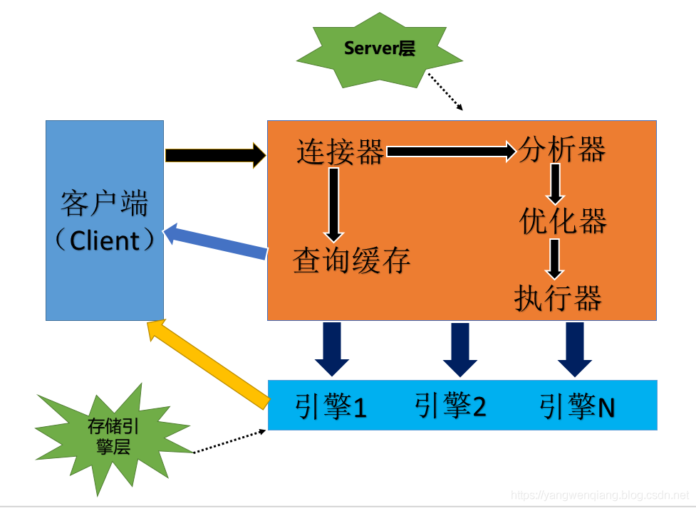

#### 1.2 基本操作

- 安装

  ```shell
  sudo apt-get install mysql-server mysql-client -y
  ```

- 启动、重启、关闭

  ```shell
  sudo /etc/init.d/mysql start|stop|restart
  ```

- 连接

  ```shell
  mysql -h127.0.0.1 -uroot -p #root用户默认密码为空
  ```

- ERROR 1698 (28000): Access denied for user 'root'@'localhost'问题解决

  ```shell
  # 查看/etc/mysql/debian.cnf
  sudo vim /etc/mysql/debian.cnf
  ###########################################################
  # Automatically generated for Debian scripts. DO NOT TOUCH!
  [client]
  host     = localhost
  user     = debian-sys-maint # 记住这两项
  password = 5VRSokq1P0uQ2S39 # 记住这两项
  socket   = /var/run/mysqld/mysqld.sock
  [mysql_upgrade]
  host     = localhost
  user     = debian-sys-maint
  password = 5VRSokq1P0uQ2S39
  socket   = /var/run/mysqld/mysqld.sock
  ###########################################################
  mysql -udebian-sys-maint -p5VRSokq1P0uQ2S39
  # 登录MySQL成功后
  select user, plugin from mysql.user;
  update mysql.user set authentication_string=PASSWORD('123'), plugin='mysql_native_password' where user='root';
  flush privileges;
  ```

- 数据库操作

  ```sql
  # 创建数据库
  create database `test` default character set utf8;
  # 使用数据库
  use test;
  # 创建表
  create table user_info (
  	id int not null auto_increment,
  	`name` varchar(20),
  	`title` varchar(20),
  	primary key(id)
  )engine = InnoDB charset = utf8;
  # 增删查改
  insert into user_info(`name`, `title`)values('gongluck', 'test');
  select * from user_info;
  update user_info set `name`='test' where id = 1;
  delete from user_info where id = 1;
  ```

- 用户操作

  ```sql
  # 创建用户
  #CREATE USER username@host IDENTIFIED BY password;
  CREATE USER 'gongluck'@'%' IDENTIFIED BY '123';
  
  # 授权
  #GRANT privileges ON databasename.tablename TO 'username'@'host' WITH GRANT OPTION;
  #privileges：用户的操作权限，如SELECT，INSERT，UPDATE等，如果要授予所的权限则使用ALL
  GRANT SELECT, REPLICATION SLAVE, REPLICATION CLIENT ON *.* TO 'gongluck'@'%';
  GRANT ALL PRIVILEGES ON *.* TO 'gongluck'@'%';
  FLUSH PRIVILEGES;
  ```

#### 1.3 libmysql编程环境

- 安装

  ```shell
  sudo apt-get install libmysqlclient-dev -y
  ```

- [头文件（/usr/include/mysql/mysql.h）](./code/mysql/mysql.h)

  <details>
  <summary>mysql.h</summary>
  
  ```C
  /* Copyright (c) 2000, 2018, Oracle and/or its affiliates. All rights reserved.
  
     This program is free software; you can redistribute it and/or modify
     it under the terms of the GNU General Public License, version 2.0,
     as published by the Free Software Foundation.
  
     This program is also distributed with certain software (including
     but not limited to OpenSSL) that is licensed under separate terms,
     as designated in a particular file or component or in included license
     documentation.  The authors of MySQL hereby grant you an additional
     permission to link the program and your derivative works with the
     separately licensed software that they have included with MySQL.
  
     Without limiting anything contained in the foregoing, this file,
     which is part of C Driver for MySQL (Connector/C), is also subject to the
     Universal FOSS Exception, version 1.0, a copy of which can be found at
     http://oss.oracle.com/licenses/universal-foss-exception.
  
     This program is distributed in the hope that it will be useful,
     but WITHOUT ANY WARRANTY; without even the implied warranty of
     MERCHANTABILITY or FITNESS FOR A PARTICULAR PURPOSE.  See the
     GNU General Public License, version 2.0, for more details.
  
     You should have received a copy of the GNU General Public License
     along with this program; if not, write to the Free Software
     Foundation, Inc., 51 Franklin St, Fifth Floor, Boston, MA 02110-1301  USA */
  
  /*
    This file defines the client API to MySQL and also the ABI of the
    dynamically linked libmysqlclient.
  
    The ABI should never be changed in a released product of MySQL,
    thus you need to take great care when changing the file. In case
    the file is changed so the ABI is broken, you must also update
    the SHARED_LIB_MAJOR_VERSION in cmake/mysql_version.cmake
  */
  
  #ifndef _mysql_h
  #define _mysql_h
  
  #ifdef	__cplusplus
  extern "C" {
  #endif
  
  #ifndef MY_GLOBAL_INCLUDED                /* If not standard header */
  #ifndef MYSQL_ABI_CHECK
  #include <sys/types.h>
  #endif
  typedef char my_bool;
  #if !defined(_WIN32)
  #define STDCALL
  #else
  #define STDCALL __stdcall
  #endif
  
  #ifndef my_socket_defined
  #ifdef _WIN32
  #include <windows.h>
  #ifdef WIN32_LEAN_AND_MEAN
  #include <winsock2.h>
  #endif
  #define my_socket SOCKET
  #else
  typedef int my_socket;
  #endif /* _WIN32 */
  #endif /* my_socket_defined */
  #endif /* MY_GLOBAL_INCLUDED */
  
  #include "mysql_version.h"
  #include "mysql_com.h"
  #include "mysql_time.h"
  
  #include "my_list.h" /* for LISTs used in 'MYSQL' and 'MYSQL_STMT' */
  
  /* Include declarations of plug-in API */
  #include "mysql/client_plugin.h"
  
  extern unsigned int mysql_port;
  extern char *mysql_unix_port;
  
  #define CLIENT_NET_READ_TIMEOUT		365*24*3600	/* Timeout on read */
  #define CLIENT_NET_WRITE_TIMEOUT	365*24*3600	/* Timeout on write */
  
  #define IS_PRI_KEY(n)	((n) & PRI_KEY_FLAG)
  #define IS_NOT_NULL(n)	((n) & NOT_NULL_FLAG)
  #define IS_BLOB(n)	((n) & BLOB_FLAG)
  /**
     Returns true if the value is a number which does not need quotes for
     the sql_lex.cc parser to parse correctly.
  */
  #define IS_NUM(t)	(((t) <= MYSQL_TYPE_INT24 && (t) != MYSQL_TYPE_TIMESTAMP) || (t) == MYSQL_TYPE_YEAR || (t) == MYSQL_TYPE_NEWDECIMAL)
  #define IS_LONGDATA(t) ((t) >= MYSQL_TYPE_TINY_BLOB && (t) <= MYSQL_TYPE_STRING)
  
  
  typedef struct st_mysql_field {
    char *name;                 /* Name of column */
    char *org_name;             /* Original column name, if an alias */
    char *table;                /* Table of column if column was a field */
    char *org_table;            /* Org table name, if table was an alias */
    char *db;                   /* Database for table */
    char *catalog;	      /* Catalog for table */
    char *def;                  /* Default value (set by mysql_list_fields) */
    unsigned long length;       /* Width of column (create length) */
    unsigned long max_length;   /* Max width for selected set */
    unsigned int name_length;
    unsigned int org_name_length;
    unsigned int table_length;
    unsigned int org_table_length;
    unsigned int db_length;
    unsigned int catalog_length;
    unsigned int def_length;
    unsigned int flags;         /* Div flags */
    unsigned int decimals;      /* Number of decimals in field */
    unsigned int charsetnr;     /* Character set */
    enum enum_field_types type; /* Type of field. See mysql_com.h for types */
    void *extension;
  } MYSQL_FIELD;
  
  typedef char **MYSQL_ROW;		/* return data as array of strings */
  typedef unsigned int MYSQL_FIELD_OFFSET; /* offset to current field */
  
  #ifndef MY_GLOBAL_INCLUDED
  #if defined (_WIN32)
  typedef unsigned __int64 my_ulonglong;
  #else
  typedef unsigned long long my_ulonglong;
  #endif
  #endif
  
  #include "typelib.h"
  
  #define MYSQL_COUNT_ERROR (~(my_ulonglong) 0)
  
  /* backward compatibility define - to be removed eventually */
  #define ER_WARN_DATA_TRUNCATED WARN_DATA_TRUNCATED
  
  typedef struct st_mysql_rows {
    struct st_mysql_rows *next;		/* list of rows */
    MYSQL_ROW data;
    unsigned long length;
  } MYSQL_ROWS;
  
  typedef MYSQL_ROWS *MYSQL_ROW_OFFSET;	/* offset to current row */
  
  #include "my_alloc.h"
  
  typedef struct embedded_query_result EMBEDDED_QUERY_RESULT;
  typedef struct st_mysql_data {
    MYSQL_ROWS *data;
    struct embedded_query_result *embedded_info;
    MEM_ROOT alloc;
    my_ulonglong rows;
    unsigned int fields;
    /* extra info for embedded library */
    void *extension;
  } MYSQL_DATA;
  
  enum mysql_option 
  {
    MYSQL_OPT_CONNECT_TIMEOUT, MYSQL_OPT_COMPRESS, MYSQL_OPT_NAMED_PIPE,
    MYSQL_INIT_COMMAND, MYSQL_READ_DEFAULT_FILE, MYSQL_READ_DEFAULT_GROUP,
    MYSQL_SET_CHARSET_DIR, MYSQL_SET_CHARSET_NAME, MYSQL_OPT_LOCAL_INFILE,
    MYSQL_OPT_PROTOCOL, MYSQL_SHARED_MEMORY_BASE_NAME, MYSQL_OPT_READ_TIMEOUT,
    MYSQL_OPT_WRITE_TIMEOUT, MYSQL_OPT_USE_RESULT,
    MYSQL_OPT_USE_REMOTE_CONNECTION, MYSQL_OPT_USE_EMBEDDED_CONNECTION,
    MYSQL_OPT_GUESS_CONNECTION, MYSQL_SET_CLIENT_IP, MYSQL_SECURE_AUTH,
    MYSQL_REPORT_DATA_TRUNCATION, MYSQL_OPT_RECONNECT,
    MYSQL_OPT_SSL_VERIFY_SERVER_CERT, MYSQL_PLUGIN_DIR, MYSQL_DEFAULT_AUTH,
    MYSQL_OPT_BIND,
    MYSQL_OPT_SSL_KEY, MYSQL_OPT_SSL_CERT, 
    MYSQL_OPT_SSL_CA, MYSQL_OPT_SSL_CAPATH, MYSQL_OPT_SSL_CIPHER,
    MYSQL_OPT_SSL_CRL, MYSQL_OPT_SSL_CRLPATH,
    MYSQL_OPT_CONNECT_ATTR_RESET, MYSQL_OPT_CONNECT_ATTR_ADD,
    MYSQL_OPT_CONNECT_ATTR_DELETE,
    MYSQL_SERVER_PUBLIC_KEY,
    MYSQL_ENABLE_CLEARTEXT_PLUGIN,
    MYSQL_OPT_CAN_HANDLE_EXPIRED_PASSWORDS,
    MYSQL_OPT_SSL_ENFORCE,
    MYSQL_OPT_MAX_ALLOWED_PACKET, MYSQL_OPT_NET_BUFFER_LENGTH,
    MYSQL_OPT_TLS_VERSION,
    MYSQL_OPT_SSL_MODE,
    MYSQL_OPT_GET_SERVER_PUBLIC_KEY
  };
  
  /**
    @todo remove the "extension", move st_mysql_options completely
    out of mysql.h
  */
  struct st_mysql_options_extention; 
  
  struct st_mysql_options {
    unsigned int connect_timeout, read_timeout, write_timeout;
    unsigned int port, protocol;
    unsigned long client_flag;
    char *host,*user,*password,*unix_socket,*db;
    struct st_dynamic_array *init_commands;
    char *my_cnf_file,*my_cnf_group, *charset_dir, *charset_name;
    char *ssl_key;				/* PEM key file */
    char *ssl_cert;				/* PEM cert file */
    char *ssl_ca;					/* PEM CA file */
    char *ssl_capath;				/* PEM directory of CA-s? */
    char *ssl_cipher;				/* cipher to use */
    char *shared_memory_base_name;
    unsigned long max_allowed_packet;
    my_bool use_ssl;                              /* Deprecated ! Former use_ssl */
    my_bool compress,named_pipe;
    my_bool unused1;
    my_bool unused2;
    my_bool unused3;
    my_bool unused4;
    enum mysql_option methods_to_use;
    union {
      /*
        The ip/hostname to use when authenticating
        client against embedded server built with
        grant tables - only used in embedded server
      */
      char *client_ip;
  
      /*
        The local address to bind when connecting to
        remote server - not used in embedded server
      */
      char *bind_address;
    } ci;
    my_bool unused5;
    /* 0 - never report, 1 - always report (default) */
    my_bool report_data_truncation;
  
    /* function pointers for local infile support */
    int (*local_infile_init)(void **, const char *, void *);
    int (*local_infile_read)(void *, char *, unsigned int);
    void (*local_infile_end)(void *);
    int (*local_infile_error)(void *, char *, unsigned int);
    void *local_infile_userdata;
    struct st_mysql_options_extention *extension;
  };
  
  enum mysql_status 
  {
    MYSQL_STATUS_READY, MYSQL_STATUS_GET_RESULT, MYSQL_STATUS_USE_RESULT,
    MYSQL_STATUS_STATEMENT_GET_RESULT
  };
  
  enum mysql_protocol_type 
  {
    MYSQL_PROTOCOL_DEFAULT, MYSQL_PROTOCOL_TCP, MYSQL_PROTOCOL_SOCKET,
    MYSQL_PROTOCOL_PIPE, MYSQL_PROTOCOL_MEMORY
  };
  
  enum mysql_ssl_mode
  {
    SSL_MODE_DISABLED= 1, SSL_MODE_PREFERRED, SSL_MODE_REQUIRED,
    SSL_MODE_VERIFY_CA, SSL_MODE_VERIFY_IDENTITY
  };
  
  typedef struct character_set
  {
    unsigned int      number;     /* character set number              */
    unsigned int      state;      /* character set state               */
    const char        *csname;    /* collation name                    */
    const char        *name;      /* character set name                */
    const char        *comment;   /* comment                           */
    const char        *dir;       /* character set directory           */
    unsigned int      mbminlen;   /* min. length for multibyte strings */
    unsigned int      mbmaxlen;   /* max. length for multibyte strings */
  } MY_CHARSET_INFO;
  
  struct st_mysql_methods;
  struct st_mysql_stmt;
  
  typedef struct st_mysql
  {
    NET		net;			/* Communication parameters */
    unsigned char	*connector_fd;		/* ConnectorFd for SSL */
    char		*host,*user,*passwd,*unix_socket,*server_version,*host_info;
    char          *info, *db;
    struct charset_info_st *charset;
    MYSQL_FIELD	*fields;
    MEM_ROOT	field_alloc;
    my_ulonglong affected_rows;
    my_ulonglong insert_id;		/* id if insert on table with NEXTNR */
    my_ulonglong extra_info;		/* Not used */
    unsigned long thread_id;		/* Id for connection in server */
    unsigned long packet_length;
    unsigned int	port;
    unsigned long client_flag,server_capabilities;
    unsigned int	protocol_version;
    unsigned int	field_count;
    unsigned int 	server_status;
    unsigned int  server_language;
    unsigned int	warning_count;
    struct st_mysql_options options;
    enum mysql_status status;
    my_bool	free_me;		/* If free in mysql_close */
    my_bool	reconnect;		/* set to 1 if automatic reconnect */
  
    /* session-wide random string */
    char	        scramble[SCRAMBLE_LENGTH+1];
    my_bool unused1;
    void *unused2, *unused3, *unused4, *unused5;
  
    LIST  *stmts;                     /* list of all statements */
    const struct st_mysql_methods *methods;
    void *thd;
    /*
      Points to boolean flag in MYSQL_RES  or MYSQL_STMT. We set this flag 
      from mysql_stmt_close if close had to cancel result set of this object.
    */
    my_bool *unbuffered_fetch_owner;
    /* needed for embedded server - no net buffer to store the 'info' */
    char *info_buffer;
    void *extension;
  } MYSQL;
  
  
  typedef struct st_mysql_res {
    my_ulonglong  row_count;
    MYSQL_FIELD	*fields;
    MYSQL_DATA	*data;
    MYSQL_ROWS	*data_cursor;
    unsigned long *lengths;		/* column lengths of current row */
    MYSQL		*handle;		/* for unbuffered reads */
    const struct st_mysql_methods *methods;
    MYSQL_ROW	row;			/* If unbuffered read */
    MYSQL_ROW	current_row;		/* buffer to current row */
    MEM_ROOT	field_alloc;
    unsigned int	field_count, current_field;
    my_bool	eof;			/* Used by mysql_fetch_row */
    /* mysql_stmt_close() had to cancel this result */
    my_bool       unbuffered_fetch_cancelled;  
    void *extension;
  } MYSQL_RES;
  
  
  #if !defined(MYSQL_SERVER) && !defined(MYSQL_CLIENT)
  #define MYSQL_CLIENT
  #endif
  
  /*
    Set up and bring down the server; to ensure that applications will
    work when linked against either the standard client library or the
    embedded server library, these functions should be called.
  */
  int STDCALL mysql_server_init(int argc, char **argv, char **groups);
  void STDCALL mysql_server_end(void);
  
  /*
    mysql_server_init/end need to be called when using libmysqld or
    libmysqlclient (exactly, mysql_server_init() is called by mysql_init() so
    you don't need to call it explicitely; but you need to call
    mysql_server_end() to free memory). The names are a bit misleading
    (mysql_SERVER* to be used when using libmysqlCLIENT). So we add more general
    names which suit well whether you're using libmysqld or libmysqlclient. We
    intend to promote these aliases over the mysql_server* ones.
  */
  #define mysql_library_init mysql_server_init
  #define mysql_library_end mysql_server_end
  
  
  /*
    Set up and bring down a thread; these function should be called
    for each thread in an application which opens at least one MySQL
    connection.  All uses of the connection(s) should be between these
    function calls.
  */
  my_bool STDCALL mysql_thread_init(void);
  void STDCALL mysql_thread_end(void);
  
  /*
    Functions to get information from the MYSQL and MYSQL_RES structures
    Should definitely be used if one uses shared libraries.
  */
  
  my_ulonglong STDCALL mysql_num_rows(MYSQL_RES *res);
  unsigned int STDCALL mysql_num_fields(MYSQL_RES *res);
  my_bool STDCALL mysql_eof(MYSQL_RES *res);
  MYSQL_FIELD *STDCALL mysql_fetch_field_direct(MYSQL_RES *res,
  					      unsigned int fieldnr);
  MYSQL_FIELD * STDCALL mysql_fetch_fields(MYSQL_RES *res);
  MYSQL_ROW_OFFSET STDCALL mysql_row_tell(MYSQL_RES *res);
  MYSQL_FIELD_OFFSET STDCALL mysql_field_tell(MYSQL_RES *res);
  
  unsigned int STDCALL mysql_field_count(MYSQL *mysql);
  my_ulonglong STDCALL mysql_affected_rows(MYSQL *mysql);
  my_ulonglong STDCALL mysql_insert_id(MYSQL *mysql);
  unsigned int STDCALL mysql_errno(MYSQL *mysql);
  const char * STDCALL mysql_error(MYSQL *mysql);
  const char *STDCALL mysql_sqlstate(MYSQL *mysql);
  unsigned int STDCALL mysql_warning_count(MYSQL *mysql);
  const char * STDCALL mysql_info(MYSQL *mysql);
  unsigned long STDCALL mysql_thread_id(MYSQL *mysql);
  const char * STDCALL mysql_character_set_name(MYSQL *mysql);
  int          STDCALL mysql_set_character_set(MYSQL *mysql, const char *csname);
  
  MYSQL *		STDCALL mysql_init(MYSQL *mysql);
  my_bool		STDCALL mysql_ssl_set(MYSQL *mysql, const char *key,
  				      const char *cert, const char *ca,
  				      const char *capath, const char *cipher);
  const char *    STDCALL mysql_get_ssl_cipher(MYSQL *mysql);
  my_bool		STDCALL mysql_change_user(MYSQL *mysql, const char *user, 
  					  const char *passwd, const char *db);
  MYSQL *		STDCALL mysql_real_connect(MYSQL *mysql, const char *host,
  					   const char *user,
  					   const char *passwd,
  					   const char *db,
  					   unsigned int port,
  					   const char *unix_socket,
  					   unsigned long clientflag);
  int		STDCALL mysql_select_db(MYSQL *mysql, const char *db);
  int		STDCALL mysql_query(MYSQL *mysql, const char *q);
  int		STDCALL mysql_send_query(MYSQL *mysql, const char *q,
  					 unsigned long length);
  int		STDCALL mysql_real_query(MYSQL *mysql, const char *q,
  					unsigned long length);
  MYSQL_RES *     STDCALL mysql_store_result(MYSQL *mysql);
  MYSQL_RES *     STDCALL mysql_use_result(MYSQL *mysql);
  
  void        STDCALL mysql_get_character_set_info(MYSQL *mysql,
                             MY_CHARSET_INFO *charset);
  
  int STDCALL mysql_session_track_get_first(MYSQL *mysql,
                                            enum enum_session_state_type type,
                                            const char **data,
                                            size_t *length);
  int STDCALL mysql_session_track_get_next(MYSQL *mysql,
                                           enum enum_session_state_type type,
                                           const char **data,
                                           size_t *length);
  /* local infile support */
  
  #define LOCAL_INFILE_ERROR_LEN 512
  
  void
  mysql_set_local_infile_handler(MYSQL *mysql,
                                 int (*local_infile_init)(void **, const char *,
                              void *),
                                 int (*local_infile_read)(void *, char *,
  							unsigned int),
                                 void (*local_infile_end)(void *),
                                 int (*local_infile_error)(void *, char*,
  							 unsigned int),
                                 void *);
  
  void
  mysql_set_local_infile_default(MYSQL *mysql);
  
  int		STDCALL mysql_shutdown(MYSQL *mysql,
                                         enum mysql_enum_shutdown_level
                                         shutdown_level);
  int		STDCALL mysql_dump_debug_info(MYSQL *mysql);
  int		STDCALL mysql_refresh(MYSQL *mysql,
  				     unsigned int refresh_options);
  int		STDCALL mysql_kill(MYSQL *mysql,unsigned long pid);
  int		STDCALL mysql_set_server_option(MYSQL *mysql,
  						enum enum_mysql_set_option
  						option);
  int		STDCALL mysql_ping(MYSQL *mysql);
  const char *	STDCALL mysql_stat(MYSQL *mysql);
  const char *	STDCALL mysql_get_server_info(MYSQL *mysql);
  const char *	STDCALL mysql_get_client_info(void);
  unsigned long	STDCALL mysql_get_client_version(void);
  const char *	STDCALL mysql_get_host_info(MYSQL *mysql);
  unsigned long	STDCALL mysql_get_server_version(MYSQL *mysql);
  unsigned int	STDCALL mysql_get_proto_info(MYSQL *mysql);
  MYSQL_RES *	STDCALL mysql_list_dbs(MYSQL *mysql,const char *wild);
  MYSQL_RES *	STDCALL mysql_list_tables(MYSQL *mysql,const char *wild);
  MYSQL_RES *	STDCALL mysql_list_processes(MYSQL *mysql);
  int		STDCALL mysql_options(MYSQL *mysql,enum mysql_option option,
  				      const void *arg);
  int		STDCALL mysql_options4(MYSQL *mysql,enum mysql_option option,
                                         const void *arg1, const void *arg2);
  int             STDCALL mysql_get_option(MYSQL *mysql, enum mysql_option option,
                                           const void *arg);
  void		STDCALL mysql_free_result(MYSQL_RES *result);
  void		STDCALL mysql_data_seek(MYSQL_RES *result,
  					my_ulonglong offset);
  MYSQL_ROW_OFFSET STDCALL mysql_row_seek(MYSQL_RES *result,
  						MYSQL_ROW_OFFSET offset);
  MYSQL_FIELD_OFFSET STDCALL mysql_field_seek(MYSQL_RES *result,
  					   MYSQL_FIELD_OFFSET offset);
  MYSQL_ROW	STDCALL mysql_fetch_row(MYSQL_RES *result);
  unsigned long * STDCALL mysql_fetch_lengths(MYSQL_RES *result);
  MYSQL_FIELD *	STDCALL mysql_fetch_field(MYSQL_RES *result);
  MYSQL_RES *     STDCALL mysql_list_fields(MYSQL *mysql, const char *table,
  					  const char *wild);
  unsigned long	STDCALL mysql_escape_string(char *to,const char *from,
  					    unsigned long from_length);
  unsigned long	STDCALL mysql_hex_string(char *to,const char *from,
                                           unsigned long from_length);
  unsigned long STDCALL mysql_real_escape_string(MYSQL *mysql,
  					       char *to,const char *from,
  					       unsigned long length);
  unsigned long STDCALL mysql_real_escape_string_quote(MYSQL *mysql,
                   char *to, const char *from,
                   unsigned long length, char quote);
  void          STDCALL mysql_debug(const char *debug);
  void          STDCALL myodbc_remove_escape(MYSQL *mysql,char *name);
  unsigned int  STDCALL mysql_thread_safe(void);
  my_bool       STDCALL mysql_embedded(void);
  my_bool       STDCALL mysql_read_query_result(MYSQL *mysql);
  int           STDCALL mysql_reset_connection(MYSQL *mysql);
  
  /*
    The following definitions are added for the enhanced 
    client-server protocol
  */
  
  /* statement state */
  enum enum_mysql_stmt_state
  {
    MYSQL_STMT_INIT_DONE= 1, MYSQL_STMT_PREPARE_DONE, MYSQL_STMT_EXECUTE_DONE,
    MYSQL_STMT_FETCH_DONE
  };
  
  
  /*
    This structure is used to define bind information, and
    internally by the client library.
    Public members with their descriptions are listed below
    (conventionally `On input' refers to the binds given to
    mysql_stmt_bind_param, `On output' refers to the binds given
    to mysql_stmt_bind_result):
  
    buffer_type    - One of the MYSQL_* types, used to describe
                     the host language type of buffer.
                     On output: if column type is different from
                     buffer_type, column value is automatically converted
                     to buffer_type before it is stored in the buffer.
    buffer         - On input: points to the buffer with input data.
                     On output: points to the buffer capable to store
                     output data.
                     The type of memory pointed by buffer must correspond
                     to buffer_type. See the correspondence table in
                     the comment to mysql_stmt_bind_param.
  
    The two above members are mandatory for any kind of bind.
  
    buffer_length  - the length of the buffer. You don't have to set
                     it for any fixed length buffer: float, double,
                     int, etc. It must be set however for variable-length
                     types, such as BLOBs or STRINGs.
  
    length         - On input: in case when lengths of input values
                     are different for each execute, you can set this to
                     point at a variable containining value length. This
                     way the value length can be different in each execute.
                     If length is not NULL, buffer_length is not used.
                     Note, length can even point at buffer_length if
                     you keep bind structures around while fetching:
                     this way you can change buffer_length before
                     each execution, everything will work ok.
                     On output: if length is set, mysql_stmt_fetch will
                     write column length into it.
  
    is_null        - On input: points to a boolean variable that should
                     be set to TRUE for NULL values.
                     This member is useful only if your data may be
                     NULL in some but not all cases.
                     If your data is never NULL, is_null should be set to 0.
                     If your data is always NULL, set buffer_type
                     to MYSQL_TYPE_NULL, and is_null will not be used.
  
    is_unsigned    - On input: used to signify that values provided for one
                     of numeric types are unsigned.
                     On output describes signedness of the output buffer.
                     If, taking into account is_unsigned flag, column data
                     is out of range of the output buffer, data for this column
                     is regarded truncated. Note that this has no correspondence
                     to the sign of result set column, if you need to find it out
                     use mysql_stmt_result_metadata.
    error          - where to write a truncation error if it is present.
                     possible error value is:
                     0  no truncation
                     1  value is out of range or buffer is too small
  
    Please note that MYSQL_BIND also has internals members.
  */
  
  typedef struct st_mysql_bind
  {
    unsigned long	*length;          /* output length pointer */
    my_bool       *is_null;	  /* Pointer to null indicator */
    void		*buffer;	  /* buffer to get/put data */
    /* set this if you want to track data truncations happened during fetch */
    my_bool       *error;
    unsigned char *row_ptr;         /* for the current data position */
    void (*store_param_func)(NET *net, struct st_mysql_bind *param);
    void (*fetch_result)(struct st_mysql_bind *, MYSQL_FIELD *,
                         unsigned char **row);
    void (*skip_result)(struct st_mysql_bind *, MYSQL_FIELD *,
  		      unsigned char **row);
    /* output buffer length, must be set when fetching str/binary */
    unsigned long buffer_length;
    unsigned long offset;           /* offset position for char/binary fetch */
    unsigned long length_value;     /* Used if length is 0 */
    unsigned int	param_number;	  /* For null count and error messages */
    unsigned int  pack_length;	  /* Internal length for packed data */
    enum enum_field_types buffer_type;	/* buffer type */
    my_bool       error_value;      /* used if error is 0 */
    my_bool       is_unsigned;      /* set if integer type is unsigned */
    my_bool	long_data_used;	  /* If used with mysql_send_long_data */
    my_bool	is_null_value;    /* Used if is_null is 0 */
    void *extension;
  } MYSQL_BIND;
  
  
  struct st_mysql_stmt_extension;
  
  /* statement handler */
  typedef struct st_mysql_stmt
  {
    MEM_ROOT       mem_root;             /* root allocations */
    LIST           list;                 /* list to keep track of all stmts */
    MYSQL          *mysql;               /* connection handle */
    MYSQL_BIND     *params;              /* input parameters */
    MYSQL_BIND     *bind;                /* output parameters */
    MYSQL_FIELD    *fields;              /* result set metadata */
    MYSQL_DATA     result;               /* cached result set */
    MYSQL_ROWS     *data_cursor;         /* current row in cached result */
    /*
      mysql_stmt_fetch() calls this function to fetch one row (it's different
      for buffered, unbuffered and cursor fetch).
    */
    int            (*read_row_func)(struct st_mysql_stmt *stmt, 
                                    unsigned char **row);
    /* copy of mysql->affected_rows after statement execution */
    my_ulonglong   affected_rows;
    my_ulonglong   insert_id;            /* copy of mysql->insert_id */
    unsigned long	 stmt_id;	       /* Id for prepared statement */
    unsigned long  flags;                /* i.e. type of cursor to open */
    unsigned long  prefetch_rows;        /* number of rows per one COM_FETCH */
    /*
      Copied from mysql->server_status after execute/fetch to know
      server-side cursor status for this statement.
    */
    unsigned int   server_status;
    unsigned int	 last_errno;	       /* error code */
    unsigned int   param_count;          /* input parameter count */
    unsigned int   field_count;          /* number of columns in result set */
    enum enum_mysql_stmt_state state;    /* statement state */
    char		 last_error[MYSQL_ERRMSG_SIZE]; /* error message */
    char		 sqlstate[SQLSTATE_LENGTH+1];
    /* Types of input parameters should be sent to server */
    my_bool        send_types_to_server;
    my_bool        bind_param_done;      /* input buffers were supplied */
    unsigned char  bind_result_done;     /* output buffers were supplied */
    /* mysql_stmt_close() had to cancel this result */
    my_bool       unbuffered_fetch_cancelled;  
    /*
      Is set to true if we need to calculate field->max_length for 
      metadata fields when doing mysql_stmt_store_result.
    */
    my_bool       update_max_length;     
    struct st_mysql_stmt_extension *extension;
  } MYSQL_STMT;
  
  enum enum_stmt_attr_type
  {
    /*
      When doing mysql_stmt_store_result calculate max_length attribute
      of statement metadata. This is to be consistent with the old API, 
      where this was done automatically.
      In the new API we do that only by request because it slows down
      mysql_stmt_store_result sufficiently.
    */
    STMT_ATTR_UPDATE_MAX_LENGTH,
    /*
      unsigned long with combination of cursor flags (read only, for update,
      etc)
    */
    STMT_ATTR_CURSOR_TYPE,
    /*
      Amount of rows to retrieve from server per one fetch if using cursors.
      Accepts unsigned long attribute in the range 1 - ulong_max
    */
    STMT_ATTR_PREFETCH_ROWS
  };
  
  
  MYSQL_STMT * STDCALL mysql_stmt_init(MYSQL *mysql);
  int STDCALL mysql_stmt_prepare(MYSQL_STMT *stmt, const char *query,
                                 unsigned long length);
  int STDCALL mysql_stmt_execute(MYSQL_STMT *stmt);
  int STDCALL mysql_stmt_fetch(MYSQL_STMT *stmt);
  int STDCALL mysql_stmt_fetch_column(MYSQL_STMT *stmt, MYSQL_BIND *bind_arg, 
                                      unsigned int column,
                                      unsigned long offset);
  int STDCALL mysql_stmt_store_result(MYSQL_STMT *stmt);
  unsigned long STDCALL mysql_stmt_param_count(MYSQL_STMT * stmt);
  my_bool STDCALL mysql_stmt_attr_set(MYSQL_STMT *stmt,
                                      enum enum_stmt_attr_type attr_type,
                                      const void *attr);
  my_bool STDCALL mysql_stmt_attr_get(MYSQL_STMT *stmt,
                                      enum enum_stmt_attr_type attr_type,
                                      void *attr);
  my_bool STDCALL mysql_stmt_bind_param(MYSQL_STMT * stmt, MYSQL_BIND * bnd);
  my_bool STDCALL mysql_stmt_bind_result(MYSQL_STMT * stmt, MYSQL_BIND * bnd);
  my_bool STDCALL mysql_stmt_close(MYSQL_STMT * stmt);
  my_bool STDCALL mysql_stmt_reset(MYSQL_STMT * stmt);
  my_bool STDCALL mysql_stmt_free_result(MYSQL_STMT *stmt);
  my_bool STDCALL mysql_stmt_send_long_data(MYSQL_STMT *stmt, 
                                            unsigned int param_number,
                                            const char *data, 
                                            unsigned long length);
  MYSQL_RES *STDCALL mysql_stmt_result_metadata(MYSQL_STMT *stmt);
  MYSQL_RES *STDCALL mysql_stmt_param_metadata(MYSQL_STMT *stmt);
  unsigned int STDCALL mysql_stmt_errno(MYSQL_STMT * stmt);
  const char *STDCALL mysql_stmt_error(MYSQL_STMT * stmt);
  const char *STDCALL mysql_stmt_sqlstate(MYSQL_STMT * stmt);
  MYSQL_ROW_OFFSET STDCALL mysql_stmt_row_seek(MYSQL_STMT *stmt, 
                                               MYSQL_ROW_OFFSET offset);
  MYSQL_ROW_OFFSET STDCALL mysql_stmt_row_tell(MYSQL_STMT *stmt);
  void STDCALL mysql_stmt_data_seek(MYSQL_STMT *stmt, my_ulonglong offset);
  my_ulonglong STDCALL mysql_stmt_num_rows(MYSQL_STMT *stmt);
  my_ulonglong STDCALL mysql_stmt_affected_rows(MYSQL_STMT *stmt);
  my_ulonglong STDCALL mysql_stmt_insert_id(MYSQL_STMT *stmt);
  unsigned int STDCALL mysql_stmt_field_count(MYSQL_STMT *stmt);
  
  my_bool STDCALL mysql_commit(MYSQL * mysql);
  my_bool STDCALL mysql_rollback(MYSQL * mysql);
  my_bool STDCALL mysql_autocommit(MYSQL * mysql, my_bool auto_mode);
  my_bool STDCALL mysql_more_results(MYSQL *mysql);
  int STDCALL mysql_next_result(MYSQL *mysql);
  int STDCALL mysql_stmt_next_result(MYSQL_STMT *stmt);
  void STDCALL mysql_close(MYSQL *sock);
  
  
  /* status return codes */
  #define MYSQL_NO_DATA        100
  #define MYSQL_DATA_TRUNCATED 101
  
  #define mysql_reload(mysql) mysql_refresh((mysql),REFRESH_GRANT)
  
  #define HAVE_MYSQL_REAL_CONNECT
  
  #ifdef	__cplusplus
  }
  #endif
  
  #endif /* _mysql_h */
  ```
  </details>

- [例子代码](./code/mysql/mysql.c)

  <details>
  <summary>例子代码</summary>
  
  ```C
  MYSQL *conn;
  MYSQL_RES *res;
  MYSQL_ROW row;
  
  char server[] = "127.0.0.1";
  char user[] = "gongluck";
  char password[] = "123";
  char database[] = "test";
  
  conn = mysql_init(NULL);
  if (mysql_real_connect(conn, server, user, password, database, 0, NULL, 0))
  {
      printf("%s\n", mysql_error(conn));
  }
  
  char sql[128] = {0};
  sprintf(sql, "insert into user_info(`name`,title)values('gongluck', 'test');");
  if (mysql_query(conn, sql))
  {
      printf("%s\n", mysql_error(conn));
  }
  
  if (mysql_query(conn, "select * from user_info"))
  {
      printf("%s\n", mysql_error(conn));
  }
  
  res = mysql_use_result(conn);
  while ((row = mysql_fetch_row(res)) != NULL)
  {
       printf("%s\t", row[0]);
       printf("%s\t", row[1]);
       printf("%s\n", row[2]);
  }
  
  mysql_free_result(res);
  mysql_close(conn);
  ```
  </details>

### 2.MySQL事务、索引、存储引擎

#### 2.1 MySQL事务

- 在MySQL中只有使用了Innodb数据库引擎的数据库或表才支持事务。
- 事务处理可以用来维护数据库的完整性，保证成批的SQL语句要么全部执行，要么全部不执行。
- 事务用来管理insert,update,delete语句。 
- 事务四大特征： 
  - 原子性（Atomicity，或称不可分割性）
  - 一致性（Consistency）
  - 隔离性（Isolation，又称独立性）
  - 持久性（Durability）

- 按照锁的粒度把数据库锁分为行级锁(INNODB引擎)、表级锁(MYISAM引擎)和页级锁(BDB引擎 )。
  - 行级锁
    - 行级锁是Mysql中锁定粒度最细的一种锁，表示只针对当前操作的行进行加锁。
    - 行级锁能大大减少数据库操作的冲突。
    - 其加锁粒度最小，但加锁的开销也最大。
    - 行级锁分为共享锁和排他锁。 
    - 特点：开销大，加锁慢；会出现死锁；锁定粒度最小，发生锁冲突的概率最低，并发度也最高。
  - 表级锁
    - 表级锁是MySQL中锁定粒度最大的一种锁，表示对当前操作的整张表加锁，它实现简单，资源消耗较少，被大部分 MySQL引擎支持。
    - 最常使用的MYISAM与INNODB都支持表级锁定。
    - 表级锁定分为表共享读锁（共享锁）与表独占写锁 （排他锁）。 
    - 特点：开销小，加锁快；不会出现死锁；锁定粒度大，发出锁冲突的概率最高，并发度最低。 
  - 页级锁
    - 页级锁是MySQL中锁定粒度介于行级锁和表级锁中间的一种锁。
    - 表级锁速度快，但冲突多，行级冲突少，但速度慢。 所以取了折衷的页级，一次锁定相邻的一组记录。
    - BDB支持页级锁
    - 特点：开销和加锁时间界于表锁和行锁之间；会出现死锁；锁定粒度界于表锁和行锁之间，并发度一般。

#### 2.2 MySQL索引

- 根据存储分类
  - B-树索引
  - 哈希索引

- 根据用途分类
  - 普通索引
  - 唯一性索引
  - 主键索引
  - 空间索引
  - 全文索引

- 索引的实现原理
  - MyISAM引擎使用B+Tree作为索引结构，叶节点的data域存放的是数据记录的地址。
  - InnoDB也使用B+Tree作为索引结构，InnoDB的数据文件本身就是索引文件。

#### 2.3 MySQL存储引擎

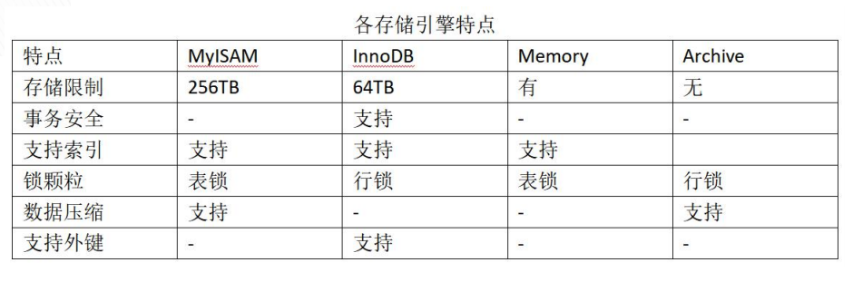

- 创建表指定存储引擎（默认InnoDB）

  ```sql
  CREATE TABLE `test`(`id` int(11) NOT NULL AUTO_INCREMENT) ENGINE = InnoDB; 
  ```

- 修改数据表命令

  ```sql
  alter table test engine = MyISAM;
  ```

- InnoDB

  - 所有的数据按照主键来组织。数据和索引放在一块，都位于B+数的叶子节点上

  - InnoDB存储引擎在磁盘中存放的对应的表的磁盘文件有*.frm*、*.ibd*这两个文件
  - frm文件是存放表结构，表的定义信息
  - ibd文件是存放表中的数据、索引信息

- MyISAM

  - 主键索引的叶子节点只存放数据在物理磁盘上的指针

  - MyISAM索引文件在数据库中存放的对应表的磁盘文件有*.frm*、*.MYD*、*.MYI*结尾的三个文件
  - frm文件是存放的表结构，表的定义信息
  - MYD文件是存放着表中的数据
  - MYI文件存放着表的索引信息

### 3.Nginx反向代理负载均衡配置

#### 3.1 安装编译

```shell
# 安装依赖
sudo apt-get update
sudo apt-get install build-essential libtool -y
sudo apt-get install libpcre3 libpcre3-dev -y
sudo apt-get install zlib1g-dev -y
sudo apt-get install openssl -y
#下载nginx
wget http://nginx.org/download/nginx-1.19.0.tar.gz
tar zxvf nginx-1.19.0.tar.gz
cd nginx-1.19.0/
# 配置
./configure --prefix=/usr/local/nginx --with-http_ssl_module --with-http_realip_module --with-http_addition_module --with-http_gzip_static_module --with-http_secure_link_module --with-http_stub_status_module --with-stream --with-pcre #--with-zlib --with-openssl
# 编译
make -j 8
# 安装
sudo make install
# 启动
sudo /usr/local/nginx/sbin/nginx -c test.conf
# 停止
sudo /usr/local/nginx/sbin/nginx -s stop
# 重新加载配置文件
sudo /usr/local/nginx/sbin/nginx -s reload
```

#### 3.2 配置文件

```nginx
worker_processes 4;#工作进程数

events {
	worker_connections 1024;#单个工作进程可以允许同时建立外部连接的数量
}

#设定http服务器，利用它的反向代理功能提供负载均衡支持
http {
    #负载均衡配置
	upstream test {
        #upstream的负载均衡，weight是权重，可以根据机器配置定义权重。
        #weigth参数表示权值，权值越高被分配到的几率越大。
		server www.baidu.com weight=2;
		server www.163.com weight=1;
		server www.example7.com weight=1;
	}

	server {
		listen 8888;
		server_name localhost;
		
		client_max_body_size 100m;
		
        #反向代理
		location / {
#			root /usr/local/nginx/html/;
#			proxy_pass http://172.20.106.204;
			proxy_pass http://test;
			
#			proxy_redirect   off;
			proxy_set_header Host             www.example7.com;
#			proxy_set_header X-Real-IP        $remote_addr;
#			proxy_set_header X-Forwarded-For  $proxy_add_x_forwarded_for;
		}

		location /images/ {
			root /usr/local/nginx/;#访问/usr/local/nginx/images/
		}
		
		location ~ \.(mp3|mp4) {
			root /usr/local/nginx/media/;#访问/usr/local/nginx/media/
		}	
	}
}
```

### 4.HTTP和Restful

#### 4.1 Http

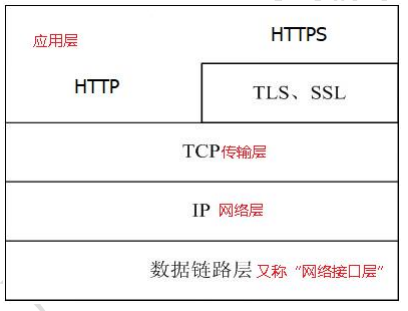

- HTTP协议，即超文本传输协议（Hypertext transfer protocol）。是一种详细规定了浏览器和万维网（WWW = World Wide Web）服务器之间互相通信的规则，通过因特网传送万维网文档的数据传送协议，可以传输文本，图片，视频等。

- HTTP协议作为TCP/IP模型中应用层的协议也不例外。HTTP 协议通常承载于TCP协议之 上，有时也承载于TLS或SSL协议层之上，这个时候，就成了我们常说的HTTPS。

- HTTP默认的端口号为 80，HTTPS的端口号为443。

- HTTP0.9和1.0使用非持续连接：限制每次连接只处理一个请求，服务器处理完客户的请求，并收到客户的应答后，即断开连接。HTTP1.1使用持续连接：不必为每个web对象创建一个新的连接，一个连接可以传送多个对象，采用这种方式可以节省传输时间。

- HTTP是媒体独立的：这意味着，只要客户端和服务器知道如何处理的数据内容，任何类型的数据都可以通过HTTP发 送。客户端以及服务器指定使用适合的MIME-type内容类型。 

- HTTP是无状态：HTTP协议是无状态协议。无状态是指协议对于事务处理没有记忆能力。缺少状态意味着如果后续处 理需要前面的信息，则它必须重传，这样可能导致每次连接传送的数据量增大。另一方面，在服务器不需要先前信息时它的应答就较快。

- HTTP1.0定义了三种请求方法: GET、POST和HEAD方法。

- HTTP1.1新增了六种请求方法: OPTIONS、PUT、PATCH、DELETE、TRACE和CONNECT方法。

  |  方法   |                             描述                             |
  | :-----: | :----------------------------------------------------------: |
  |   GET   |             请求指定的页面信息，并返回实体主体。             |
  |  HEAD   | 类似于GET请求，只不过返回的响应中没有具体的内容，用于获取报头。 |
  |  POST   | 向指定资源提交数据进行处理请求（例如提交表单或者上传文件）。 数据被包含在请求体中。POST请求可能会导致新的资源的建立和/或已有资源的修改。 |
  |   PUT   |       从客户端向服务器传送的数据取代指定的文档的内容。       |
  | DELETE  |                  请求服务器删除指定的页面。                  |
  | CONNECT |   HTTP/1.1协议中预留给能够将连接改为管道方式的代理服务器。   |
  | OPTIONS |                 允许客户端查看服务器的性能。                 |
  |  TRACE  |          回显服务器收到的请求，主要用于测试或诊断。          |
  |  PATCH  |      是对 PUT 方法的补充，用来对已知资源进行局部更新。       |


- HTTP响应头信息

  |      应答头      |                             说明                             |
  | :--------------: | :----------------------------------------------------------: |
  |      Allow       |          服务器支持哪些请求方法（如GET、POST等）。           |
  | Content-Encoding | 文档的编码（Encode）方法。只有在解码之后才可以得到Content-Type头指定的内容类型。利用gzip压缩文档能够显著地减少HTML文档的下载时间。 |
  |  Content-Length  |                        表示内容长度。                        |
  |   Content-Type   | 表示后面的文档属于什么MIME类型。Servlet默认为text/plain，但通常需要显式 地指定为text/html。 |
  |     Location     |                表示客户应当到哪里去提取文档。                |
  |    Set-Cookie    |                   设置和页面关联的Cookie。                   |

#### 4.2 Restful

- REST全称是Representational State Transfer，中文意思是表述（编者注：通常译为表征）性状态转移。 它首次出现在2000年Roy Fielding的博士论文中，Roy Fielding是HTTP规范的主要编写者之一。 他在论文中提到："我这篇文章的写作目的，就是想在符合架构原理的前提下，理解和评估以网络为基础的应用软件的架构设计，得到一个功能强、性能好、适宜通信的架构。REST指的是一组架构约束条件和原则。" 如果一个架构符合REST的约束条件和原则，我们就称它为RESTful架构。
- REST本身并没有创造新的技术、组件或服务，而隐藏在RESTful背后的理念就是使用Web的现有特征和能力，更好地使用现有Web标准中的一些准则和约束。虽然REST本身受Web技术的影响很深，但是理论上REST架构风格并不是绑定在HTTP上，只不过目前HTTP是唯一与REST相关的实例。所以我们这里描述的REST也是通过HTTP实现的REST。
- RESTful架构应该遵循统一接口原则，统一接口包含了一组受限的预定义的操作，不论什么样的资源，都是通过使用相同的接口进行资源的访问。接口应该使用标准的HTTP方法如GET，PUT和POST，并遵循这些方法的语义。
- 如果按照HTTP方法的语义来暴露资源，那么接口将会拥有安全性和幂等性的特性，例如GET和HEAD请求都是安全的，无论请求多少次，都不会改变服务器状态。而GET、HEAD、PUT和DELETE请求都是幂等的，无论对资源操作多少次，结果总是一样的，后面的请求并不会产生比第一次更多的影响。

### 5.Redis操作和编程

#### 5.1 Redis操作

- REmote DIctionary Server（Redis）是一个由Salvatore Sanfilippo写的key-value存储系统。Redis是一个开源的使用ANSI C语言编写、遵守 BSD 协议、支持网络、可基于内存亦可持久化的日志型、Key-Value数据库，并提供多种语言的API。它通常被称为数据结构服务器，因为值（value）可以是字符串(String)、哈希(Hash)、列表(list)、集合(sets)和有序集合(sorted sets)等类型。

- 编译安装

  ```shell
  # 下载源码
  wget http://download.redis.io/releases/redis-6.0.0.tar.gz
  tar zxvf redis-6.0.0.tar.gz
  # 编译
  cd redis-6.0.0/
  make -j 8
  # 安装（默认安装到/usr/local/bin/目录）
  sudo make install
  ```

- 常用命令

  - 查看版本

    ```shell
    redis-server -v
    ```

  - 启动

    ```shell
    redis-server redis.conf
    ```

- redis-cli

  - 连接

    ```shell
    redis-cli -h 127.0.0.1 -p 6379 -a 123456
    ```

  - 停止服务

    ```shell
    redis-cli -h 127.0.0.1 -p 6379 shutdown
    ```

  - 内部命令

    |                 命令                 |                             说明                             |
    | :----------------------------------: | :----------------------------------------------------------: |
    |               DEL key                |               该命令用于在key存在时删除 key。                |
    |               DUMP key               |             序列化给定key，并返回被序列化的值。              |
    |              EXISTS key              |                    检查给定key是否存在。                     |
    |          EXPIRE key seconds          |               为给定key设置过期时间，以秒计。                |
    |        EXPIREAT key timestamp        | EXPIREAT的作用和EXPIRE类似，都用于为key设置过期时间。不同在于EXPIREAT命令接受的时间参数是UNIX时间戳(unix timestamp)。 |
    |       PEXPIRE key milliseconds       |                 设置key的过期时间以毫秒计。                  |
    | PEXPIREAT key milliseconds-timestamp |      设置key过期时间的时间戳(unix timestamp) 以毫秒计。      |
    |             KEYS pattern             |            查找所有符合给定模式( pattern)的key。             |
    |             MOVE key db              |         将当前数据库的key移动到给定的数据库db当中。          |
    |             PERSIST key              |              移除key的过期时间，key将持久保持。              |
    |               PTTL key               |            以毫秒为单位返回key的剩余的过期时间。             |
    |               TTL key                |  以秒为单位，返回给定key的剩余生存时间(TTL, time to live)。  |
    |              RANDOMKEY               |               从当前数据库中随机返回一个key。                |
    |          RENAME key newkey           |                       修改key的名称。                        |
    |         RENAMENX key newkey          |           仅当newkey不存在时，将key改名为newkey。            |
    |               TYPE key               |                  返回key所储存的值的类型。                   |

- redis基本数据结构

  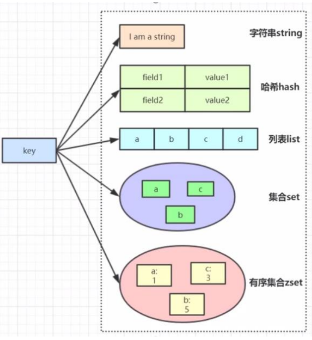

#### 5.2 hiredis编程

- 编译安装hiredis

  ```shell
  cd deps/hiredis
  make -j 8
  sudo make install
  sudo ldconfig
  ```

- [例子代码](./code/redis/hiredis.c)

  <details>
  <summary>例子代码</summary>

  ```C
  // 连接Redis服务
  redisContext *context = redisConnect("127.0.0.1", 6379);
  if (context == NULL || context->err)
  {
      if (context)
      {
          printf("%s\n", context->errstr);
      }
      else
      {
          printf("redisConnect error\n");
      }
      exit(EXIT_FAILURE);
  }
  printf("-----------------connect success--------------------\n");
  
  // REDIS_REPLY_STRING == 1 :返回值是字符串,字符串储存在redis->str当中,字符串长度为redis->len。
  // REDIS_REPLY_ARRAY == 2 :返回值是数组,数组大小存在redis->elements里面,数组值存储在redis->element[i]里面。数组里面存储的是指向redisReply的指针,数组里面的返回值可以通过redis->element[i]->str来访问,数组的结果里全是type==REDIS_REPLY_STRING的redisReply对象指针。
  // REDIS_REPLY_INTEGER == 3 :返回值为整数long long。
  // REDIS_REPLY_NIL == 4 :返回值为空表示执行结果为空。
  // REDIS_REPLY_STATUS == 5 :返回命令执行的状态,比如set foo bar返回的状态为OK,存储在str当中reply->str == "OK"。
  // REDIS_REPLY_ERROR == 6 :命令执行错误,错误信息存放在reply->str当中。
  
  // 授权
  redisReply *reply = redisCommand(context, "auth gongluck");
  printf("type : %d\n", reply->type);
  if (reply->type == REDIS_REPLY_STATUS)
  {
      printf("auth ok\n");
  }
  else if (reply->type == REDIS_REPLY_ERROR)
  {
      printf("auth err : %s\n", reply->str);
  }
  freeReplyObject(reply);
  
  // Set Key Value
  char *key = "str";
  char *val = "Hello World";
  reply = redisCommand(context, "SET %s %s", key, val);
  printf("type : %d\n", reply->type);
  if (reply->type == REDIS_REPLY_STATUS)
  {
      printf("SET %s %s\n", key, val);
  }
  freeReplyObject(reply);
  
  // GET Key
  reply = redisCommand(context, "GET %s", key);
  if (reply->type == REDIS_REPLY_STRING)
  {
      printf("GET str %s\n", reply->str);
      printf("GET len %ld\n", reply->len);
  }
  freeReplyObject(reply);
  
  // APPEND key value
  char *append = " I am your GOD";
  reply = redisCommand(context, "APPEND %s %s", key, append);
  if (reply->type == REDIS_REPLY_INTEGER)
  {
      printf("APPEND %s %s \n", key, append);
  }
  freeReplyObject(reply);
  
  reply = redisCommand(context, "GET %s", key);
  if (reply->type == REDIS_REPLY_STRING)
  {
      printf("GET %s\n", reply->str);
  }
  freeReplyObject(reply);
  
  // INCR key
  reply = redisCommand(context, "INCR counter");
  if (reply->type == REDIS_REPLY_INTEGER)
  {
      printf("INCR counter %lld\n", reply->integer);
  }
  freeReplyObject(reply);
  reply = redisCommand(context, "INCR counter");
  if (reply->type == REDIS_REPLY_INTEGER)
  {
      printf("INCR counter %lld\n", reply->integer);
  }
  freeReplyObject(reply);
  
  // DECR key
  reply = redisCommand(context, "DECR counter");
  if (reply->type == REDIS_REPLY_INTEGER)
  {
      printf("DECR counter %lld\n", reply->integer);
  }
  freeReplyObject(reply);
  reply = redisCommand(context, "DECR counter");
  if (reply->type == REDIS_REPLY_INTEGER)
  {
      printf("DECR counter %lld\n", reply->integer);
  }
  freeReplyObject(reply);
  
  // DECRBY key decrement
  reply = redisCommand(context, "DECRBY counter 5");
  if (reply->type == REDIS_REPLY_INTEGER)
  {
      printf("DECRBY counter %lld\n", reply->integer);
  }
  freeReplyObject(reply);
  reply = redisCommand(context, "DECRBY counter 5");
  if (reply->type == REDIS_REPLY_INTEGER)
  {
      printf("DECRBY counter %lld\n", reply->integer);
  }
  freeReplyObject(reply);
  
  // INCRBY key increment
  reply = redisCommand(context, "INCRBY counter 5");
  if (reply->type == REDIS_REPLY_INTEGER)
  {
      printf("INCRBY counter %lld\n", reply->integer);
  }
  freeReplyObject(reply);
  
  reply = redisCommand(context, "INCRBY counter 5");
  if (reply->type == REDIS_REPLY_INTEGER)
  {
      printf("INCRBY counter %lld\n", reply->integer);
  }
  freeReplyObject(reply);
  
  // GETRANGE key start end
  reply = redisCommand(context, "GETRANGE str 0 5");
  if (reply->type == REDIS_REPLY_STRING)
  {
      printf("GETRANGE %s %s\n", key, reply->str);
  }
  freeReplyObject(reply);
  
  // GETSET key value
  reply = redisCommand(context, "GETSET %s %s", key, val);
  if (reply->type == REDIS_REPLY_STRING)
  {
      printf("GETSET %s %s\n", key, reply->str);
  }
  freeReplyObject(reply);
  
  /*INCRBYFLOAT key increment*/
  reply = redisCommand(context, "INCRBYFLOAT f 2.1");
  if (reply->type == REDIS_REPLY_STRING)
  {
      printf("INCRBYFLOAT counter %s\n", reply->str);
  }
  freeReplyObject(reply);
  
  /*MSET key value [key value ...]*/
  reply = redisCommand(context, "MSET k1 hello k2 world k3 good");
  if (reply->type == REDIS_REPLY_STATUS)
  {
      printf("MSET k1 hello k2 world k3 good\n");
  }
  freeReplyObject(reply);
  
  /*MGET key [key ...]*/
  reply = redisCommand(context, "MGET k1 k2 k3");
  if (reply->type == REDIS_REPLY_ARRAY)
  {
      printf("MGET k1  k2  k3 \n");
      redisReply **pReply = reply->element;
      int i = 0;
      size_t len = reply->elements;
      //hello world good
      for (; i < len; ++i)
      {
          printf("%s ", pReply[i]->str);
      }
      printf("\n");
  }
  freeReplyObject(reply);
  
  /*STRLEN key*/
  reply = redisCommand(context, "STRLEN str");
  if (reply->type == REDIS_REPLY_INTEGER)
  {
      printf("STRLEN str %lld \n", reply->integer);
  }
  freeReplyObject(reply);
  
  /*SETEX key seconds value*/
  reply = redisCommand(context, "SETEX s 10 10seconds");
  if (reply->type == REDIS_REPLY_STATUS)
  {
      printf("SETEX s 10 10seconds\n");
      freeReplyObject(reply);
      int i = 0;
      while (i++ < 12)
      {
          reply = redisCommand(context, "GET s");
          if (reply->type == REDIS_REPLY_STRING)
          {
              printf("%d s %s\n", i, reply->str);
          }
          else if (reply->type == REDIS_REPLY_NIL)
          {
              printf("%d s nil\n", i);
          }
          freeReplyObject(reply);
          sleep(1);
      }
  }
  
  redisFree(context);
  return EXIT_SUCCESS;
  ```
  </details>
  

### 6.MongoDB操作和编程

#### 6.1 MongoDB操作

- MongoDB概念

  | SQL术语/概念 | MongoDB术语/概念 |              解释/说明               |
  | :----------: | :--------------: | :----------------------------------: |
  |   database   |     database     |                数据库                |
  |    table     |    collection    |            数据库表/集合             |
  |     row      |     document     |           数据记录行/文档            |
  |    column    |      field       |             数据字段/域              |
  |    index     |      index       |                 索引                 |
  | table joins  |        -         |        表连接，MongoDB不支持         |
  | primary key  |   primary key    | 主键，MongoDB自动将_id字段设置为主键 |

- 安装MongoDB

  ```shell
  wget https://fastdl.mongodb.org/linux/mongodb-linux-x86_64-ubuntu1804-4.4.1.tgz
  tar -zxvf mongodb-linux-x86_64-ubuntu1804-4.4.1.tgz 
  sudo mv mongodb-linux-x86_64-ubuntu1804-4.4.1 /usr/local/mongodb
  ```

- 启动MongoDB

  - MongoDB的数据存储在data目录的db目录下，但是这个目录在安装过程不会自动创建，所以需要手动创建data目录，并在data目录中创建db目录。

  - 可以在命令行中执行mongo安装目录中的bin目录执行mongod命令来启动mongdb服务。如果数据库目录不是/data/db，可以通过--dbpath来指定。

    ```shell
    /usr/local/mongodb/bin/mongod --dbpath=/data/db --bind_ip=0.0.0.0
    ```

- MongoDB后台管理

  - MongoDB Shell是MongoDB自带的交互式Javascript shell，用来对MongoDB进行操作和管理的交互式环境。它默认会链接到test文档（数据库）

    ```shell
    /usr/local/mongodb/bin/mongo
    ```

  - 显示所有数据的列表

    ```sql
    show dbs
    ```

  - 显示当前数据库对象或集合

    ```sql
    db
    ```

  - （创建）连接到一个指定的数据库。

    ```sql
    use gongluck
    ```

  - 插入数据

    ```sql
    db.gongluck.insert({"name":"gongluck"})
    ```

  - 删除当前数据库

    ```sql
    db.dropDatabase()
    ```

  - 创建集合

    ```sql
    db.createCollection("test")
    ```

  - 查看已有集合

    ```sql
    show collections
    ```

  - 删除集合

    ```sql
    db.test.drop()
    ```

  - 插入文档

    ```sql
    db.test.insert({"name":"gongluck","socre":100})
    ```

  - 查看已插入文档

    ```sql
    db.test.find().pretty()
    ```

  - 更新文档

    ```sql
    db.test.update({"name":"gongluck"}, {$set:{"name":"updated"}}, {multi:true})
    db.test.save({"_id":ObjectId("5fafd5407f51c6334abca881"),"name":"gongluck","socre":100})
    ```

  - 删除文档

    ```sql
    db.test.remove({"name":"gongluck"})
    db.test.remove()
    ```

  - 创建索引

    ```sql
    # 1:升序,-1:降序
    db.test.createIndex({"name":1,"score":-1})
    ```

#### 6.2 MongoDB编程

- 编译mongo-c-driver

  ```shell
  wget https://github.com/mongodb/mongo-c-driver/releases/download/1.17.2/mongo-c-driver-1.17.2.tar.gz
  tar -zxvf mongo-c-driver-1.17.2.tar.gz
  mongo-c-driver-1.17.2/
  mkdir cmake-build
  cd cmake-build
  cmake -DENABLE_AUTOMATIC_INIT_AND_CLEANUP=OFF ..
  cmake --build .
  sudo cmake --build . --target install
  ```

- [例子代码](./code/mongodb/mongodb.c)

  <details>
  <summary>例子代码</summary>
  
  ```C
  //gcc mongodb.c -I/usr/local/include/libmongoc-1.0 -I/usr/local/include/libbson-1.0/ -lmongoc-1.0 -lbson-1.0
  
  #include <bson.h>
  #include <mongoc.h>
  
  int main()
  {
      mongoc_client_t *client;
      mongoc_collection_t *collection;
      bson_t *insert;
      bson_error_t error;
  
      //初始化libmongoc驱动
      mongoc_init();
      
      //创建连接对象
      client = mongoc_client_new("mongodb://localhost:27017");
      
      //获取指定数据库和集合
      collection = mongoc_client_get_collection(client, "gongluck", "test");
      
      //字段为hello，值为world字符串
      insert = BCON_NEW("hello", BCON_UTF8("world"));
      
      //插入文档
      if (!mongoc_collection_insert(collection, MONGOC_INSERT_NONE, insert, NULL, &error))
      {
          fprintf(stderr, "%s\n", error.message);
      }
      
      bson_destroy(insert);
      
      mongoc_collection_destroy(collection); //释放表对象
      mongoc_client_destroy(client);         //释放连接对象
      mongoc_cleanup();                      //释放libmongoc驱动
      return 0;
  }
  ```
  </details>

## 三、基础组件开发专栏

### 1.线程池原理与实现

#### 1.1 线程池工作流程

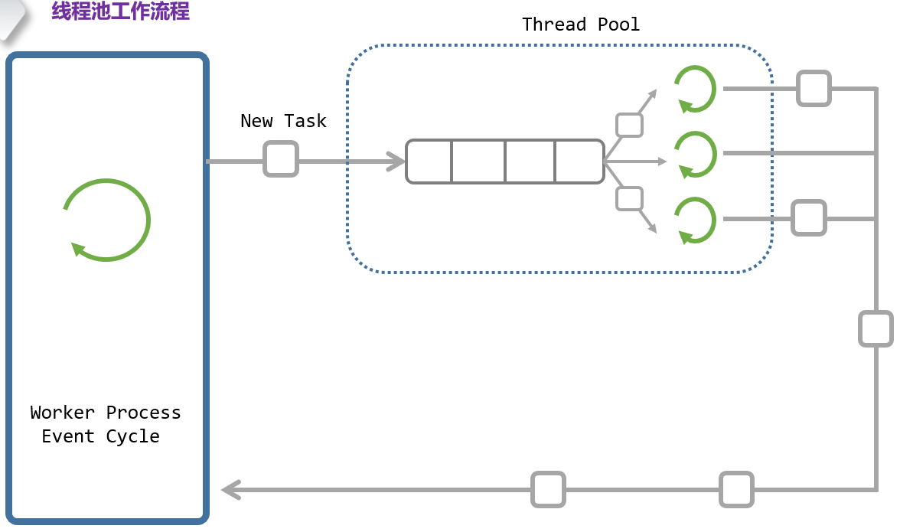

#### 1.2 线程池实现

- [线程池实现代码](./code/threadpool/threadpool.c)

  <details>
  <summary>线程池实现代码</summary>
  
  ```C
  #include <pthread.h>
  
  // 添加队列节点
  #define LL_ADD(item, list) \
      do                     \
      {                      \
          item->prev = NULL; \
          item->next = list; \
          list = item;       \
      } while (0)
  
  // 移除队列节点
  #define LL_REMOVE(item, list)              \
      do                                     \
      {                                      \
          if (item->prev != NULL)            \
              item->prev->next = item->next; \
          if (item->next != NULL)            \
              item->next->prev = item->prev; \
          if (list == item)                  \
              list = item->next;             \
          item->prev = item->next = NULL;    \
      } while (0)
  
  // 工作线程
  typedef struct WORKER
  {
      pthread_t thread;
      int terminate;
      struct WORKQUEUE *workqueue;
      struct WORKER *prev;
      struct WORKER *next;
  } Worker;
  
  // 工作任务
  typedef struct JOB
  {
      void (*job_function)(struct JOB *job);
      void *user_data;
      struct JOB *prev;
      struct JOB *next;
  } Job;
  
  // 工作调度
  typedef struct WORKQUEUE
  {
      struct WORKER *workers;
      struct JOB *waiting_jobs;
      pthread_mutex_t jobs_mtx;
      pthread_cond_t jobs_cond;
  } WorkQueue;
  
  typedef WorkQueue ThreadPool;
  
  // 工作线程回调函数
  static void *WorkerThread(void *ptr)
  {
      Worker *worker = (Worker *)ptr;
  
      while (1)
      {
          pthread_mutex_lock(&worker->workqueue->jobs_mtx);
  
          while (worker->workqueue->waiting_jobs == NULL)
          {
              if (worker->terminate)
                  break;
              pthread_cond_wait(&worker->workqueue->jobs_cond, &worker->workqueue->jobs_mtx);
          }
  
          if (worker->terminate)
          {
              pthread_mutex_unlock(&worker->workqueue->jobs_mtx);
              break;
          }
  
          Job *job = worker->workqueue->waiting_jobs;
          if (job != NULL)
          {
              LL_REMOVE(job, worker->workqueue->waiting_jobs);
          }
  
          pthread_mutex_unlock(&worker->workqueue->jobs_mtx);
  
          if (job == NULL)
              continue;
  
          job->job_function(job);
      }
  
      free(worker);
      pthread_exit(NULL);
  }
  
  // 创建线程池
  int ThreadPoolCreate(ThreadPool *workqueue, int numWorkers)
  {
      if (numWorkers < 1)
          numWorkers = 1;
      memset(workqueue, 0, sizeof(ThreadPool));
  
      pthread_mutex_init(&workqueue->jobs_mtx, NULL);
      pthread_cond_init(&workqueue->jobs_cond, NULL);
  
      for (int i = 0; i < numWorkers; i++)
      {
          Worker *worker = (Worker *)malloc(sizeof(Worker));
          if (worker == NULL)
          {
              perror("malloc");
              return 1;
          }
  
          memset(worker, 0, sizeof(Worker));
          worker->workqueue = workqueue;
  
          int ret = pthread_create(&worker->thread, NULL, WorkerThread, (void *)worker);
          if (ret)
          {
              perror("pthread_create");
              free(worker);
              return 1;
          }
  
          LL_ADD(worker, worker->workqueue->workers);
      }
  
      return 0;
  }
  
  // 终止线程池
  void ThreadPoolShutdown(ThreadPool *workqueue)
  {
      for (Worker *worker = workqueue->workers; worker != NULL; worker = worker->next)
      {
          worker->terminate = 1;
      }
  
      pthread_mutex_lock(&workqueue->jobs_mtx);
  
      workqueue->workers = NULL;
      workqueue->waiting_jobs = NULL;
  
      pthread_cond_broadcast(&workqueue->jobs_cond);
  
      pthread_mutex_unlock(&workqueue->jobs_mtx);
  }
  
  // 添加任务
  void ThreadPoolQueue(ThreadPool *workqueue, Job *job)
  {
      pthread_mutex_lock(&workqueue->jobs_mtx);
  
      LL_ADD(job, workqueue->waiting_jobs);
  
      pthread_cond_signal(&workqueue->jobs_cond);
      pthread_mutex_unlock(&workqueue->jobs_mtx);
  }
  ```
  </details>

### 2.CAS和无锁队列

#### 2.1 CAS

- 比较并交换（compare and swap，CAS），是**原⼦操作**的⼀种，可⽤于在多线程编程中实现不被打断的数据交换操作，从而避免多线程同时改写某⼀数据时由于执行顺序不确定性以及中断的不可预知性产⽣的数据不一致问题有了CAS，我们就可以用它来实现各种无锁（lock free）的数据结构。

- 该操作通过将内存中的值与指定数据进行比较，当数值⼀样时将内存中的数据替换为新的值。

  ```C
  int compare_and_swap(int *reg, int oldval, int newval)
  {
      int old_ref_val = *reg;
      if(old_reg_val == oldval)//compare
          *reg = newval;//swap
      return old_reg_val;
  }
  ```

- gcc/g++中的CAS

  ```C
  bool __sync_bool_compare_and_swap(type *ptr, type oldval type newval, ...);
  type __sync_val_compare_and_swap(type *ptr, type oldval type newval, ...);
  ```

- Windows的CAS

  ```C
  InterlockedCompareExchange(__inout LONG volatile  *Target, __in LONG Exchange, __in LONG Comperand);
  ```

- C++11标准库的CAS

  ```C
  template< class T >
  bool atomic_compare_exchange_weak(std::atomic<T>* obj, T* expected, T desired);
  template< class T >
  bool atomic_compare_exchange_weak(volatile std::atomic<T>* obj, T* expected, T desired );
  ```

#### 2.2 无锁队列

- [无锁队列代码](./code/cas/cas.h)

  <details>
  <summary>无锁队列代码</summary>
  
  ```C
  /*
   * @Author: gongluck 
   * @Date: 2020-11-16 16:02:56 
   * @Last Modified by:   gongluck 
   * @Last Modified time: 2020-11-16 16:02:56 
   */
  
  template <typename ElemType>
  class Queue
  {
  public:
      Queue();
      ~Queue();
  
  public:
      void push(ElemType elem);
      bool pop();
      void show();
  
  private:
      struct _qNode
      {
          _qNode() : _next(nullptr) {}
          _qNode(ElemType elem) : _elem(elem), _next(nullptr) {}
          ElemType _elem;
          struct _qNode *_next;
      };
  
  private:
      struct _qNode *_head;
      struct _qNode *_tail;
  };
  
  template <typename ElemType>
  Queue<ElemType>::Queue()
  {
      _head = _tail = new _qNode();
  }
  
  template <typename ElemType>
  Queue<ElemType>::~Queue()
  {
      while (_head != nullptr)
      {
          struct _qNode *tempNode = _head;
          _head = _head->_next;
          delete tempNode;
      }
  }
  
  template <typename ElemType>
  void Queue<ElemType>::push(ElemType elem)
  {
      struct _qNode *newNode = new struct _qNode(elem);
      struct _qNode *oldp = _tail;
      while (!__sync_bool_compare_and_swap(&_tail->_next, nullptr, newNode))
          ;
      __sync_bool_compare_and_swap(&_tail, oldp, newNode);
  }
  
  template <typename ElemType>
  bool Queue<ElemType>::pop()
  {
      struct _qNode *p;
      do
      {
          p = _head;
          if (p->_next == nullptr)
              return false;
      } while (!__sync_bool_compare_and_swap(&_head, p, p->_next));
      delete p;
      return true;
  }
  ```
  </details>
  

### 3.内存池

#### 3.1 Nginx内存池结构

- Nginx内存池结构

  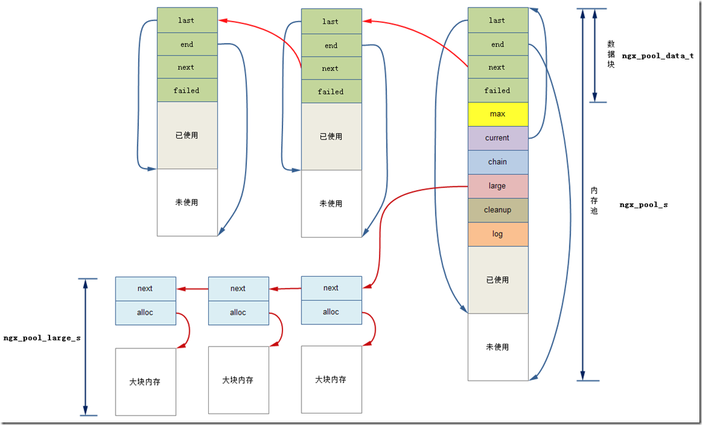

- nginx对内存的管理分为大内存与小内存，当某一个申请的内存大于某一个值时，就需要从大内存中分配空间，否则从小内存中分配空间。

- nginx中的内存池是在创建的时候就设定好了大小，在以后分配小块内存的时候，如果内存不够，则是重新创建一块内存串到内存池中，而不是将原有的内存池进行扩张。当要分配大块内存是，则是在内存池外面再分配空间进行管理的，称为大块内存池。

- Nginx内存池中大内存块和小内存块的分配与释放是不一样的。使用内存池时，可以使用ngx_palloc进行分配，使用ngx_pfree释放。对于大内存，这样做是没有问题的，而对于小内存就不一样了，分配的小内存，不会进行释放。

#### 3.2 [Nginx内存池的实现](./code/mmpool/ngx_palloc.c)

<details>
<summary>Nginx内存池的实现</summary>


```C
ngx_pool_t *
ngx_create_pool(size_t size, ngx_log_t *log)
{
    ngx_pool_t  *p;

    p = ngx_memalign(NGX_POOL_ALIGNMENT, size, log);
    if (p == NULL) {
        return NULL;
    }

    p->d.last = (u_char *) p + sizeof(ngx_pool_t);//初始状态：last指向ngx_pool_t结构体之后数据取起始位置
    p->d.end = (u_char *) p + size;//end指向分配的整个size大小的内存的末尾
    p->d.next = NULL;
    p->d.failed = 0;

    size = size - sizeof(ngx_pool_t);
    p->max = (size < NGX_MAX_ALLOC_FROM_POOL) ? size : NGX_MAX_ALLOC_FROM_POOL;

    p->current = p;
    p->chain = NULL;
    p->large = NULL;
    p->cleanup = NULL;
    p->log = log;

    return p;
}


void
ngx_destroy_pool(ngx_pool_t *pool)
{
    ngx_pool_t          *p, *n;
    ngx_pool_large_t    *l;
    ngx_pool_cleanup_t  *c;

    //首先调用所有的数据清理函数
    for (c = pool->cleanup; c; c = c->next) {
        if (c->handler) {
            ngx_log_debug1(NGX_LOG_DEBUG_ALLOC, pool->log, 0,
                           "run cleanup: %p", c);
            c->handler(c->data);
        }
    }

#if (NGX_DEBUG)

    /*
     * we could allocate the pool->log from this pool
     * so we cannot use this log while free()ing the pool
     */

    for (l = pool->large; l; l = l->next) {
        ngx_log_debug1(NGX_LOG_DEBUG_ALLOC, pool->log, 0, "free: %p", l->alloc);
    }

    for (p = pool, n = pool->d.next; /* void */; p = n, n = n->d.next) {
        ngx_log_debug2(NGX_LOG_DEBUG_ALLOC, pool->log, 0,
                       "free: %p, unused: %uz", p, p->d.end - p->d.last);

        if (n == NULL) {
            break;
        }
    }

#endif

    //释放所有的大块内存
    for (l = pool->large; l; l = l->next) {
        if (l->alloc) {
            ngx_free(l->alloc);
        }
    }

    //最后释放所有内存池中的内存块
    for (p = pool, n = pool->d.next; /* void */; p = n, n = n->d.next) {
        ngx_free(p);

        if (n == NULL) {
            break;
        }
    }
}


void
ngx_reset_pool(ngx_pool_t *pool)
{
    ngx_pool_t        *p;
    ngx_pool_large_t  *l;

    //释放所有大块内存
    for (l = pool->large; l; l = l->next) {
        if (l->alloc) {
            ngx_free(l->alloc);
        }
    }

    //重置所有小块内存区
    for (p = pool; p; p = p->d.next) {
        p->d.last = (u_char *) p + sizeof(ngx_pool_t);
        p->d.failed = 0;
    }

    pool->current = pool;
    pool->chain = NULL;
    pool->large = NULL;
}


void *
ngx_palloc(ngx_pool_t *pool, size_t size)
{
#if !(NGX_DEBUG_PALLOC)
    if (size <= pool->max) {
        return ngx_palloc_small(pool, size, 1);
    }
#endif

    return ngx_palloc_large(pool, size);
}


void *
ngx_pnalloc(ngx_pool_t *pool, size_t size)
{
#if !(NGX_DEBUG_PALLOC)
    if (size <= pool->max) {
        return ngx_palloc_small(pool, size, 0);
    }
#endif

    return ngx_palloc_large(pool, size);
}


static ngx_inline void *
ngx_palloc_small(ngx_pool_t *pool, size_t size, ngx_uint_t align)
{
    u_char      *m;
    ngx_pool_t  *p;

    p = pool->current;

    do {
        m = p->d.last;

        if (align) {
            m = ngx_align_ptr(m, NGX_ALIGNMENT);
        }

        if ((size_t) (p->d.end - m) >= size) {//如果在当前内存块有效范围内，进行内存指针的移动
            p->d.last = m + size;

            return m;
        }

        p = p->d.next;//如果当前内存块有效容量不够分配，则移动到下一个内存块进行分配

    } while (p);

    return ngx_palloc_block(pool, size);
}


static void *
ngx_palloc_block(ngx_pool_t *pool, size_t size)
{
    u_char      *m;
    size_t       psize;
    ngx_pool_t  *p, *new;

    psize = (size_t) (pool->d.end - (u_char *) pool);//计算内存池第一个内存块的大小

    m = ngx_memalign(NGX_POOL_ALIGNMENT, psize, pool->log);//分配和第一个内存块同样大小的内存块
    if (m == NULL) {
        return NULL;
    }

    new = (ngx_pool_t *) m;

    new->d.end = m + psize;//设置新内存块的end
    new->d.next = NULL;
    new->d.failed = 0;

    m += sizeof(ngx_pool_data_t);//将指针m移动到d后面的一个位置，作为起始位置
    m = ngx_align_ptr(m, NGX_ALIGNMENT);
    new->d.last = m + size;//设置新内存块的last，即申请使用size大小的内存

    //这里的循环用来找最后一个链表节点，这里failed用来控制循环的长度，如果分配失败次数达到5次，就忽略，不需要每次都从头找起
    for (p = pool->current; p->d.next; p = p->d.next) {
        if (p->d.failed++ > 4) {
            pool->current = p->d.next;
        }
    }

    p->d.next = new;

    return m;
}


static void *
ngx_palloc_large(ngx_pool_t *pool, size_t size)
{
    void              *p;
    ngx_uint_t         n;
    ngx_pool_large_t  *large;

    //直接在系统堆中分配一块空间
    p = ngx_alloc(size, pool->log);
    if (p == NULL) {
        return NULL;
    }

    n = 0;
    //查找到一个空的large区，如果有，则将刚才分配的空间交由它管理
    for (large = pool->large; large; large = large->next) {
        if (large->alloc == NULL) {
            large->alloc = p;
            return p;
        }

        if (n++ > 3) {
            break;
        }
    }

    //为了提高效率， 如果在三次内没有找到空的large结构体，则创建一个
    large = ngx_palloc_small(pool, sizeof(ngx_pool_large_t), 1);
    if (large == NULL) {
        ngx_free(p);
        return NULL;
    }

    large->alloc = p;
    large->next = pool->large;
    pool->large = large;

    return p;
}


void *
ngx_pmemalign(ngx_pool_t *pool, size_t size, size_t alignment)
{
    void              *p;
    ngx_pool_large_t  *large;

    p = ngx_memalign(alignment, size, pool->log);
    if (p == NULL) {
        return NULL;
    }

    large = ngx_palloc_small(pool, sizeof(ngx_pool_large_t), 1);
    if (large == NULL) {
        ngx_free(p);
        return NULL;
    }

    large->alloc = p;
    large->next = pool->large;
    pool->large = large;

    return p;
}


ngx_int_t
ngx_pfree(ngx_pool_t *pool, void *p)
{
    ngx_pool_large_t  *l;

    //只检查是否是大内存块，如果是大内存块则释放
    for (l = pool->large; l; l = l->next) {
        if (p == l->alloc) {
            ngx_log_debug1(NGX_LOG_DEBUG_ALLOC, pool->log, 0,
                           "free: %p", l->alloc);
            ngx_free(l->alloc);
            l->alloc = NULL;

            return NGX_OK;
        }
    }

    return NGX_DECLINED;
}
```
</details>

## 四、开源框架专题

### 1.字符编码和压缩

#### 1.1 字符编码

- ASCII（American Standard Code for Information Interchange），128个字符，用7位二进制表示（00000000-01111111即0x00-0x7F）;EASCII（Extended ASCII），256个字符，用8位二进制表示（00000000-11111111即0x00-0xFF）。当计算机传到了欧洲，国际标准化组织在ASCII的基础上进行了扩展，形成了ISO-8859标准，跟EASCII类似，兼容ASCII，在高128个码位上有所区别。但是由于欧洲的语言环境十分复杂，所以根据各地区的语言又形成了很多子标准，ISO-8859-1、ISO-8859- 2、ISO-8859-3、……、ISO-8859-16。

- 双字节编码可以是变长的，也就是说同一个编码里面有些字符是单字节表示，有些字符是双字节表示。这样做的好处是，一方面可以兼容ASCII，另一方面可以节省存储容量，代价就是会损失一部分码位。

  - GBK（Chinese Internal Code Specification汉字内码扩展规范）是GB2312的扩展（gbk编码能够用来同时表示繁体字和简体字），按理说都属于双字节编码，码位是一样的，根本谈不上扩展，但实际上是预留空间在起作用。
  - UNICODE字符集（国际标准字符集），它将世界各种语言的每个字符定义一个唯一的编码，以满足跨语言、跨平台的文本信息转换。有多个编码方式，分别是UTF-8，UTF-16，UTF-32编码。

- UTF是Unicode Transformation Format的缩写，意思是“Unicode转换格式”，后面的数字表明**至少**使用多少个比特位（Bit）来存储字符。

  - UFT-8：一种变长的编码方案，使用1~6个字节来存储；

    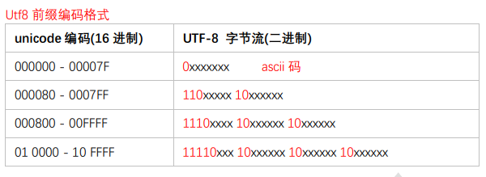

  - UFT-32：一种固定长度的编码方案，不管字符编号大小，直接存储Unicode编号，始终使用4个字节来存储；

  - UTF-16：介于UTF-8和UTF-32之间，使用2个或者4个字节来存储，长度既固定又可变。

    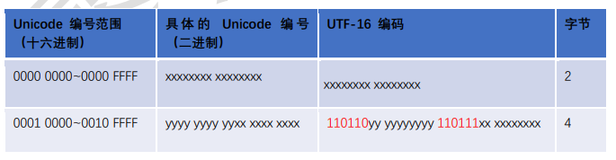

  - UTF格式在文件中的**固定文件头**

    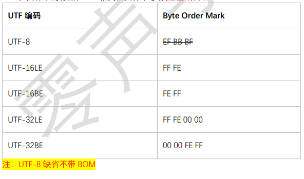

#### 1.2 libiconv字符编码转换库

- [libiconv例子](./code/convert/iconv.c)

  <details>
  <summary>libiconv例子</summary>
  
  ```C
  /*
   * @Author: gongluck 
   * @Date: 2020-11-18 07:52:34 
   * @Last Modified by: gongluck
   * @Last Modified time: 2020-11-18 09:14:11
   */
  
  #include <stdio.h>
  #include <stdlib.h>
  #include <iconv.h>
  
  int main()
  {
      iconv_t cd = iconv_open("GBK", "UTF-8"); //UTF8 -> GBK
      if (cd == (iconv_t)-1)
      {
          printf("iconv_open failed.\n");
          exit(-1);
      }
  
      char str[] = "iconv例子";
      char *pstr = str;
      size_t len = sizeof(str);
      char out[100] = {0};
      char *pout = out;
      size_t leftlen = sizeof(out);
      while (pstr-str < sizeof(str))
      {
          pout = out;
          leftlen = sizeof(out);
          int n = iconv(cd, &pstr, &len, &pout, &leftlen);
          //printf("iconv return %d\n", n);
          if (pout != out)//有转换成功字符
          {
              printf("%.*s", (int)(sizeof(out)-leftlen), out);
          }
          else
          {
              break;
          }
          
          if(n != -1)
          {
              pout = out;
  			leftlen = sizeof(out);
  			n = iconv(cd, NULL, NULL, &pout, &leftlen);
  			if (pout != out) // 检测iconv内部是否还有缓存
  			{
  				printf("%.*s", (int)(sizeof(out)-leftlen), out);
  			}
  			break;
          }
      }
      printf("\n");
      iconv_close(cd);
  
      return 0;
  }
  ```
  </details>

#### 1.3 zlib

- 编译安装zlib

  ```shell
  #下载
  wget http://www.zlib.net/zlib-1.2.11.tar.gz
  #解压
  tar -zxvf zlib-1.2.11.tar.gz
  #进入目录
  cd zlib-1.2.11
  #配置
  ./configure
  #编译
  make -j 8
  #检查
  make check
  #安装
  sudo make install
  ```

- [zlib例子](./code/zlib/zlib.c)

  <details>
  <summary>zlib例子</summary>
  
  ```C
  /*
   * @Author: gongluck 
   * @Date: 2020-11-18 17:02:24 
   * @Last Modified by: gongluck
   * @Last Modified time: 2020-11-18 17:05:37
   */
  
  // gcc zlib.c -lz
  // ./a.out < zlib.c > out
  // ./a.out -d < out > zlib.c
  
  #include <stdio.h>
  #include <string.h>
  #include <assert.h>
  #include "zlib.h"
  
  #if defined(MSDOS) || defined(OS2) || defined(WIN32) || defined(__CYGWIN__)
  #include <fcntl.h>
  #include <io.h>
  #define SET_BINARY_MODE(file) setmode(fileno(file), O_BINARY)
  #else
  #define SET_BINARY_MODE(file)
  #endif
  
  #define CHUNK 1024
  
  /* Compress from file source to file dest until EOF on source.
     def() returns Z_OK on success, Z_MEM_ERROR if memory could not be
     allocated for processing, Z_STREAM_ERROR if an invalid compression
     level is supplied, Z_VERSION_ERROR if the version of zlib.h and the
     version of the library linked do not match, or Z_ERRNO if there is
     an error reading or writing the files. */
  int def(FILE *source, FILE *dest, int level)
  {
      int ret, flush;
      unsigned have;
      z_stream strm;
      unsigned char in[CHUNK];
      unsigned char out[CHUNK];
  
      /* allocate deflate state */
      strm.zalloc = Z_NULL;
      strm.zfree = Z_NULL;
      strm.opaque = Z_NULL;
      ret = deflateInit(&strm, level);
      if (ret != Z_OK)
          return ret;
  
      /* compress until end of file */
      do
      {
          strm.avail_in = fread(in, 1, CHUNK, source);
          if (ferror(source))
          {
              (void)deflateEnd(&strm);
              return Z_ERRNO;
          }
          flush = feof(source) ? Z_FINISH : Z_NO_FLUSH;
          strm.next_in = in;
  
          /* run deflate() on input until output buffer not full, finish
             compression if all of source has been read in */
          do
          {
              strm.avail_out = CHUNK;
              strm.next_out = out;
              ret = deflate(&strm, flush);   /* no bad return value */
              assert(ret != Z_STREAM_ERROR); /* state not clobbered */
              have = CHUNK - strm.avail_out;
              if (fwrite(out, 1, have, dest) != have || ferror(dest))
              {
                  (void)deflateEnd(&strm);
                  return Z_ERRNO;
              }
          } while (strm.avail_out == 0);
          assert(strm.avail_in == 0); /* all input will be used */
  
          /* done when last data in file processed */
      } while (flush != Z_FINISH);
      assert(ret == Z_STREAM_END); /* stream will be complete */
  
      /* clean up and return */
      (void)deflateEnd(&strm);
      return Z_OK;
  }
  
  /* Decompress from file source to file dest until stream ends or EOF.
     inf() returns Z_OK on success, Z_MEM_ERROR if memory could not be
     allocated for processing, Z_DATA_ERROR if the deflate data is
     invalid or incomplete, Z_VERSION_ERROR if the version of zlib.h and
     the version of the library linked do not match, or Z_ERRNO if there
     is an error reading or writing the files. */
  int inf(FILE *source, FILE *dest)
  {
      int ret;
      unsigned have;
      z_stream strm;
      unsigned char in[CHUNK];
      unsigned char out[CHUNK];
  
      /* allocate inflate state */
      strm.zalloc = Z_NULL;
      strm.zfree = Z_NULL;
      strm.opaque = Z_NULL;
      strm.avail_in = 0;
      strm.next_in = Z_NULL;
      ret = inflateInit(&strm);
      if (ret != Z_OK)
          return ret;
  
      /* decompress until deflate stream ends or end of file */
      do
      {
          strm.avail_in = fread(in, 1, CHUNK, source);
          if (ferror(source))
          {
              (void)inflateEnd(&strm);
              return Z_ERRNO;
          }
          if (strm.avail_in == 0)
              break;
          strm.next_in = in;
  
          /* run inflate() on input until output buffer not full */
          do
          {
              strm.avail_out = CHUNK;
              strm.next_out = out;
              ret = inflate(&strm, Z_NO_FLUSH);
              assert(ret != Z_STREAM_ERROR); /* state not clobbered */
              switch (ret)
              {
              case Z_NEED_DICT:
                  ret = Z_DATA_ERROR; /* and fall through */
              case Z_DATA_ERROR:
              case Z_MEM_ERROR:
                  (void)inflateEnd(&strm);
                  return ret;
              }
              have = CHUNK - strm.avail_out;
              if (fwrite(out, 1, have, dest) != have || ferror(dest))
              {
                  (void)inflateEnd(&strm);
                  return Z_ERRNO;
              }
          } while (strm.avail_out == 0);
  
          /* done when inflate() says it's done */
      } while (ret != Z_STREAM_END);
  
      /* clean up and return */
      (void)inflateEnd(&strm);
      return ret == Z_STREAM_END ? Z_OK : Z_DATA_ERROR;
  }
  
  /* report a zlib or i/o error */
  void zerr(int ret)
  {
      fputs("zpipe: ", stderr);
      switch (ret)
      {
      case Z_ERRNO:
          if (ferror(stdin))
              fputs("error reading stdin\n", stderr);
          if (ferror(stdout))
              fputs("error writing stdout\n", stderr);
          break;
      case Z_STREAM_ERROR:
          fputs("invalid compression level\n", stderr);
          break;
      case Z_DATA_ERROR:
          fputs("invalid or incomplete deflate data\n", stderr);
          break;
      case Z_MEM_ERROR:
          fputs("out of memory\n", stderr);
          break;
      case Z_VERSION_ERROR:
          fputs("zlib version mismatch!\n", stderr);
      }
  }
  
  /* compress or decompress from stdin to stdout */
  int main(int argc, char **argv)
  {
      int ret;
  
      /* avoid end-of-line conversions */
      SET_BINARY_MODE(stdin);
      SET_BINARY_MODE(stdout);
  
      /* do compression if no arguments */
      if (argc == 1)
      {
          ret = def(stdin, stdout, Z_DEFAULT_COMPRESSION);
          if (ret != Z_OK)
              zerr(ret);
          return ret;
      }
  
      /* do decompression if -d specified */
      else if (argc == 2 && strcmp(argv[1], "-d") == 0)
      {
          ret = inf(stdin, stdout);
          if (ret != Z_OK)
              zerr(ret);
          return ret;
      }
  
      /* otherwise, report usage */
      else
      {
          fputs("zpipe usage: zpipe [-d] < source > dest\n", stderr);
          return 1;
      }
  }
  ```
  </details>

  

### 2.Json和Xml

#### 2.1 cJSON

- [cJSON例子](./code/json/cjson/test.c)

  <details>
  <summary>[cJSON例子](./code/json/cjson/test.c)</summary>

  ```C
  /*
   * @Author: gongluck 
   * @Date: 2020-11-18 21:27:47 
   * @Last Modified by: gongluck
   * @Last Modified time: 2020-11-18 21:41:36
   */

  // gcc *.c -lm

  #include <stdio.h>
  #include "cJSON.h"

  int main()
  {
      cJSON* root = cJSON_CreateObject();
      cJSON_AddBoolToObject(root, "bool", cJSON_False);
      cJSON_AddStringToObject(root, "str", "cJSON");
  
      char* str = cJSON_Print(root);
      printf("%s\n", str);
      cJSON_Delete(root);
      root = NULL;

      root = cJSON_Parse(str);
      cJSON* b = cJSON_GetObjectItem(root, "bool");
      if(b->type == cJSON_True || b->type == cJSON_False)
          printf("bool value : %d\n", b->type);
      cJSON* s = cJSON_GetObjectItem(root, "str");
      if(s->type == cJSON_String)
          printf("str value : %s\n", s->valuestring);
      cJSON_Delete(root);
      return 0;
  }
  ```
  </details>

#### 2.2 jsoncpp

- 编译安装

  ```shell
  # 下载
  git clone https://github.com/open-source-parsers/jsoncpp.git
  cd jsoncpp
  mkdir -p build/release
  cd build/release
  # 编译
  cmake -DCMAKE_BUILD_TYPE=release -DBUILD_STATIC_LIBS=ON -DBUILD_SHARED_LIBS=OFF -DCMAKE_INSTALL_INCLUDEDIR=include/jsoncpp -DARCHIVE_INSTALL_DIR=. -G "Unix Makefiles" ../..
  make
  # 安装
  sudo make install
  ```

- [jsoncpp例子](./code/json/jsoncpp/test.cpp)

  <details>
  <summary>[jsoncpp例子](./code/json/cjson/test.c)</summary>
  
  ```C++
  /*
   * @Author: gongluck 
   * @Date: 2020-11-19 09:40:21 
   * @Last Modified by: gongluck
   * @Last Modified time: 2020-11-19 09:46:42
   */
  
  // g++ test.cpp -ljsoncpp
  
  #include <iostream>
  #include <string>
  #include <jsoncpp/json/json.h>
  
  void readJson()
  {
      std::string strValue = "{\"name\":\"json\",\"array\":[{\"cpp\":\"jsoncpp\"},{\"java\":\"jsoninjava\"},{\"php\":\"support\"}]}";
  
      Json::Reader reader;
      Json::Value value;
  
      if (reader.parse(strValue, value))
      {
          std::string out = value["name"].asString();
          std::cout << out << std::endl;
          const Json::Value arrayObj = value["array"];
          for (unsigned int i = 0; i < arrayObj.size(); i++)
          {
              if (!arrayObj[i].isMember("cpp"))
                  continue;
              out = arrayObj[i]["cpp"].asString();
              std::cout << out;
              if (i != (arrayObj.size() - 1))
                  std::cout << std::endl;
          }
      }
  }
  
  void writeJson()
  {
      Json::Value root;
      Json::Value arrayObj;
      Json::Value item;
  
      item["cpp"] = "jsoncpp";
      item["java"] = "jsoninjava";
      item["php"] = "support";
      arrayObj.append(item);
  
      root["name"] = "json";
      root["array"] = arrayObj;
  
      root.toStyledString();
      std::string out = root.toStyledString();
      std::cout << out << std::endl;
  }
  
  int main(int argc, char **argv)
  {
      readJson();
      writeJson();
      return 0;
  }
  ```
  </details>
  

#### 2.3 TinyXML2

- 安装编译

  ```shell
  #下载 tinyxml2
  git clone https://github.com/leethomason/tinyxml2.git
  #进入相应目录并编译
  cd tinyxml2/
  cmake . 
  make -j 8
  #测试该版本的准确性
  ./xmltest
  #安装
  sudo make install
  ```

- [tinyxml2例子](./code/xml/tinyxml2/test.cpp)

  <details>
  <summary>[tinyxml2例子](./code/json/cjson/test.c)</summary>
  
  ```C++
  /*
   * @Author: gongluck 
   * @Date: 2020-11-19 17:11:24 
   * @Last Modified by: gongluck
   * @Last Modified time: 2020-11-19 17:27:23
   */
  
  // g++ test.cpp -ltinyxml2
  
  #include <iostream>
  #include "tinyxml2.h"
  
  int main(void)
  {
      const char *xml = "<?xml version=\"1.0\" encoding=\"UTF-8\"?>   \
                          <note>                      \
                              <to>beijing</to>             \
                              <from>shenzhen</from>           \
                              <heading>Reminder</heading> \
                              <body>Don't forget the meeting!</body> \
                          </note>";
      tinyxml2::XMLDocument doc;
      doc.Parse(xml);
      std::cout << doc.ErrorID() << std::endl;
  
      // 1. 第一种刷新到本地
      FILE *fp = fopen("memory_1.xml", "wb");
      tinyxml2::XMLPrinter printer(fp);
      doc.Print(&printer); // 打印到文件
      fclose(fp);
  
      // 2. 第二种刷新到本地
      doc.SaveFile("memory_2.xml");
  
      return 0;
  }
  ```
  </details>
  

### 3.ProtoBuf

#### 3.1 序列化和反序列化

- 序列化：把对象转换为字节序列的过程称为对象。

  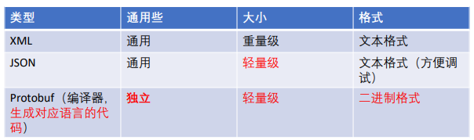

  - TLV编码及其变体（tag, length和value的缩写）：比如Protobuf。
  - 文本流编码：比如XML/JSON。
  - 固定结构编码：基本原理是，协议约定了传输字段类型和字段含义，和TLV的方式类似，但是没有了tag和len，只有value，比如TCP/IP。
  - 内存dump：把内存中的数据直接输出，不做任何序列化操作。反序列化的时候，直接还原内存。

- 反序列化：把字节序列恢复为对象的过程称为对象的反序列化。

#### 3.2 编译安装ProtoBuf

```shell
#下载源码
wget https://github.com/protocolbuffers/protobuf/archive/v3.1.0.tar.gz
tar -zxvf v3.1.0.tar.gz
cd protobuf-3.1.0/
#编译
./autogen.sh
./configure
make -j 8
make check
sudo make install
# refresh shared library cache.
sudo ldconfig
```

#### 3.3 [ProtoBuf例子](./code/protobuf)

```protobuf
/*
 * @Author: gongluck 
 * @Date: 2020-11-20 18:16:05 
 * @Last Modified by:   gongluck 
 * @Last Modified time: 2020-11-20 18:16:05 
 */
 
// protoc --cpp_out=./ addressbook.proto

syntax = "proto3";

package Test;

message Person
{
    string name = 1;
    int32 id = 2;
    string email = 3;

    enum PhoneType
    {
        MOBLIE = 0;//首成员必须为0
        HOME = 1;
        WORK = 2;
    }
    message PhoneNumber
    {
        string number = 1;
        PhoneType type = 2;
    }
    repeated PhoneNumber phones = 4;
}

message AddressBook
{
    repeated Person people = 1;
}
```

<details>
<summary>ProtoBuf例子</summary>

```C++
/*
 * @Author: gongluck 
 * @Date: 2020-11-20 17:23:22 
 * @Last Modified by: gongluck
 * @Last Modified time: 2020-11-20 18:14:44
 */

// g++ *.cc *.cpp `pkg-config --cflags --libs protobuf`

#include <iostream>
#include "addressbook.pb.h"

using namespace std;

int main()
{
    char buf[1024];
    int len;

    GOOGLE_PROTOBUF_VERIFY_VERSION;

    Test::Person obj;
    obj.set_name("gongluck");
    obj.set_id(1);
    *obj.mutable_email() = "https://github.com.cnpmjs.org/gongluck/CVIP";
    len = obj.ByteSize();
    cout << "len = " << len << endl;
    obj.SerializeToArray(buf, len);

    Test::Person obj2;
    obj2.ParseFromArray(buf, len);
    cout << "name = " << obj2.name() << endl;
    cout << "id = " << obj2.id() << endl;
    cout << "email = " << obj2.email() << endl;

    google::protobuf::ShutdownProtobufLibrary();

    return 0;
}
```
</details>

### 4.消息队列

#### 4.1 消息队列比较

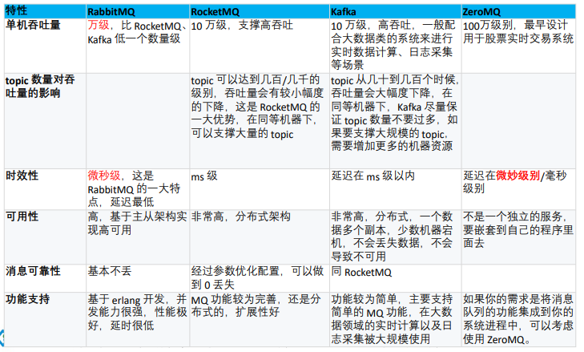

#### 4.2 zmq编译安装

```shell
#安装编译依赖
sudo apt-get install libtool pkg-config build-essential autoconf automake
#安装加密库
git clone git://github.com/jedisct1/libsodium.git
cd libsodium
./autogen.sh -s
./configure && make -j 8 && make check
sudo make install
sudo ldconfig
cd ..
#下载
git clone https://github.com/zeromq/libzmq.git
cd libzmq
#查看tag
#git tag
#版本 获取指定的版本
git checkout v4.3.2
./autogen.sh
./configure && make -j 8 && make check
sudo make install
sudo ldconfig
cd ..
```

#### 4.3 [zmq例子](./code/messagequeue/zmq)

- [服务端](./code/messagequeue/zmq/zmqserver.c)

  <details>
  <summary>服务端代码</summary>
  
  ```C
  /*
   * @Author: gongluck 
   * @Date: 2020-11-24 09:49:11 
   * @Last Modified by: gongluck
   * @Last Modified time: 2020-11-24 09:51:26
   */
  
  // gcc zmqserver.c -lzmq
  
  #include <zmq.h>
  #include <stdio.h>
  #include <unistd.h>
  #include <string.h>
  #include <assert.h>
  
  int main(void)
  {
      // Socket to talk to clients
      void *context = zmq_ctx_new();
      // 与客户端通信的套接字
      void *responder = zmq_socket(context, ZMQ_REP);
      int rc = zmq_bind(responder, "tcp://*:5555");
      assert(rc == 0);
  
      while (1)
      {
          // 等待客户端请求
          char buffer[10];
          zmq_recv(responder, buffer, 10, 0);
          printf("收到 %.*s\n", 10, buffer);
          // 返回应答
          zmq_send(responder, "RECVED", 6, 0);
      }
      return 0;
  }
  ```
  </details>

- [客户端](./code/messagequeue/zmq/zmqclient.c)

  <details>
  <summary>客户端代码</summary>
  
  ```C
  /*
   * @Author: gongluck 
   * @Date: 2020-11-24 09:52:58 
   * @Last Modified by: gongluck
   * @Last Modified time: 2020-11-24 09:56:14
   */
  
  //gcc zmqclient.c -lzmq
  
  #include <zmq.h>
  #include <string.h>
  #include <stdio.h>
  #include <unistd.h>
  
  int main(void)
  {
      printf("Connecting to zmq server...\n");
      void *context = zmq_ctx_new();
      // 连接⾄服务端的套接字
      void *requester = zmq_socket(context, ZMQ_REQ);
      zmq_connect(requester, "tcp://localhost:5555");
  
      char buffer[10];
      for (int request_nbr = 0; request_nbr != 10; request_nbr++)
      {  
          printf("正在发送 %d...\n", request_nbr);
          zmq_send(requester, "Hello", 5, 0);
          zmq_recv(requester, buffer, 10, 0);
          printf("接收到 %.*s\n", 10, buffer);
      }
      zmq_close(requester);
      zmq_ctx_destroy(context);
      return 0;
  }
  ```
  </details>

### 5.OpenSSL

#### 5.1 OpenSSL编译安装

```shell
wget https://www.openssl.org/source/old/1.1.0/openssl-1.1.0l.tar.gz
tar xzvf OpenSSL-1.1.0l.tar.gz
cd OpenSSL-1.1.0l
./config --prefix=/usr/local/OpenSSL
make -j 8
sudo make install
```

#### 5.2 [OpenSSL例子](./code/openssl/test.c)

<details>
<summary>OpenSSL例子</summary>

```C
/*
 * @Author: gongluck 
 * @Date: 2020-11-24 18:44:16 
 * @Last Modified by: gongluck
 * @Last Modified time: 2020-11-24 18:53:20
 */

// gcc test.c -lssl -lcrypto

#include <stdio.h>
#include <string.h>
#include <openssl/lhash.h>
#include <openssl/bio.h>
#include <openssl/evp.h>
#include <openssl/sha.h>
#include <openssl/rsa.h>

#define NAME_LENGTH 32

typedef struct _Person
{
    char name[NAME_LENGTH];
    int high;
    char otherInfo[NAME_LENGTH];
} Person;

// 自定义比较函数
static int person_cmp(const void *a, const void *b)
{
    char *namea = ((Person *)a)->name;
    char *nameb = ((Person *)b)->name;
    return strcmp(namea, nameb);
}

void print_value(void *a)
{
    Person *p = (Person *)a;
    printf("name: %s\n", p->name);
    printf("high: %d\n", p->high);
    printf("other info : %s\n", p->otherInfo);
}

int main()
{
    // hash
    OPENSSL_LHASH *h = lh_new(NULL, person_cmp);
    if (h == NULL)
    {
        printf("err.\n");
        return -1;
    }

    Person p1 = {"gongluck", 170, "xxxx"};
    Person p2 = {"ben", 175, "xxxx"};
    Person p3 = {"ken", 170, "xxxx"};
    Person p4 = {"dio", 170, "xxxx"};

    lh_insert(h, &p1);
    lh_insert(h, &p2);
    lh_insert(h, &p3);
    lh_insert(h, &p4);

    lh_doall(h, print_value);

    void *data = lh_retrieve(h, (const char *)"dio"); //person_cmp return 0
    if (data == NULL)
    {
        return -1;
    }

    print_value(data);
    lh_free(h);

    printf("\n------------------------------\n");

    //bio
    BIO *b = BIO_new(BIO_s_mem());
    int len = BIO_write(b, "OpenSSL", 4);
    len = BIO_printf(b, "%s", "gongluck");
    printf("len: %d\n", len);
    char *out = OPENSSL_malloc(len);
    len = BIO_read(b, out, len);
    printf("%s, len: %d\n", out, len);
    OPENSSL_free(out);
    BIO_free(b);

    printf("\nsocket bio\n");
    int sock = BIO_get_accept_socket("8899", 0);
    BIO *bsock = BIO_new_socket(sock, BIO_NOCLOSE);
    char *addr = NULL;
    int ret = BIO_accept(sock, &addr);
    BIO_set_fd(bsock, ret, BIO_NOCLOSE);
    while (1)
    {
        char out[128] = {0};
        BIO_read(bsock, out, 128);
        if (out[0] = 'q')
            break;
        printf("%s\n", out);
    }
    BIO_free(bsock);

    printf("\n------------------------------\n");

    //base64
    unsigned char in[30], base64[40], decode[30];
    EVP_ENCODE_CTX *ectx = EVP_ENCODE_CTX_new();
    EVP_EncodeInit(ectx);
    for (int i = 0; i < 30; i++)
    {
        in[i] = i;
    }
    int outl, inl = 30;
    EVP_EncodeUpdate(ectx, base64, &outl, in, inl);
    EVP_EncodeFinal(ectx, base64 + outl, &outl);
    EVP_ENCODE_CTX_free(ectx);
    printf("%40s\n", base64);

    printf("\n------------------------------\n");

    //rsa
    unsigned char inbuf[] = "https://github.com/gongluck/CVIP";
    unsigned char outbuf[128] = {0};
    int n = strlen(in);
    MD4(inbuf, n, outbuf);
    printf("MD4 result: \n"); // 16 byte
    for (int i = 0; i < 16; i++)
    {
        printf("%x", outbuf[i]);
    }
    printf("\n");
    MD5(inbuf, n, outbuf);
    printf("MD5 result: \n"); // 16 byte
    for (int i = 0; i < 16; i++)
    {
        printf("%x", outbuf[i]);
    }
    printf("\n");
    // SHA(inbuf, n, outbuf);
    // printf("SHA result: \n"); // 20 byte
    // for (int i = 0; i < 20; i++)
    // {
    //     printf("%x", outbuf[i]);
    // }
    // printf("\n");
    SHA1(inbuf, n, outbuf);
    printf("SHA1 result: \n"); // 20 byte
    for (int i = 0; i < 20; i++)
    {
        printf("%x", outbuf[i]);
    }
    printf("\n");
    SHA256(inbuf, n, outbuf);
    printf("SHA256 result: \n"); // 32 byte
    for (int i = 0; i < 32; i++)
    {
        printf("%x", outbuf[i]);
    }
    printf("\n");
    SHA512(inbuf, n, outbuf);
    printf("SHA512 result: \n"); // 64 byte
    for (int i = 0; i < 64; i++)
    {
        printf("%x", outbuf[i]);
    }
    printf("\n");

    return 0;
}
```
</details>

### 6.网络IO管理

#### 6.1 [信号驱动IO](./code/io/signalio.c)

<details>
<summary>信号驱动IO</summary>

```C
/*
 * @Author: gongluck 
 * @Date: 2020-11-26 08:05:17 
 * @Last Modified by: gongluck
 * @Last Modified time: 2020-11-26 08:19:07
 */

// test : nc -uv 127.0.0.1 9096

#include <stdio.h>
#include <sys/types.h>
#include <sys/socket.h>
#include <netinet/in.h>

#include <string.h>
#include <unistd.h>
#include <signal.h>
#include <fcntl.h>

int sockfd = 0;

void do_sigio(int sig)
{
    struct sockaddr_in cli_addr;
    int clilen = sizeof(struct sockaddr_in);

    char buffer[256] = {0};
    int len = recvfrom(sockfd, buffer, 256, 0, (struct sockaddr *)&cli_addr, (socklen_t *)&clilen);
    printf("Message : %s\r\n", buffer);
    int slen = sendto(sockfd, buffer, len, 0, (struct sockaddr *)&cli_addr, clilen);
}

int main(int argc, char *argv[])
{
    sockfd = socket(AF_INET, SOCK_DGRAM, 0);

    struct sigaction sigio_action;
    sigio_action.sa_flags = 0;
    sigio_action.sa_handler = do_sigio;
    sigaction(SIGIO, &sigio_action, NULL);//SIGIO call do_sigio

    struct sockaddr_in serv_addr = {0};
    serv_addr.sin_family = AF_INET;
    serv_addr.sin_port = htons(9096);
    serv_addr.sin_addr.s_addr = INADDR_ANY;

    fcntl(sockfd, F_SETOWN, getpid());
    int flags = fcntl(sockfd, F_GETFL, 0);
    flags |= O_ASYNC | O_NONBLOCK;//异步非阻塞
    fcntl(sockfd, F_SETFL, flags);

    bind(sockfd, (struct sockaddr *)&serv_addr, sizeof(serv_addr));
    while (1)
        sleep(1);

    close(sockfd);

    return 0;
}
```
</details>

#### 6.2 [select IO](./code/io/select.c)

<details>
<summary>select IO</summary>

```C
/*
 * @Author: gongluck 
 * @Date: 2020-11-26 08:36:17 
 * @Last Modified by: gongluck
 * @Last Modified time: 2020-11-26 08:39:02
 */

#include <stdio.h>
#include <stdlib.h>
#include <string.h>

#include <netinet/tcp.h>
#include <arpa/inet.h>

#include <errno.h>
#include <fcntl.h>

#define BUFFER_LENGTH 1024

int main(int argc, char *argv[])
{
    int port = 9096;
    int listenfd = socket(AF_INET, SOCK_STREAM, 0);
    if (listenfd < 0)
    {
        perror("socket");
        return -1;
    }

    struct sockaddr_in addr = {0};
    addr.sin_family = AF_INET;
    addr.sin_port = htons(port);
    addr.sin_addr.s_addr = INADDR_ANY;

    if (bind(listenfd, (struct sockaddr *)&addr, sizeof(struct sockaddr_in)) < 0)
    {
        perror("bind");
        return -2;
    }
    if (listen(listenfd, 5) < 0)
    {
        perror("listen");
        return -3;
    }

    fd_set rfds, rset;
    FD_ZERO(&rfds);
    FD_SET(listenfd, &rfds);

    int max_fd = listenfd;
    int i = 0;

    while (1)
    {
        rset = rfds;
        int nready = select(max_fd + 1, &rset, NULL, NULL, NULL);
        if (nready < 0)
        {
            printf("select error : %d\n", errno);
            continue;
        }

        if (FD_ISSET(listenfd, &rset)) // listen的fd可读代表有连接到达
        {
            struct sockaddr_in client_addr = {0};
            socklen_t client_len = sizeof(client_addr);

            int clientfd = accept(listenfd, (struct sockaddr *)&client_addr, &client_len);
            if (clientfd <= 0)
                continue;

            char str[INET_ADDRSTRLEN] = {0};
            printf("recvived from %s at port %d, listenfd:%d, clientfd:%d\n", inet_ntop(AF_INET, &client_addr.sin_addr, str, sizeof(str)),
                   ntohs(client_addr.sin_port), listenfd, clientfd);

            if (max_fd == FD_SETSIZE) // select的fd上限一般是1024
            {
                printf("clientfd --> out range\n");
                break;
            }
            FD_SET(clientfd, &rfds); // 将新连接fd加入到读取队列中

            if (clientfd > max_fd)
                max_fd = clientfd;

            printf("listenfd:%d, max_fd:%d, clientfd:%d\n", listenfd, max_fd, clientfd);

            if (--nready == 0)
                continue;
        }

        for (i = listenfd + 1; i <= max_fd; i++)
        {
            if (FD_ISSET(i, &rset))
            {
                char buffer[BUFFER_LENGTH] = {0};
                int ret = recv(i, buffer, BUFFER_LENGTH, 0);
                if (ret < 0)
                {
                    if (errno == EAGAIN || errno == EWOULDBLOCK) // 实际可能出现被其他线程读取掉数据的情况
                    {
                        printf("read all data");
                    }
                    FD_CLR(i, &rfds);
                    close(i);
                }
                else if (ret == 0)
                {
                    printf("disconnect %d\n", i);
                    FD_CLR(i, &rfds);
                    close(i);
                    break;
                }
                else
                {
                    printf("Recv: %s, %d Bytes\n", buffer, ret);
                }
                if (--nready == 0)
                    break;
            }
        }
    }

    return 0;
}
```
</details>

#### 6.3 [poll IO](./code/io/poll.c)

<details>
<summary>poll IO</summary>

```C
/*
 * @Author: gongluck 
 * @Date: 2020-11-26 08:36:17 
 * @Last Modified by: gongluck
 * @Last Modified time: 2020-11-26 08:44:12
 */

#include <stdio.h>
#include <stdlib.h>
#include <string.h>

#include <netinet/tcp.h>
#include <arpa/inet.h>
#include <sys/poll.h>

#include <errno.h>
#include <fcntl.h>

#define BUFFER_LENGTH 1024
#define POLL_SIZE 1024

int main(int argc, char *argv[])
{
    int port = 9096;
    int listenfd = socket(AF_INET, SOCK_STREAM, 0);
    if (listenfd < 0)
    {
        perror("socket");
        return -1;
    }

    struct sockaddr_in addr = {0};
    addr.sin_family = AF_INET;
    addr.sin_port = htons(port);
    addr.sin_addr.s_addr = INADDR_ANY;

    if (bind(listenfd, (struct sockaddr *)&addr, sizeof(struct sockaddr_in)) < 0)
    {
        perror("bind");
        return -2;
    }
    if (listen(listenfd, 5) < 0)
    {
        perror("listen");
        return -3;
    }

    struct pollfd fds[POLL_SIZE] = {0};
    fds[0].fd = listenfd;
    fds[0].events = POLLIN;

    int max_fd = 0, i = 0;
    for (i = 1; i < POLL_SIZE; i++)
    {
        fds[i].fd = -1;
    }

    while (1)
    {
        int nready = poll(fds, max_fd + 1, 5);
        if (nready <= 0)
            continue;

        if ((fds[0].revents & POLLIN) == POLLIN) // 判断listenfd是否有数据可读(新连接)
        {
            struct sockaddr_in client_addr = {0};
            socklen_t client_len = sizeof(client_addr);

            int clientfd = accept(listenfd, (struct sockaddr *)&client_addr, &client_len);
            if (clientfd <= 0)
                continue;

            char str[INET_ADDRSTRLEN] = {0};
            printf("recvived from %s at port %d, sockfd:%d, clientfd:%d\n", inet_ntop(AF_INET, &client_addr.sin_addr, str, sizeof(str)),
                   ntohs(client_addr.sin_port), listenfd, clientfd);

            fds[clientfd].fd = clientfd;
            fds[clientfd].events = POLLIN;

            if (clientfd > max_fd)
                max_fd = clientfd;

            if (--nready == 0)
                continue;
        }

        for (i = listenfd + 1; i <= max_fd; i++)
        {
            if (fds[i].revents & (POLLIN | POLLERR))
            {
                char buffer[BUFFER_LENGTH] = {0};
                int ret = recv(i, buffer, BUFFER_LENGTH, 0);
                if (ret < 0)
                {
                    if (errno == EAGAIN || errno == EWOULDBLOCK)
                    {
                        printf("read all data");
                    }

                    close(i);
                    fds[i].fd = -1;
                }
                else if (ret == 0)
                {
                    printf(" disconnect %d\n", i);

                    close(i);
                    fds[i].fd = -1;
                    break;
                }
                else
                {
                    printf("Recv: %s, %d Bytes\n", buffer, ret);
                }
                if (--nready == 0)
                    break;
            }
        }
    }

    return 0;
}
```
</details>

#### 6.4 [epoll IO](./code/io/epoll.c)

<details>
<summary>epoll IO</summary>

```C
/*
 * @Author: gongluck 
 * @Date: 2020-11-26 08:36:17 
 * @Last Modified by: gongluck
 * @Last Modified time: 2020-11-26 08:52:01
 */

#include <stdio.h>
#include <stdlib.h>
#include <string.h>

#include <netinet/tcp.h>
#include <arpa/inet.h>
#include <sys/epoll.h>

#include <errno.h>
#include <fcntl.h>

#define BUFFER_LENGTH 1024
#define EPOLL_SIZE 1024

int main(int argc, char *argv[])
{
    int port = 9096;
    int listenfd = socket(AF_INET, SOCK_STREAM, 0);
    if (listenfd < 0)
    {
        perror("socket");
        return -1;
    }

    struct sockaddr_in addr = {0};
    addr.sin_family = AF_INET;
    addr.sin_port = htons(port);
    addr.sin_addr.s_addr = INADDR_ANY;

    if (bind(listenfd, (struct sockaddr *)&addr, sizeof(struct sockaddr_in)) < 0)
    {
        perror("bind");
        return -2;
    }
    if (listen(listenfd, 5) < 0)
    {
        perror("listen");
        return -3;
    }

    int epoll_fd = epoll_create(EPOLL_SIZE);
    struct epoll_event ev, events[EPOLL_SIZE] = {0};

    ev.events = EPOLLIN;
    ev.data.fd = listenfd;
    epoll_ctl(epoll_fd, EPOLL_CTL_ADD, listenfd, &ev);

    while (1)
    {
        int nready = epoll_wait(epoll_fd, events, EPOLL_SIZE, -1);
        if (nready == -1)
        {
            printf("epoll_wait\n");
            break;
        }

        for (int i = 0; i < nready; i++)
        {
            if (events[i].data.fd == listenfd)
            {
                struct sockaddr_in client_addr = {0};
                socklen_t client_len = sizeof(client_addr);

                int clientfd = accept(listenfd, (struct sockaddr *)&client_addr, &client_len);
                if (clientfd <= 0)
                    continue;

                char str[INET_ADDRSTRLEN] = {0};
                printf("recvived from %s at port %d, sockfd:%d, clientfd:%d\n", inet_ntop(AF_INET, &client_addr.sin_addr, str, sizeof(str)),
                       ntohs(client_addr.sin_port), listenfd, clientfd);

                ev.events = EPOLLIN | EPOLLET;
                ev.data.fd = clientfd;
                epoll_ctl(epoll_fd, EPOLL_CTL_ADD, clientfd, &ev);
            }
            else
            {
                int clientfd = events[i].data.fd;

                char buffer[BUFFER_LENGTH] = {0};
                int ret = recv(clientfd, buffer, BUFFER_LENGTH, 0);
                if (ret < 0)
                {
                    if (errno == EAGAIN || errno == EWOULDBLOCK)
                    {
                        printf("read all data");
                    }

                    close(clientfd);

                    ev.events = EPOLLIN | EPOLLET;
                    ev.data.fd = clientfd;
                    epoll_ctl(epoll_fd, EPOLL_CTL_DEL, clientfd, &ev);
                }
                else if (ret == 0)
                {
                    printf(" disconnect %d\n", clientfd);

                    close(clientfd);

                    ev.events = EPOLLIN | EPOLLET;
                    ev.data.fd = clientfd;
                    epoll_ctl(epoll_fd, EPOLL_CTL_DEL, clientfd, &ev);

                    break;
                }
                else
                {
                    printf("Recv: %s, %d Bytes\n", buffer, ret);
                }
            }
        }
    }

    return 0;
}
```
</details>

## 五、网络服务专题

### 1.Reactor反应堆

#### 1.1 Reactor模型

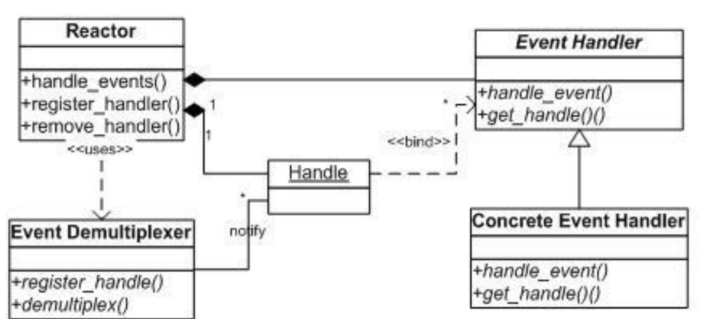

- Reactor释义“反应堆”，是一种事件驱动机制。和普通函数调用的不同之处在于：应用程序不是主动的调用某个API完成处理，而是恰恰 相反，Reactor逆置了事件处理流程，应用程序需要提供相应的接口并注册到Reactor上，如果相应的时间发生，Reactor将主动调用应用程序注册的接口，这些接口又称为“回调函数”。

- Reactor模式是处理并发I/O比较常见的一种模式，用于同步I/O，中心思想是将所有要处理的I/O事件注册到一个中心I/O多路复用器上，同时主线程/进程阻塞在多路复用器上；一旦有I/O事件到来或是准备就绪（文件描述符或socket可读、写），多路复用器返回并将事先注册的相应I/O事件分发到对应的处理器中。

- Reactor模型有三个重要的组件：

  ​	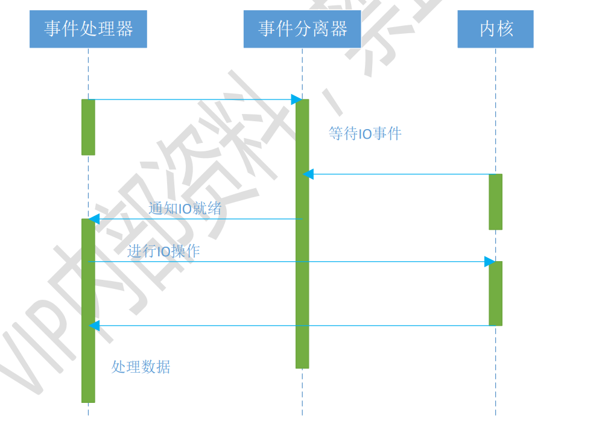

  - 多路复用器：由操作系统提供，在linux上一般是select、poll、epoll等系统调用。
  - 事件分发器：将多路复用器中返回的就绪事件分到对应的处理函数中。
  - 事件处理器：负责处理特定事件的处理函数。

#### 1.2 [Reactor实现](./code/io/reactor.c)

<details>
<summary>Reactor实现</summary>

```C
/*
 * @Author: gongluck 
 * @Date: 2020-11-26 09:41:40 
 * @Last Modified by: gongluck
 * @Last Modified time: 2020-11-26 16:58:43
 */

#include <stdio.h>
#include <stdlib.h>
#include <string.h>
#include <sys/socket.h>
#include <sys/epoll.h>
#include <arpa/inet.h>

#include <fcntl.h>
#include <unistd.h>
#include <errno.h>

#define BUFFER_LENGTH 4096
#define MAX_EPOLL_EVENTS 1024
#define SERVER_PORT 8888

typedef int NCALLBACK(int, int, void *);

struct ntyevent
{
    int fd;
    int events;
    void *arg;
    int (*callback)(int fd, int events, void *arg);

    int status;//是否已经添加到epoll中
    char buffer[BUFFER_LENGTH];
    int length;
    long last_active;
};

struct ntyreactor
{
    int epfd;
    struct ntyevent events[MAX_EPOLL_EVENTS];
};

void nty_event_set(struct ntyevent *ev, int fd, NCALLBACK callback, void *arg)
{
    ev->fd = fd;
    ev->callback = callback;
    ev->events = 0;
    ev->arg = arg;
    ev->last_active = time(NULL);

    return;
}

int nty_event_add(int epfd, int events, struct ntyevent *ev)
{
    struct epoll_event ep_ev = {0, {0}};
    ep_ev.data.ptr = ev;
    ep_ev.events = ev->events = events;

    int op;
    if (ev->status == 1)
    {
        op = EPOLL_CTL_MOD;
    }
    else
    {
        op = EPOLL_CTL_ADD;
        ev->status = 1;
    }

    if (epoll_ctl(epfd, op, ev->fd, &ep_ev) < 0)
    {
        printf("event add failed [fd=%d], events[%d]\n", ev->fd, events);
        return -1;
    }

    return 0;
}

int nty_event_del(int epfd, struct ntyevent *ev)
{
    struct epoll_event ep_ev = {0, {0}};

    if (ev->status != 1)
    {
        return -1;
    }

    ep_ev.data.ptr = ev;
    ev->status = 0;
    epoll_ctl(epfd, EPOLL_CTL_DEL, ev->fd, &ep_ev);

    return 0;
}

int recv_cb(int fd, int events, void *arg);
int send_cb(int fd, int events, void *arg)
{
    struct ntyreactor *reactor = (struct ntyreactor *)arg;
    struct ntyevent *ev = reactor->events + fd;

    int len = send(fd, ev->buffer, ev->length, 0);
    if (len > 0)
    {
        printf("send[fd=%d], [%d]%s\n", fd, len, ev->buffer);

        nty_event_del(reactor->epfd, ev);
        nty_event_set(ev, fd, recv_cb, reactor);
        nty_event_add(reactor->epfd, EPOLLIN, ev);
    }
    else
    {
        close(ev->fd);

        nty_event_del(reactor->epfd, ev);
        printf("send[fd=%d] error %s\n", fd, strerror(errno));
    }

    return len;
}

int recv_cb(int fd, int events, void *arg)
{
    struct ntyreactor *reactor = (struct ntyreactor *)arg;
    struct ntyevent *ev = reactor->events + fd;

    int len = recv(fd, ev->buffer, BUFFER_LENGTH, 0);
    nty_event_del(reactor->epfd, ev);
    if (len > 0)
    {
        ev->length = len;
        ev->buffer[len] = '\0';

        printf("C[%d]:%s\n", fd, ev->buffer);

        nty_event_set(ev, fd, send_cb, reactor);
        nty_event_add(reactor->epfd, EPOLLOUT, ev);
    }
    else if (len == 0)
    {
        close(ev->fd);
        printf("[fd=%d] pos[%ld], closed\n", fd, ev - reactor->events);
    }
    else
    {
        close(ev->fd);
        printf("recv[fd=%d] error[%d]:%s\n", fd, errno, strerror(errno));
    }

    return len;
}

int accept_cb(int fd, int events, void *arg)
{
    struct ntyreactor *reactor = (struct ntyreactor *)arg;
    if (reactor == NULL)
        return -1;

    struct sockaddr_in client_addr = {0};
    socklen_t len = sizeof(client_addr);

    int clientfd;
    if ((clientfd = accept(fd, (struct sockaddr *)&client_addr, &len)) == -1)
    {
        if (errno != EAGAIN && errno != EINTR)
        {
        }
        printf("accept: %s\n", strerror(errno));
        return -1;
    }

    int i = 0;
    do
    {
        for (i = 0; i < MAX_EPOLL_EVENTS; i++)
        {
            if (reactor->events[i].status == 0)
            {
                break;
            }
        }
        if (i == MAX_EPOLL_EVENTS)
        {
            printf("%s: max connect limit[%d]\n", __func__, MAX_EPOLL_EVENTS);
            break;
        }

        if (fcntl(clientfd, F_SETFL, O_NONBLOCK) < 0)
        {
            printf("%s: fcntl nonblocking failed, %d\n", __func__, MAX_EPOLL_EVENTS);
            break;
        }

        nty_event_set(&reactor->events[clientfd], clientfd, recv_cb, reactor);
        nty_event_add(reactor->epfd, EPOLLIN, &reactor->events[clientfd]);
    } while (0);

    printf("new connect [%s:%d][time:%ld], pos[%d]\n",
           inet_ntoa(client_addr.sin_addr), ntohs(client_addr.sin_port), reactor->events[i].last_active, i);

    return 0;
}

int init_sock(short port)
{
    int fd = socket(AF_INET, SOCK_STREAM, 0);
    fcntl(fd, F_SETFL, O_NONBLOCK);

    struct sockaddr_in server_addr = {0};
    server_addr.sin_family = AF_INET;
    server_addr.sin_addr.s_addr = htonl(INADDR_ANY);
    server_addr.sin_port = htons(port);

    bind(fd, (struct sockaddr *)&server_addr, sizeof(server_addr));
    if (listen(fd, 20) < 0)
    {
        printf("listen failed : %s\n", strerror(errno));
    }

    return fd;
}

int ntyreactor_init(struct ntyreactor *reactor)
{
    if (reactor == NULL)
        return -1;
    memset(reactor, 0, sizeof(struct ntyreactor));

    reactor->epfd = epoll_create(1);
    if (reactor->epfd <= 0)
    {
        printf("create epfd in %s err %s\n", __func__, strerror(errno));
        return -2;
    }
}

int ntyreactor_destory(struct ntyreactor *reactor)
{
    close(reactor->epfd);
    
    return 0;
}

int ntyreactor_addlistener(struct ntyreactor *reactor, int sockfd, NCALLBACK *acceptor)
{
    if (reactor == NULL)
        return -1;

    nty_event_set(&reactor->events[sockfd], sockfd, acceptor, reactor);
    nty_event_add(reactor->epfd, EPOLLIN, &reactor->events[sockfd]);

    return 0;
}

int ntyreactor_run(struct ntyreactor *reactor)
{
    if (reactor == NULL)
        return -1;
    if (reactor->epfd < 0)
        return -1;

    struct epoll_event events[MAX_EPOLL_EVENTS + 1];
    int checkpos = 0, i;
    while (1)
    {
        long now = time(NULL);
        for (i = 0; i < MAX_EPOLL_EVENTS/10; i++, checkpos++)
        {
            if (checkpos == MAX_EPOLL_EVENTS)
            {
                checkpos = 0;
            }

            if (reactor->events[checkpos].status != 1)
            {
                continue;
            }

            long duration = now - reactor->events[checkpos].last_active;
            if (duration >= 60)
            {
                close(reactor->events[checkpos].fd);
                printf("[fd=%d] timeout\n", reactor->events[checkpos].fd);
                nty_event_del(reactor->epfd, &reactor->events[checkpos]);
            }
        }

        int nready = epoll_wait(reactor->epfd, events, MAX_EPOLL_EVENTS, 1000);
        if (nready < 0)
        {
            printf("epoll_wait error, exit\n");
            continue;
        }

        for (i = 0; i < nready; i++)
        {
            struct ntyevent *ev = (struct ntyevent *)events[i].data.ptr;
            if ((events[i].events & EPOLLIN) && (ev->events & EPOLLIN))
            {
                ev->callback(ev->fd, events[i].events, ev->arg);
            }
            if ((events[i].events & EPOLLOUT) && (ev->events & EPOLLOUT))
            {
                ev->callback(ev->fd, events[i].events, ev->arg);
            }
        }
    }
}

int main()
{
    unsigned short port = SERVER_PORT;
    int sockfd = init_sock(port);

    struct ntyreactor reactor;
    ntyreactor_init(&reactor);

    ntyreactor_addlistener(&reactor, sockfd, accept_cb);
    ntyreactor_run(&reactor);

    ntyreactor_destory(&reactor);
    close(sockfd);

    return 0;
}
```
</details>

### 2.日志模块

#### 2.1 log4cpp模块

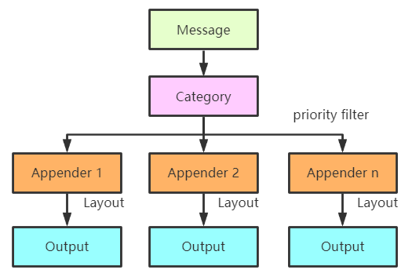

- log4cpp有且只⼀个根Category，可以有多个⼦Category组成树型结构。

  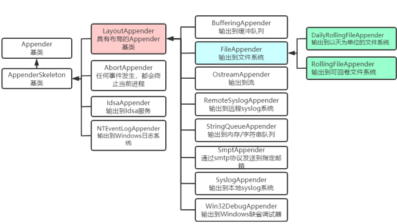

- Appender负责将⽇志写⼊相应的设备，⽐如控制台、⽂件、调试器、Windows⽇志、syslog等。

- Layout控制输出⽇志的显示样式。Log4cpp内置了4种Layout：

  - PassThroughLayout：直通布局。
  - SimpleLayout：简单布局。它只会为你添加“优先级”的输出。
  - BasicLayout：基本布局。它会为你添加“时间”、“优先级”、“种类”、“NDC”。
  - PatternLayout：格式化布局。它的使⽤⽅式类似C语⾔中的printf，使⽤格式化它符串来描述输出格式。

#### 2.2 log4cpp编译安装

```shell
wget https://sourceforge.net/projects/log4cpp/files/log4cpp-1.1.x%20%28new%29/log4cpp-1.1/log4cpp-1.1.3.tar.gz
tar zxf log4cpp-1.1.3.tar.gz
cd log4cpp
./configure
make -j 8
sudo make install
sudo ldconfig
```

#### 2.3 [log4cpp例子](./code/log/log4cpp)

- [例子1](./code/log/log4cpp/log1.cpp)

  <details>
  <summary>例子1</summary>
  ```C++
  /*
   * @Author: gongluck 
   * @Date: 2020-11-27 21:12:58 
   * @Last Modified by: gongluck
   * @Last Modified time: 2020-11-27 21:30:54
   */

  // g++ log1.cpp -llog4cpp -lpthread

  #include "log4cpp/Category.hh"
  #include "log4cpp/FileAppender.hh"
  #include "log4cpp/OstreamAppender.hh"
  #include "log4cpp/BasicLayout.hh"

  int main()
  {
      // 实例化一个layout对象
      log4cpp::Layout *layout = new log4cpp::BasicLayout();
      // 初始化一个appender对象
      log4cpp::Appender *appender = new log4cpp::FileAppender("FileAppender","./log1.log");
      log4cpp::Appender *osappender = new log4cpp::OstreamAppender("OstreamAppender",&std::cout);
      // 把layout对象附着在appender对象上，一个layout格式样式对应一个appender
      appender->setLayout(layout);
      // 实例化一个category对象
      log4cpp::Category &warn_log = log4cpp::Category::getInstance("gongluck"); // 单例工厂
      // 设置additivity为false，替换已有的appender，不继承父类appender
      warn_log.setAdditivity(false);
      // 把appender对象附到category上
      warn_log.setAppender(appender);
      warn_log.addAppender(osappender);
      // 设置category的优先级，低于此优先级的日志不被记录
      warn_log.setPriority(log4cpp::Priority::INFO);
      // 记录一些日志
      warn_log.info("Program info which cannot be wirten");
      warn_log.debug("This debug message will fail to write");
      warn_log.alert("Alert info");
      // 其他记录日志方式
      warn_log.log(log4cpp::Priority::WARN, "This will be a logged warning");

      log4cpp::Priority::PriorityLevel priority = log4cpp::Priority::DEBUG;
      warn_log.log(priority, "Importance depends on context");
      warn_log.critStream() << "This will show up << as " << 1 << " critical message";
      // clean up and flush all appenders
      log4cpp::Category::shutdown();
      return 0;
  }
  ```
  </details>
  ```

- [例子2](./code/log/log4cpp/log2.cpp)

  <details>
  <summary>例子2</summary>
  
  ```C++
  /*
   * @Author: gongluck 
   * @Date: 2020-11-27 21:31:03 
   * @Last Modified by: gongluck
   * @Last Modified time: 2020-11-27 21:44:29
   */
  
  // g++ log2.cpp -llog4cpp -lpthread
  
  #include "log4cpp/Category.hh"
  #include "log4cpp/PropertyConfigurator.hh"
  
  int main()
  {
      try
      {
          log4cpp::PropertyConfigurator::configure("./log2.conf");
      }
      catch (log4cpp::ConfigureFailure &f)
      {
          std::cout << "Configure Problem " << f.what() << std::endl;
          return -1;
      }
  
      // 实例化category对象
      log4cpp::Category &root = log4cpp::Category::getRoot();
  
      log4cpp::Category &category1 = log4cpp::Category::getInstance(std::string("category1"));
      log4cpp::Category &category3 = log4cpp::Category::getInstance(std::string("category1.category2"));
     
      category1.info("This is some info");
      category1.alert("A warning");
  
      category3.debug("This debug message will fail to write");
      category3.alert("All hands abandon ship");
      category3.critStream() << "This will show up << as " << 1 << " critical message";
      category3 << log4cpp::Priority::ERROR<< "And this will be an error";
      category3.log(log4cpp::Priority::WARN, "This will be a logged warning");
      
      log4cpp::Category::shutdown();
      return 0;
  }
  ```
  </details>
  