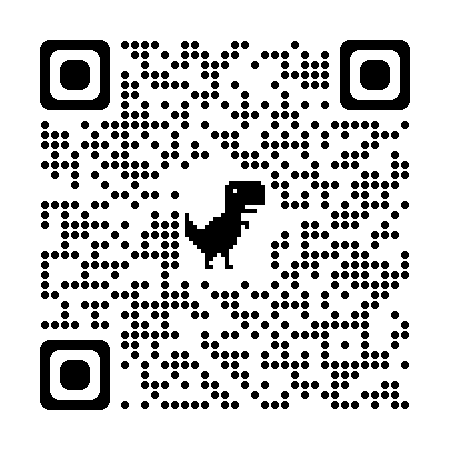

# CVIP

## chapters and sections

- [x] [数据结构与算法](./data_structure_and_algorithm/)
- [x] [计算机基础](./computer_basics/)

---

- [x] [C++](./cpp/)
- [x] [STL 源码](./stl/)

---

- [x] [Go](./go/)

---

- [x] [Redis](./redis/)
- [x] [MySQL](./mysql/)
- [x] [Kafka](./kafka/)

---

- [x] [网络](./network/)

---

- [x] [jenkins](./jenkins/)

---

- [x] [BPF](./tools/bpf.md)

## 源码和注释

[源码和注释](https://github.com/gongluck/sourcecode)

## Stargazers over time

## QR Code

