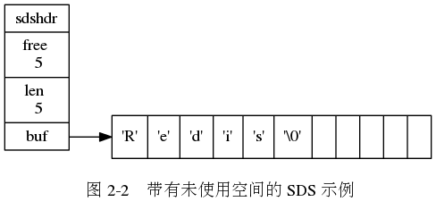
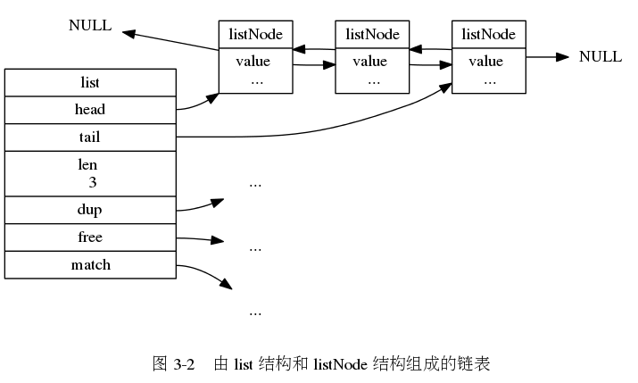
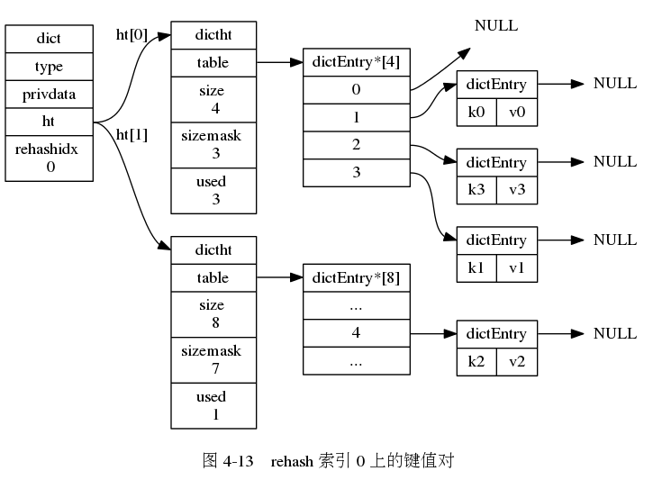
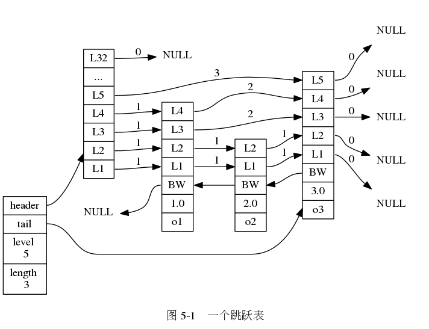
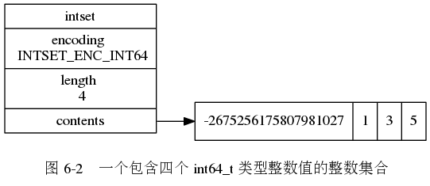
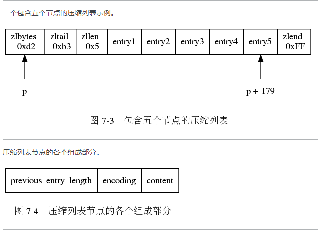

# Redis 数据结构

- [Redis 数据结构](#redis-数据结构)
  - [简单动态字符串](#简单动态字符串)
  - [链表](#链表)
  - [字典](#字典)
  - [跳表](#跳表)
  - [整数集合](#整数集合)
  - [压缩列表](#压缩列表)

## 简单动态字符串

- 常数复杂度获取字符串长度(`len`字段)
- 杜绝缓冲区溢出(`len`字段)
- 减少修改字符串长度时所需的内存重分配次数(`free`字段)
- 二进制安全(`len`字段)
- 兼容部分`c++`字符串函数(`buf`字段)

[sds.h](https://github.com/gongluck/sourcecode/blob/main/redis/src/sds.h#L40)

## 链表

- `Redis`链表是双向链表，每个节点都有指向前置节点和后置节点的指针
- 每个链表用一个`list`结构表示，结构中有表头节点指针、表尾节点指针，以及链表长度和类型特定函数指针等信息
- `Redis`链表是无环链表，表头节点的前置指针和表尾节点的后置指针都指向`NULL`
- 通过设置不同的类型特定函数，`Redis`链表可用保存不同类型的值

[adlist.h](https://github.com/gongluck/sourcecode/blob/main/redis/src/adlist.h#L34)

## 字典

- 字典中有两个哈希表，一个平时使用，一个在`rehash`时使用
- 哈希表使用链地址法解决键冲突
- 对哈希表进行扩展或者收缩操作时，进行`rehash`将现有哈希表的所有键值对重新计算到新哈希表中，整个过程是渐进式的

[dict.h](https://github.com/gongluck/sourcecode/blob/main/redis/src/dict.h#L48)

## 跳表

- 跳表节点的层高是`1~32`之间的随机数
- 多个节点可以包含相同的分值，但节点的成员对象必须是唯一的
- 节点按照分值排序，分值相同时按照对象的大小进行排序

[redis.h](https://github.com/gongluck/sourcecode/blob/main/redis/src/redis.h#L599)

## 整数集合

- 整数集合底层是数组，这个数组以有序、无重复的方式保存集合元素
- 在插入元素时，如果新插入元素的类型比原集合中的元素都大，会对整数集合进行升级
- 整数集合只会进行升级，不会进行降级

[intset.h](https://github.com/gongluck/sourcecode/blob/main/redis/src/intset.h#L35)

## 压缩列表

- 压缩列表包含多个节点，每个节点保存一个字节数组或者整数值
- 添加新元素或者删除元素，可能会出现连锁更新操作

[ziplist.c](https://github.com/gongluck/sourcecode/blob/main/redis/src/ziplist.c#L115)
