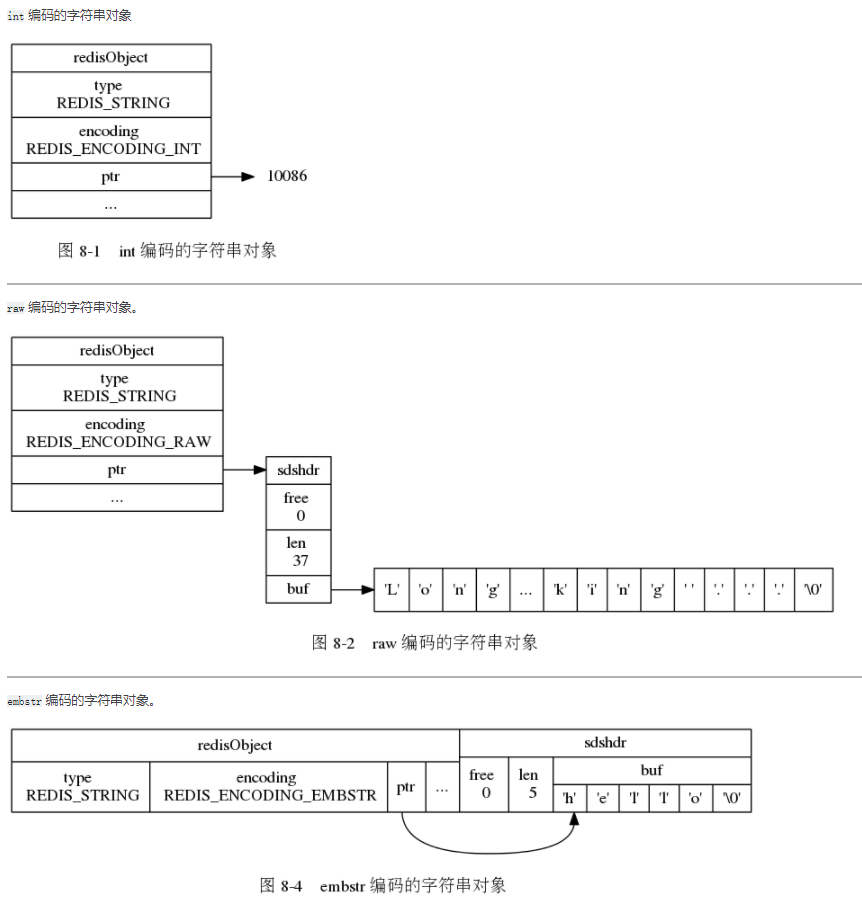
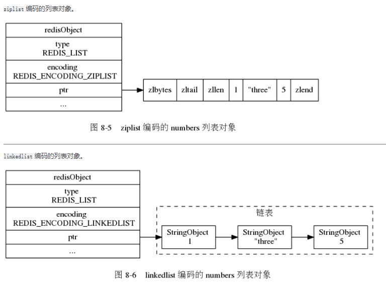
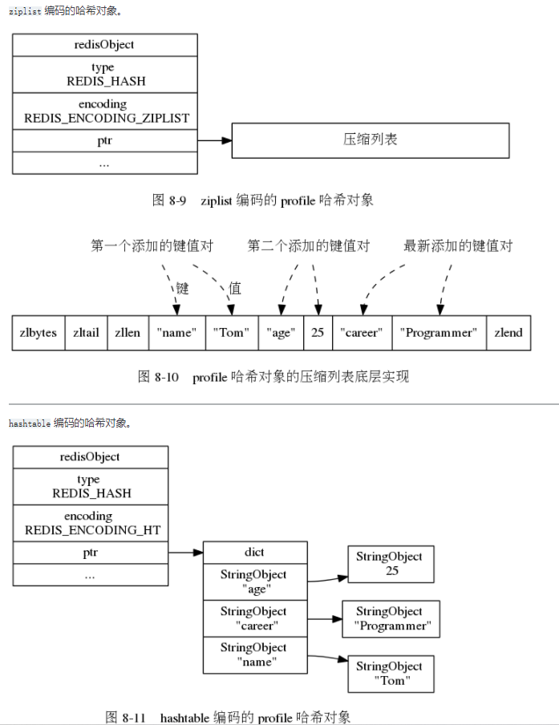
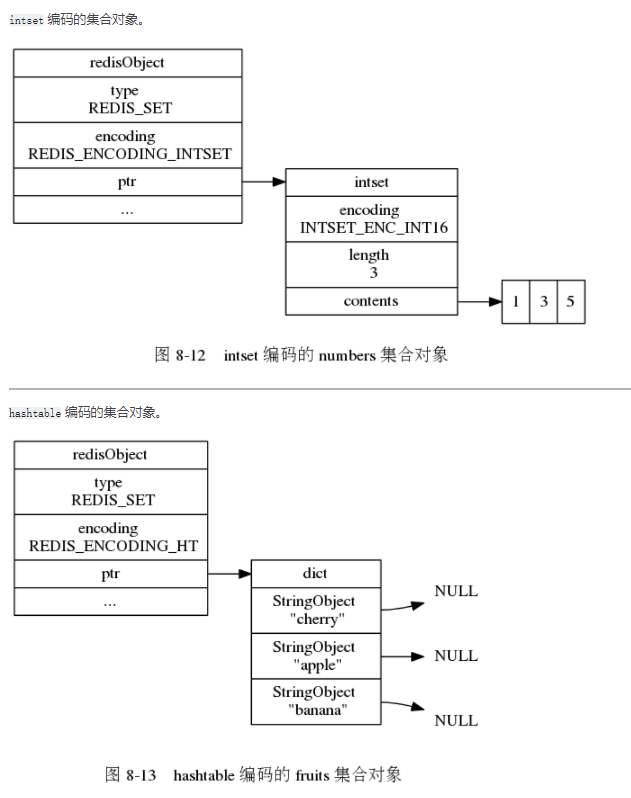
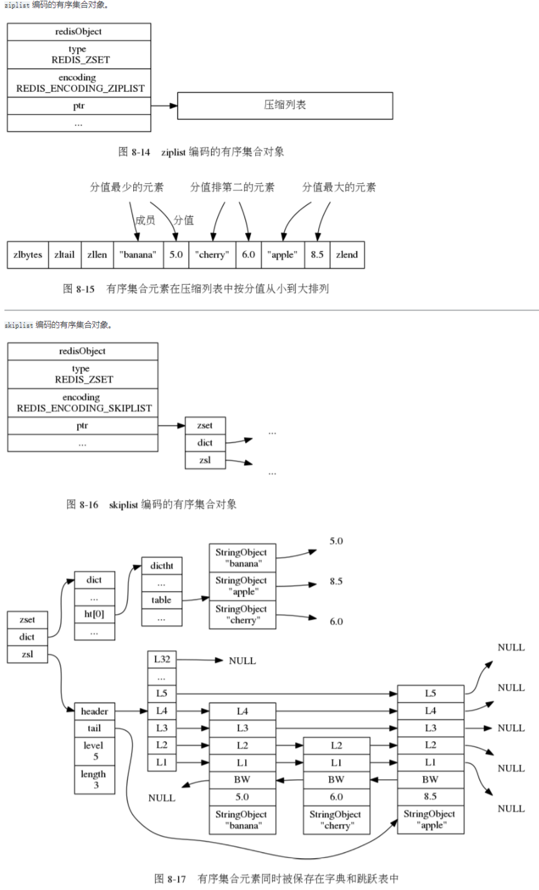

# Redis 对象

- [Redis 对象](#redis-对象)
  - [Redis 对象基础结构](#redis-对象基础结构)
  - [字符串对象](#字符串对象)
  - [列表对象](#列表对象)
  - [哈希对象](#哈希对象)
  - [集合对象](#集合对象)
  - [有序集合对象](#有序集合对象)

## Redis 对象基础结构

[redis.h](https://github.com/gongluck/sourcecode/blob/main/redis/src/redis.h#L413)

## 字符串对象

使用`REDIS_ENCODING_RAW`、`REDIS_ENCODING_INT`或`REDIS_ENCODING_EMBSTR`编码类型

[object.c](https://github.com/gongluck/sourcecode/blob/main/redis/src/object.c#L39)

## 列表对象

使用`REDIS_ENCODING_ZIPLIST`或`REDIS_ENCODING_LINKEDLIST`编码类型

[object.c](https://github.com/gongluck/sourcecode/blob/main/redis/src/object.c#L220)

## 哈希对象

使用`REDIS_ENCODING_ZIPLIST`或`REDIS_ENCODING_HT`编码类型

[object.c](https://github.com/gongluck/sourcecode/blob/main/redis/src/object.c#L257)

## 集合对象

使用`REDIS_ENCODING_INTSET`或`REDIS_ENCODING_HT`编码类型

[object.c](https://github.com/gongluck/sourcecode/blob/main/redis/src/object.c#L239)

## 有序集合对象

使用`REDIS_ENCODING_ZIPLIST`或`REDIS_ENCODING_SKIPLIST`编码类型

[object.c](https://github.com/gongluck/sourcecode/blob/main/redis/src/object.c#L266)
